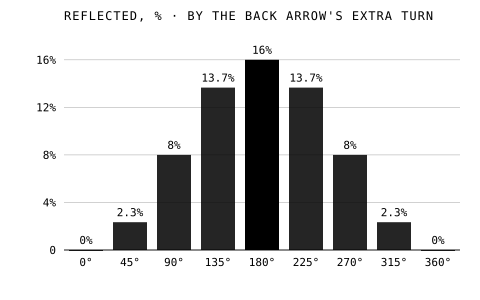
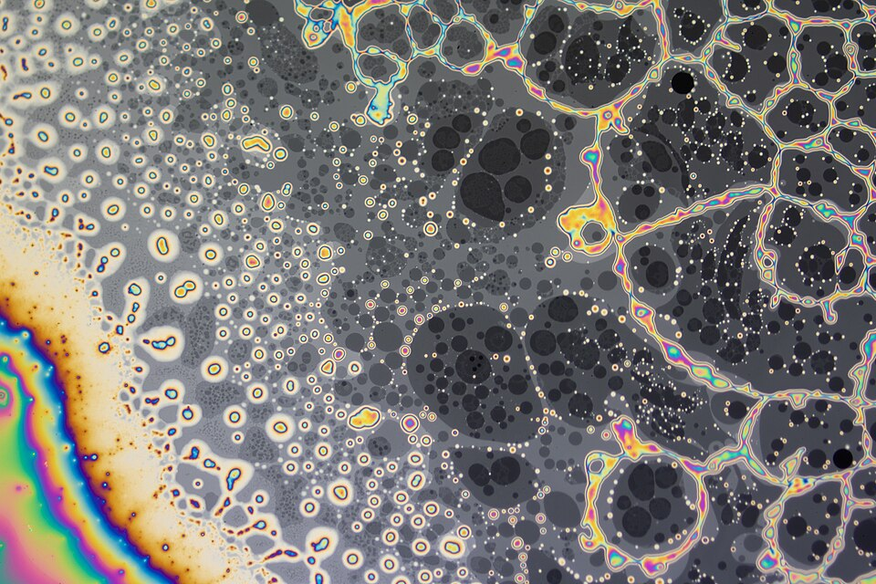

In 1985, the year of his memoir, Feynman published a book of real
physics for readers with no mathematics at all: **_QED: The Strange Theory
of Light and Matter_**, from Princeton University Press. It explains
quantum electrodynamics, the theory that won him the Nobel Prize, with
nothing more than little arrows, and it does not cheat. A reader who
follows the rules can work out, correctly, how much light a sheet of glass
reflects.

## From Auckland to UCLA

The book began as lectures. In 1979 Feynman gave the **Sir Douglas Robb
lectures** at the University of Auckland in New Zealand, four talks on QED
for the public, which were videotaped. In 1983 he gave a new set at UCLA
as the first **Alix G. Mautner Memorial Lectures**. Alix Mautner had long
asked him to explain the physics of small particles in a way she could
follow; her husband, **Leonard Mautner**, had been Feynman's friend since
their boyhood in Far Rockaway, and the lecture series was founded in her
memory after her death. Ralph Leighton transcribed and edited the UCLA talks, and
Feynman's acknowledgement notes that the manuscript was then considerably
reworked. In 1996 two physicists at Auckland, J. M. Dudley and A. M.
Kwan, compared the book with the Auckland tapes, listed where they
differ, and argued that the spoken versions show more of the man.

He was frank about the difficulty. Nobody understands why nature behaves
this way, he told the audience, and his own physics students did not
understand it either; they had only learned how to calculate it. He
would teach them to calculate.

## Arrows that add

The worked example runs through the first two lectures. Shine light on a
single surface of glass, and about 4 photons in 100 bounce back; the rest
go in. Light comes in lumps: a detector clicks, photon by photon, and
nothing predicts which photon will be one of the four. Now use a sheet
with two surfaces. The reflection is not 8%, as common sense expects.
Depending on the exact thickness, it is anything from 0% to 16%, cycling
up and down as the glass gets thicker. Newton saw this in his rings and
could not explain it.

Feynman's explanation, in the book's terms: every way the photon can go
has an arrow, like the hand of a stopwatch that turns as it travels. Add
the arrows for all the ways, head to tail, and square the length of the
result: that is the probability. The front surface contributes an arrow
0.2 long, reversed; the back surface another 0.2, turned further by the
extra trip through the glass. The plate draws the sum. When the two point
opposite ways they cancel, and nothing reflects; when they line up the sum
is 0.4, which squared is 16%. The chart runs the same arithmetic round a
full turn of the back arrow.

| Back arrow's extra turn | Length of the sum | Reflected |
| ----------------------- | ----------------- | --------- |
| 0°                      | 0                 | 0%        |
| 90°                     | 0.28              | 8%        |
| 180°                    | 0.40              | 16%       |
| 270°                    | 0.28              | 8%        |
| 360°                    | 0                 | 0%        |

The steps are this frame's; the rule and the 0% to 16% are the book's.
The same arithmetic colours a soap film. Where the film drains thinner
than a small fraction of a wavelength, the back arrow has hardly turned,
the reversed front arrow cancels it, and the film goes black.

## The whole theory in three actions

With the arrows in hand, the later lectures build the rest: a photon goes
from place to place, an electron goes from place to place, an electron
emits or absorbs a photon. Every effect of light and electrons is those
three, combined in every possible way, with the arrows added. The book
ends by sketching what lies beyond QED, the quarks and gluons that his
partons became, and its famously precise agreement with experiment. It
is still in print, with a new introduction by **Anthony Zee** since 2006.

The trail **Sum over histories** follows the arrows further, through the
double slit to the path integral. The main spine goes on to January 1986,
and the space shuttle _Challenger_.
