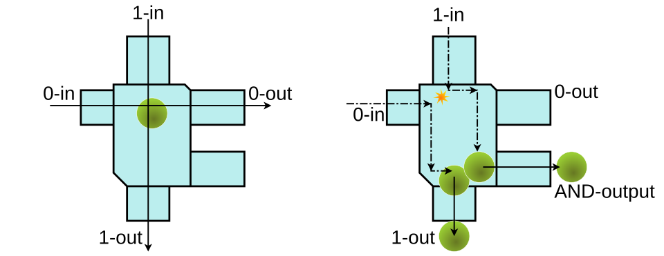

In 1984 [Feynman](kloom:e/richard-feynman) gave a plenary talk at the CLEO/IQEC laser
conference, written up as "Quantum Mechanical Computers" in _Optics News_
in February 1985 and reprinted in _Foundations of Physics_ in 1986. It
asks a narrower question than his 1981 talk. That talk had asked what a
[quantum computer](kloom:e/quantum-computing) might do that no ordinary one could. This paper asks
whether an ordinary computer could be built out of quantum parts at all,
and what physics charges for each step.

## The debt to reversible logic

The paper opens with work by others. In 1961 **[Rolf Landauer](kloom:e/rolf-landauer)** of IBM
argued that throwing away a bit of information must release at least
_kT_ ln 2 of heat, where _T_ is the temperature and _k_ Boltzmann's
constant. An AND gate throws information away: from an output of 0 you
cannot tell which of three inputs made it. In 1973 **[Charles Bennett](kloom:e/charles-h-bennett-physicist)**,
also at IBM, showed that any computation can be done _reversibly_,
keeping enough to run it backwards, and then need not pay that price at
all. **[Edward Fredkin](kloom:e/edward-fredkin)** and **[Tommaso Toffoli](kloom:e/tommaso-toffoli)** at MIT built a whole
logic on the idea, including a computer made of colliding billiard balls.

Feynman noted that the transistors of 1984 dissipated about 10¹⁰ _kT_ per
step, far above any of these limits, and that even the cell copying its
DNA spends about 100 _kT_ a bit. The question was academic, he said, and
entertaining to professors.

He built his machine from three reversible gates: **NOT**; the
**controlled NOT**, which flips one line when another is 1; and the
**controlled controlled NOT**, now called the [Toffoli gate](kloom:e/toffoli-gate), which flips a
third line only when both of the first two are 1. From these he assembled
a full adder, five gates on four lines, the circuit at the top of the
plate. Its extra outputs, which he called _garbage_, can always be
cleared: copy the answer out, then run the whole machine in reverse.

## A cursor on a line of sites

Then the quantum step. Each bit is a two-state "atom", and each gate is a
small matrix acting on a few of them. The whole calculation is the
product of those matrices, taken in order. The hard part is to make it
happen by itself, as a physical system evolving in time. Feynman's answer
was to add a second row of atoms, the **program sites**, and one
excitation among them, the **cursor**. His Hamiltonian, written on the
plate, lets the cursor hop from site _i_ to site _i_ + 1 and apply gate
_i_ + 1 as it goes, or hop back and undo it.

The cursor moves like an electron along a chain of atoms, and a wave
packet of cursor can run through the whole program ballistically. When it
arrives at the last site, the register holds the answer. Feynman worked
out what it costs when the chain is imperfect and the cursor scatters:
energy lost per step is _kT_ times the chance of scattering, times the
ratio of the fastest possible running time to the time you allow. As
with a Carnot engine, go slowly enough and the cost falls towards
nothing. With couplings of about a tenth of an electronvolt, a step would
take about 6 × 10⁻¹⁵ seconds.

| What he assumed                   | What he concluded                             |
| --------------------------------- | --------------------------------------------- |
| bits stored in single atoms       | no limit from quantum mechanics on size       |
| gates as terms in one Hamiltonian | a universal computer can be built this way    |
| an imperfect chain that scatters  | energy per step as small as you have time for |
| copy, then reverse                | garbage never larger than the input           |

He was frank about what the machine was not. It imitated an ordinary
sequential computer as closely as it could, he wrote, and made no real use
of what is special about quantum mechanics.

## Deutsch, the same year

That was left to **[David Deutsch](kloom:e/david-deutsch)** at Oxford. His paper "Quantum theory,
the Church–Turing principle and the universal quantum computer" appeared
in the _Proceedings of the Royal Society_ in July 1985. It defined a
universal quantum computer as precisely as Turing had defined his
machine, argued that superposition lets it work on many inputs at once,
and sketched a small problem on which it could do better than any
classical machine. Feynman's 1981 talk had pointed there; his 1985 paper, by
its own account, did not go. [John Preskill](kloom:e/john-preskill), his Caltech colleague from
1983, has written that he finds it baffling that Feynman never
mentioned the speed-up in his lectures on computation.

Those lectures are the next frame's.
