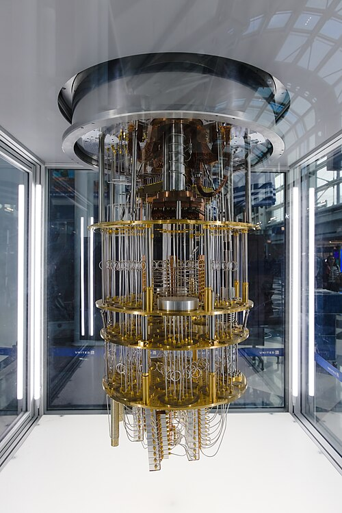

This frame describes [quantum computing](kloom:e/quantum-computing) as of 28 September 2026, forty-five
years after [Feynman](kloom:e/richard-feynman) asked for a computer built from quantum parts to
simulate nature. Machines of about a hundred good [qubits](kloom:e/qubit) now exist, error
correction works in the laboratory, and several groups claim to have
computed things no ordinary computer can check in reasonable time. No
quantum computer has yet done a piece of useful physics or chemistry that
classical computers demonstrably cannot.

## Shor, and the fear of errors

For a decade the idea stayed a curiosity. Then in 1994 **[Peter Shor](kloom:e/peter-shor)** of
Bell Labs found quantum algorithms for discrete logarithms and for
factoring large numbers, which would break the public-key cryptography
the internet runs on. Interest soared, and so did doubt: physicists
including Rolf Landauer argued that noise would destroy any large quantum
computation. Shor answered again, with the first [quantum error-correcting
code](kloom:e/quantum-error-correction) in 1995. By the end of 1996 a _threshold theorem_ was in place: if
each operation fails rarely enough, many noisy physical qubits can be
bundled into one reliable _logical_ qubit, and computations can run as
long as needed.

The cost of that bundling is why factoring remains out of reach. The
chart gives published estimates of the physical qubits needed to factor a
2048-bit RSA key under comparable assumptions (in Gidney's own, gates that
fail once in a thousand and a microsecond per round of error correction).

| Estimate                    | Physical qubits | Note                         |
| --------------------------- | --------------- | ---------------------------- |
| Jones et al., 2012          | ~600 million    | read off Gidney's 2025 chart |
| Fowler et al., 2012         | ~1 billion      | read off Gidney's 2025 chart |
| O'Gorman and Campbell, 2017 | ~230 million    | read off Gidney's 2025 chart |
| Gheorghiu and Mosca, 2019   | ~170 million    | read off Gidney's 2025 chart |
| Gidney and Ekerå, 2019      | 20 million      | eight hours                  |
| Gidney, 2025                | 897,864         | about five days              |

The most accurate machines of 2026 have about a hundred qubits; the
largest arrays hold a few thousand atoms.

## Below threshold

The plate draws what changed in December 2024. [Google](kloom:e/google)'s 105-qubit
**[Willow](kloom:e/willow-processor)** processor stored one logical qubit in square patches of 9, 25
and 49 data qubits, with measure qubits between them checking for errors.
Each step up in size cut the logical error rate by a factor of 2.14, the
first clear sign in hardware of the suppression the threshold theorem
promises. The largest patch, 101 qubits in all, failed 0.143 percent of
the time per cycle and outlived its best physical qubit by a factor of
2.4. Critics pointed out that deep algorithms need error rates around one
in a million.

Other hardware followed. In November 2025 Quantinuum's **Helios**, 98
trapped-ion qubits, reported 48 error-corrected logical qubits at two
physical qubits apiece. In 2025 a group at Feynman's Caltech held
6,100 atoms as qubits in an array of laser tweezers. On 24 September 2026 Infleqtion announced 30 entangled
logical qubits from 80 atoms; an analyst noted that its code detects
errors rather than correcting them, and that failed runs were discarded.

## Simulating physics, forty-five years on

Feynman's own application is where the recent claims cluster. In October
2025 Google measured an "echo" of scrambled quantum information on 65 of
Willow's qubits, a quantity it estimated would take the Frontier
supercomputer about 13,000 times longer, and which a second quantum
computer could check. A follow-up on real molecules, by NMR, was not yet
beyond classical reach. Quantinuum measured superconducting pairing in
Fermi–Hubbard models on Helios, the first time a quantum computer had
seen it. On 30 July 2026 [IBM](kloom:e/ibm) and partners posted three papers claiming
quantum advantage on its Heron processors, among them simulations of
disordered and laser-driven materials on 56 and 74 qubits. They were not
yet peer reviewed; one analyst judged the new verification methods real
but the three papers' claims different in strength.

[John Preskill](kloom:e/john-preskill), writing in 2021, still thought simulating quantum systems
the use most likely to change the world. That is where this trail began, with
the 1981 talk "Simulating Physics with Computers" and the problem it set.
