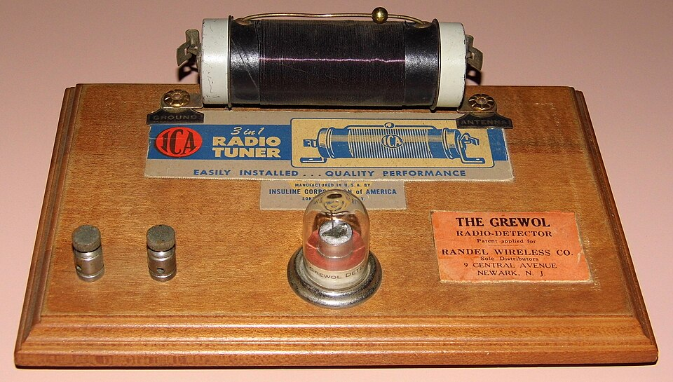

By the time he was eleven or twelve, Feynman had a laboratory. It began as junk on
his bedroom floor and moved into an old packing case that his father brought
home, a crate from a radio about five feet long. In it went a storage
battery, motors from an Erector set, a photoelectric cell, switches, lamp
bulbs, and a growing pile of radios bought at rummage sales. He kept it
through high school and moved it with the family.

## A house wired to one room

He ran wires through the house so that he could plug his earphones into his
radio from any room, and pipe sound the other way, to a loudspeaker
upstairs, to broadcast to whoever was there. He built a burglar alarm while
his parents were out for the day. He listened to _The Shadow_ all night
on a **crystal set**, the simplest receiver there is: an aerial, a coil and a
variable condenser to tune it, a crystal with a fine wire touching it to
pull the sound out of the signal, and a pair of headphones. The plate draws
one, with the resonance curve that tuning chooses. No battery is needed; the
radio station's own signal drives the phones.

His first repairs were the easy kind, he told an interviewer in 1966: a wire
hanging loose, a bad connection. The rest he learned by going deeper into
each set. By high school he was mending the neighbours' radios for money,
and spending the money on more junk for the laboratory.

## The story he told

In _"Surely You're Joking, Mr. Feynman!"_ (1985), the memoir made from
Feynman's stories as Ralph Leighton recorded them, the first chapter is about this trade,
and gives the frame its headline. During the Depression, he says, people
hired a boy because he was cheap. One man had a set that roared horribly
for a moment every time it was switched on. Feynman walked up and down,
thinking, while the man grew impatient at a boy who thought instead of
fixing. Then he reasoned that the tubes were warming up in the wrong order,
swapped two of them, and the noise was gone. The man went round telling
people the boy fixed radios by thinking.

It is a good story, and it is Feynman's own. Nobody else recorded it, and
the memoir was put together fifty years later from stories he had polished
by telling them many times. What the 1966 interview confirms is the
underlying habit.

## Where does the π come from?

The habit showed in how he read formulas. A friend's book gave eight or so
formulas for current, voltage, resistance and power. Feynman saw that most
were restatements of each other: from Ohm's law and the rule that power is
voltage times current, the rest follow. Nobody had taught him that letters
could stand for amperes and volts. He worked it out.

| What the book gave      | What it comes from      |
| ----------------------- | ----------------------- |
| volts = amperes × ohms  | Ohm's law               |
| watts = volts × amperes | the definition of power |
| watts = amperes² × ohms | both, combined          |
| watts = volts² ÷ ohms   | both, combined          |

Then, in high school, he met the frequency of a tuned circuit, the
formula written on the plate, with a 2π in it. Where did a circle come from
in a radio? The coil is round, he decided: that must be the circle. Later
he found a handbook giving the inductance of square coils too, and his
explanation fell apart, because the π was still there. It kept him
interested, he said, in how mathematics connects to physics: that a formula
means nothing unless there is some way to make something go.

The circle was in time, not in the coil: the current swings back and
forth, and one full swing is a turn of 2π in its phase. A teacher at Far
Rockaway High was about to show him that physics could be written in a
stranger way still.
