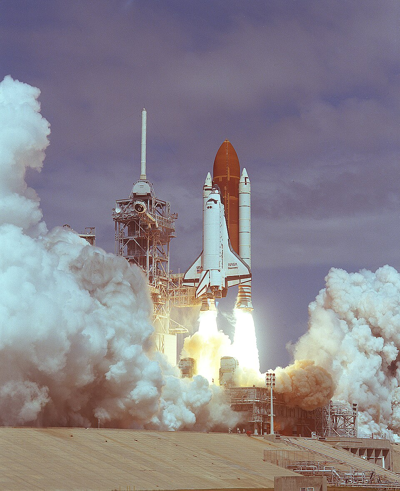

The commission's first recommendation was that the booster joint be
redesigned, under the eye of an independent panel, before the shuttle flew
again. NASA and [Morton Thiokol](kloom:e/thiokol) spent more than two years doing it, with a
National Research Council panel chaired by **H. Guyford Stever** looking
over their shoulders. The shuttle did not fly for 975 days.

## A joint that cannot open

NASA's report of June 1987 on how it was carrying out the recommendations
describes the new field joint, and the plate draws it in section, beside
the drawing of the old one earlier in this trail.

| Change                           | What it does                                                              |
| -------------------------------- | ------------------------------------------------------------------------- |
| Capture feature on the tang      | A second lip that grips the clevis's inner leg, so the gap cannot open    |
| Custom-fit shims                 | Close the space between tang and clevis, so the rings are always squeezed |
| Deeper O-ring grooves            | A compressed ring never fills more than 90% of its groove                 |
| Third O-ring                     | Seats the primary ring and blocks heat if the insulation is breached      |
| Insulation flap instead of putty | No putty for hot gas to jet through                                       |
| External heaters, weather seal   | Keep the seals at 75°F or warmer, and rain out of the joint               |
| Extra leak-check port            | Proves after assembly that both rings are in place and holding            |

The principle had changed. The old joint relied on pressure to push the
ring into a gap that the pressure was also opening. The new one was built
so that the gap stayed small, the rings stayed squeezed whatever the
temperature, and pressure was welcome but not needed. The rings were made
of a fluorocarbon rubber, Viton, chosen for sealing across the whole range
of conditions. The capture feature itself was not new: boosters with
filament-wound cases, built for launches from California that never took
place, had used a similar double tang.

## Discovery, 1988

**[STS-26](kloom:e/sts-26)** lifted off from Kennedy at 11:37 a.m. on 29 September 1988:
**Discovery**, with a crew of five who had all flown before, in pressure
suits and with a way to bail out, neither of which [Challenger](kloom:e/space-shuttle-challenger-disaster)'s crew had
had. It deployed a tracking and data relay satellite, the twin of one
lost with Challenger, and landed four days later. When the boosters
were recovered, the new joints showed no sign of leakage or overheating. [Feynman](kloom:e/richard-feynman) did not live to see it; he had died in
February.

The redesigned boosters flew for the rest of the program, to 2011, and
were never again the cause of a loss.

## Columbia, 2003

On 1 February 2003 **[Columbia](kloom:e/space-shuttle-columbia-disaster)** broke up as it came home, and its crew of
seven were killed. Eighty-two seconds after its launch a piece of foam
insulation had fallen from the external tank and holed the leading edge of
the left wing, and on re-entry hot gas got in. Foam had come off the tank
on flight after flight since the program began. It was never supposed to,
and at first it was treated as a hazard; over the years it came to be
logged as a maintenance matter, until hardly anyone saw it as a threat.

The **[Columbia Accident Investigation Board](kloom:e/columbia-accident-investigation-board)** called this, borrowing a
term from the sociologist **[Diane Vaughan](kloom:e/diane-vaughan)**, the [_normalization of
deviance_](kloom:e/normalization-of-deviance): an event that is not supposed to happen becomes, by happening
without disaster, the normal state of things. Vaughan had coined it in
_The Challenger Launch Decision_ (1996), her study of how NASA came to
accept the eroding O-rings. The board quoted Feynman's appendix on the
seals and the slowly loosening criteria, and called the parallels
striking. **[Sally Ride](kloom:e/sally-ride)**, the one member of both investigations, spoke of
echoes of Challenger in Columbia. The board's conclusion was blunt: history
is cause, and despite all the changes since 1986, the causes of the
institutional failure responsible for Challenger had not been fixed.

The joint had been redesigned; the habit of mind Feynman described, of
taking each survival as proof of safety, had not. This trail began with
the loss of Challenger, on the main spine, and returns there.
