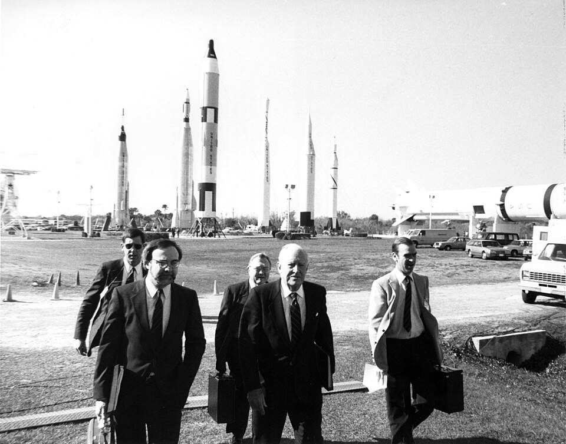

On 3 February 1986, six days after the loss of [Challenger](kloom:e/space-shuttle-challenger-disaster), President Reagan
signed **Executive Order 12546**, setting up the [Presidential Commission on
the Space Shuttle Challenger Accident](kloom:e/rogers-commission). Its orders were two: find the
probable cause, and recommend what should be done. The members were sworn
in on 6 February, and the chairman undertook to report within 120 days.

## Thirteen members

The chairman, **[William P. Rogers](kloom:e/william-p-rogers)**, had been Attorney General under
Eisenhower and Secretary of State under Nixon. The commission mixed famous names with
expert ones. [Feynman](kloom:e/richard-feynman) remembered Rogers as a careful chairman who ran it by
procedure and worried constantly about leaks to the press.

| Member            | What they brought                                      |
| ----------------- | ------------------------------------------------------ |
| William P. Rogers | Chairman; lawyer, former Secretary of State            |
| Neil Armstrong    | Vice chairman; commander of Apollo 11                  |
| David Acheson     | Lawyer, once general counsel of Comsat                 |
| Eugene Covert     | Head of aeronautics and astronautics at MIT            |
| Richard Feynman   | Theoretical physicist, Caltech                         |
| Robert Hotz       | Long-time editor of _Aviation Week_                    |
| Donald Kutyna     | Air Force general, director of space systems           |
| Sally Ride        | Astronaut, the first American woman in space           |
| Robert Rummel     | Aerospace engineer, once a TWA vice president          |
| Joseph Sutter     | Boeing engineer, a leader of the 747's development     |
| Arthur Walker     | Solar physicist at Stanford                            |
| Albert Wheelon    | Physicist, executive vice president of Hughes Aircraft |
| Chuck Yeager      | Test pilot, the first to fly faster than sound         |

Feynman had been recruited by **[William Graham](kloom:e/william-robert-graham)**, NASA's acting
administrator and once his student. By his own account, told in a talk at
Caltech the next year, he wanted to work the way he had at Los Alamos:
talk to the engineers directly, one after another, and ask what he called
his dumb-sounding questions. The commission's first meetings were public
briefings and procedure, and at one of them [Armstrong](kloom:e/neil-armstrong) said the
commissioners would not be doing detailed investigative work. Feynman,
whose only skill, he said, was detailed work, went round Rogers. Graham
arranged a private day of briefings at NASA headquarters on Saturday 8
February, and there Feynman read a NASA summary on the booster seals that
called the lack of a good secondary seal most critical and, a few lines
further down, called it safe to keep flying.

## The hint

On Sunday, by Feynman's telling, **General [Donald Kutyna](kloom:e/donald-kutyna)** telephoned him.
He had been working on his carburettor, the general said, and wondered what
cold did to rubber seals. Feynman took the point at once: the launch had
been far colder than any before it. He gave Kutyna the credit for the idea,
and drew a moral from it: a physics professor has to be told what to look
for. Two days later came the glass of ice water, on the main spine where this
trail begins.

Kutyna's own account, given long after, differs in where it happened and in
where the idea came from. In a 2016 oral history he said that early in the
investigation **[Sally Ride](kloom:e/sally-ride)**, still a NASA astronaut, had silently handed
him a NASA document tabulating how the [O-rings](kloom:e/o-ring) stiffened with cold. She
could not raise it herself without exposing the engineers who had given it
to her. So he had Feynman to dinner, showed him the carburettor from his
car in the garage, and mentioned that its O-rings leaked in the cold. He
kept Ride's part secret until after her death in 2012. The two accounts
agree that the hint came from Kutyna and that Feynman acted on it within
days; this frame follows Kutyna on the source, since only he knew it, and
records Feynman's version of the setting as his.

## Working his own way

The commission split into four panels. Feynman joined Kutyna's, on accident
analysis. Rather than fly back to Washington after a tour of Kennedy, he
stayed on for several days, talking to the photographers who had filmed
the smoke at lift-off, to the crew who had inspected the ice on the pad,
and to the technicians who assembled the boosters, who knew a great deal
that no memo had carried upward. At Marshall, he asked NASA engineers and
their manager to write down, separately, the chance that an engine would
fail. At the end he wrote his own report and fought to have it printed.

The panels found what failed, and why the warnings had not stopped it. What
failed was a joint in the booster's steel case, and the next frame takes it
apart.
