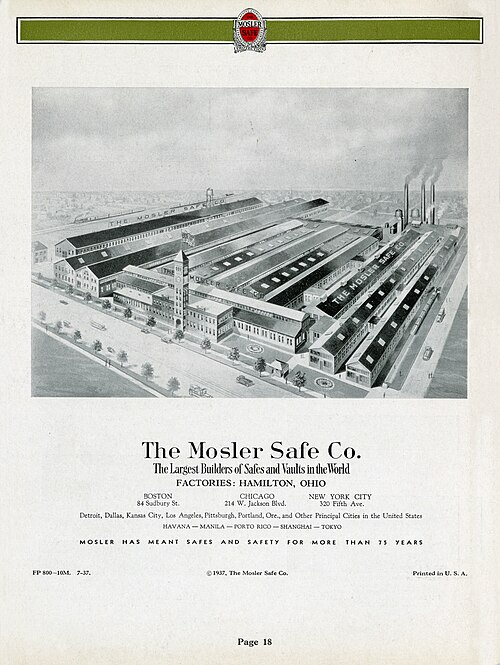

Almost everything known about Feynman the safecracker comes from Feynman.
He told the stories to Charles Weiner in 1966, to an audience at Santa
Barbara in 1975, and in the chapter "Safecracker Meets Safecracker" of
_"Surely You're Joking, Mr. Feynman!"_ (1985), and they grew in the
telling. What can be checked is that he really did take up locks at Los
Alamos: in April 1945 he wrote to Arline that his interest was probably
because he liked puzzles so much, and that each lock was "just like a
puzzle you have to open without forcing it."

## Padlocks and wooden drawers

He had learned to pick ordinary pin-tumbler locks at Princeton, he said,
from a fellow graduate student, Leo Lavatelli. At the start of Los Alamos
the most secret papers in the world were kept, for want of anything
better, in wooden filing cabinets closed with a padlock on a bar through
the handles. He found he did not even need to pick the padlock: tip a
cabinet back, and the papers could be pulled out through a gap under the
bottom drawer. He kept demonstrating it, by quietly borrowing reports, to
get better cabinets bought.

The best of the stories is about **Edward Teller**, and it is the same in
1966 and 1975. At a meeting on security Teller said he kept his important
papers in his desk drawer instead. Feynman slipped out before the end,
found that he could reach under the back of the drawer and draw the papers
out one after another, emptied it, and caught Teller up in the corridor
asking to see the drawer. Teller opened it, saw it empty, and said at once
that Feynman had seen it already. It was no fun, Feynman complained,
fooling a man that quick.

## Twenty numbers a wheel

The new cabinets had a combination lock on the top drawer, made, in his
1966 account, by the **Mosler Safe Company**. Behind the dial are three
wheels, each with a notch, the _gate_. Dialling the right three numbers
lines up the gates so that a bar, the _fence_, can drop into them; the
plate draws the dial and the wheel pack. This design gave no click or give
to feel for, because the fence did not touch the wheels until the dial was
turned back to 10 at the end.

He spent, he said, about two years on it, and found three things.

| What he found                                                      | What it gave him                          |
| ------------------------------------------------------------------ | ----------------------------------------- |
| A number within 2 of the right one still works                     | 20 numbers a wheel to try, not 100        |
| Wheels can be set without disturbing the others                    | all 20 × 20 × 20 = 8,000 in about 8 hours |
| With the drawer open, the last two numbers can be read off by feel | only 20 tries left: minutes               |

The third was the one that made his name. Leaning on a colleague's open
cabinet during a conversation, fiddling idly with the dial, he would take
the last two numbers, write them down later, and keep a list. When a
document was needed from a safe whose owner was away, he would go for his
"tools", really to look up the list, shut himself in, and sit reading for
twenty minutes or so before emerging, so that no one would think it easy.

## The safes of Oak Ridge, and after

On his trips to **Oak Ridge** he opened, by his account, a manager's safe
on a Sunday when only an absent secretary knew the combination, using two
numbers he had half remembered from a visit weeks before, and a colonel's
big double-doored safe, whose lock turned out to be the same mechanism as
the cabinets', in seven minutes while the colonel read a magazine. After
the war, back at Los Alamos in 1946 to finish some papers, he opened the
filing cabinets of **Frederic de Hoffmann**, which held a copy of every
document in the laboratory's library, by guessing that a physicist would
use a mathematical constant: π failed, but _e_, 27-18-28, worked. All of
de Hoffmann's cabinets had the same combination.

Others did notice at the time. When Klaus Fuchs was later asked who at Los
Alamos might be a spy, he pointed to Feynman's safecracking and his
frequent trips to Albuquerque. Feynman's own point, in every telling, was
that security was only as good as its locks and the people using them;
Mosler, he told Weiner, brought out a new design after the war on which
his method would not work.

His trips to Oak Ridge had a more serious purpose, and they are the
trail's last frame.
