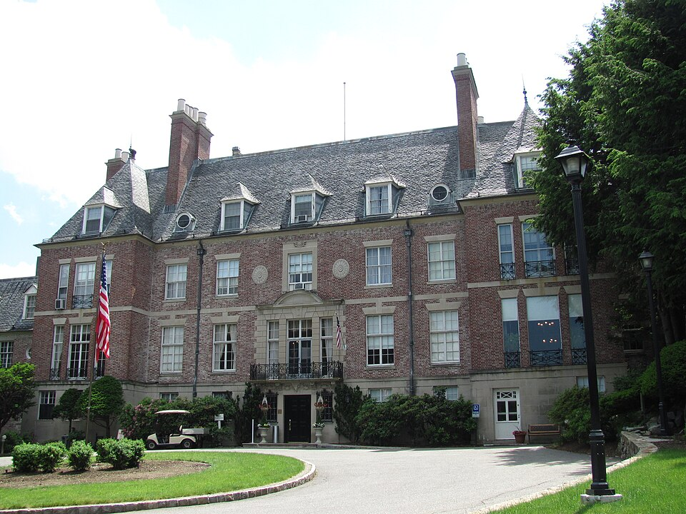

In May 1981 about fifty physicists and computer scientists spent three
days at **Endicott House**, MIT's conference centre in a mansion in
Dedham, Massachusetts, at a meeting called the **Physics of
Computation**. It was organised by **Ed Fredkin** of MIT, **Rolf
Landauer** of IBM and **Tommaso Toffoli**, and its question was what the
laws of physics allow a computer to do. Feynman gave the keynote. His
talk, printed the next year as **"Simulating Physics with Computers"** in
the _International Journal of Theoretical Physics_, is now read as the
founding statement of quantum simulation.

## The rules of the game

Feynman set himself a strict question. Not whether a computer could
approximate nature, which people did every day, but whether it could
imitate nature exactly, with a machine whose size grows only in
proportion to the piece of the world it imitates. Double the volume of
space and time, and the computer may double; if it must grow
exponentially, he said, that is against the rules.

Classical physics can pass, if space and time are made discrete. Quantum
mechanics cannot, and the reason is bookkeeping. A quantum system of many
parts is described by an amplitude for every possible arrangement of all
the parts at once. For a row of spins, each up or down, that is two
numbers for one spin, four for two, and 2ᴺ for _N_. A computer that
stores them all grows exponentially with the system. The chart does the
arithmetic, at 16 bytes an amplitude.

| Spins | Amplitudes  | Memory at 16 bytes each |
| ----- | ----------- | ----------------------- |
| 10    | 1,024       | 16 kilobytes            |
| 20    | 1.05 × 10⁶  | 17 megabytes            |
| 30    | 1.07 × 10⁹  | 17 gigabytes            |
| 40    | 1.10 × 10¹² | 18 terabytes            |
| 50    | 1.13 × 10¹⁵ | 18 petabytes            |
| 60    | 1.15 × 10¹⁸ | 18 exabytes             |

The numbers are this frame's worked example, not Feynman's; his point was
the shape of the curve. Each added spin doubles the bill.

## Why not fake it with dice?

Could a computer that uses randomness do better, by imitating the
probabilities rather than storing them? Feynman showed why not, with the
argument the plate draws. Two photons fly apart from one atom, and two
observers measure each one's polarization with a calcite crystal at some
angle. Quantum mechanics predicts, and experiments had confirmed, that if
the crystals are 30° apart the observers get the same answer three
quarters of the time: cos² 30°.

Now suppose each photon carries its answers with it, fixed in advance for
every angle, so that a local machine could simulate it. Feynman took six
angles, 30° apart, and marked each O or E. Whatever the pattern, the
chance that neighbouring angles agree can never exceed two thirds. Three
quarters is more than two thirds, and no local classical machine can make
up the difference. He had squeezed the strangeness of quantum mechanics,
he said, into one number being bigger than another. It is, in effect,
John Bell's theorem of 1964, which the talk does not name.

## Let the computer be quantum

His answer was to change the computer. Build it from quantum parts that
obey quantum laws, and it could imitate any quantum system, as lattices of
spins in a crystal already imitate the particles of a field theory. He
asked what a _universal quantum simulator_ would be, and ended with the
line people still quote: nature isn't classical, and a simulation of it
had better be quantum mechanical.

He was not the first to think of quantum computing. **Paul Benioff** had
described a quantum-mechanical Turing machine in 1980, and spoke at the
same meeting, and **Yuri Manin** had suggested the idea in Russian the
same year. What Feynman added was the reason to want one: a job
classical machines cannot do without an exponential cost.

The trail **Computing** follows what came next: his course at Caltech on
computation, his summers building a parallel computer, the design of a
quantum computer he published in 1985, and the machines of today.
