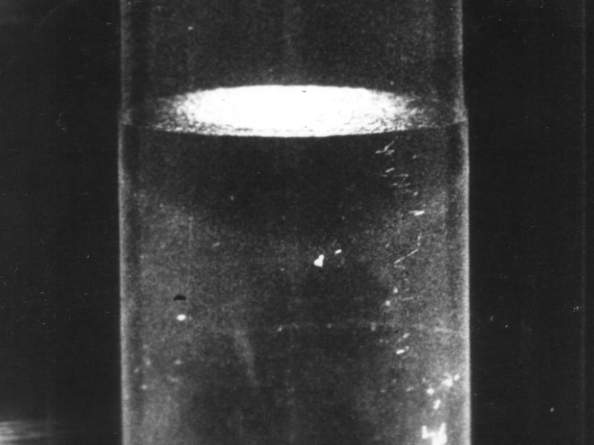

Cooled below about 2.2 kelvin, liquid helium turns into something no other
liquid is. It stops boiling, flows through cracks too fine for any other
fluid, creeps up the walls of its container and conducts heat almost
perfectly. By 1950 there were two ways of describing this **superfluid**.
Fritz London and László Tisza traced it to quantum statistics: helium-4
atoms are bosons, and an ideal gas of bosons condenses into a single
quantum state. Lev Landau built a two-fluid theory around the liquid's
excitations, sound waves called _phonons_ and something heavier he called
_rotons_, with a curve of energy against momentum fitted to the data. What
nobody had done was show how that curve followed from the atoms. From
1953 Feynman did, in a run of papers he later counted among the
work he enjoyed most.

## A method in search of a problem

He came to helium sideways. As he told Charles Weiner in 1966, a visiting
lecturer had been presenting Lars Onsager's exact solution of a model magnet,
and Feynman, as he did with every new problem, tried his path integrals on
it. He got muddled, found a mistake, and saw that the method might suit
helium better. His first paper, in 1953, argued that a liquid of bosons
must have a transition much as the ideal gas does. He believed he was
arguing against Landau; in fact, he learned, the field had already come
round to statistics while he was not reading.

The harder question was why the only excitations of low energy are
phonons. He reasoned it out with almost no equations, by picturing how the
wave function of billions of atoms could change, standing, he remembered,
at the kitchen sink. Then he needed the next excitation up. He found it in
Rio, on a later trip there with his new wife, walking back to his hotel
after trying to explain the problem to Leite Lopes.

## One curve

The 1954 paper gives the result in one line. If an excitation of wave
number _k_ is the ground state with each atom given a phase, its energy is
_E_(_k_) = _ħ_²_k_²/2_mS_(_k_): the energy of a free helium atom, divided by
the liquid's **structure factor** _S_(_k_), the quantity X-ray and neutron
diffraction measure. At small _k_, _S_ rises in proportion to _k_ and the
energy is a straight line, the phonons. Near 2 per ångström _S_ has a peak,
the ring in a liquid's diffraction pattern, and dividing by the peak cuts a
dip in the energy: Landau's rotons, on the same curve as the phonons. The
plate draws the two curves one above the other; its _S_(_k_) is a smooth
model with the right shape, not the measured function.

The way he got there is one of his favourite stories. His first guess at
_S_(_k_) had no peak, and the specific heat came out wrong. Sure of his
reasoning, he worked backwards from the experiment to the function he
needed, found it must rise to a peak, and recognised the peak as the
diffraction ring. Only then did he remember someone telling him about
Landau's roton formula.

The number was less good than the shape. His 1954 estimate of the roton's
minimum energy was about twice what the thermodynamic data required. His
student **Michael Cohen** improved the wave function, letting the atoms
around a moving one flow back like a smoke ring, and brought the estimate
much closer. Cohen and Feynman then proposed measuring the curve directly
by scattering slow neutrons from the liquid, and within a few years
neutron experiments had traced it.

| Estimate                       | Roton energy gap Δ |
| ------------------------------ | ------------------ |
| Feynman, 1954                  | 19.1 K             |
| Feynman and Cohen, 1956        | 11.5 K             |
| Required by thermodynamic data | 9.6 K              |

## Vortex lines

One puzzle remained. His theory said the superfluid could flow without any
friction far faster than it really does, so something must break the flow,
and his wave functions could not rotate. Lying awake, he imagined the
liquid moving on one side of a thin sheet and still on the other, then
pulled the sheet away. The phases could only be stitched together along
thin lines, with the phase turning by a whole 2π around each: **quantised
vortex lines**, each carrying a circulation of _h_/_m_, about 10⁻⁷ square
metres per second for helium. He published it in 1955 and then found that
Onsager had said the same in a remark at a conference in 1949, and had
hardly published it. In 1961 W. F. Vinen detected single quanta of
circulation. The lambda transition itself, how exactly the liquid tips over
at 2.2 K, he never solved.

By 1957 he had turned from the liquid to a different puzzle, a law of
nature that seemed to tell left from right: the **weak force**.
