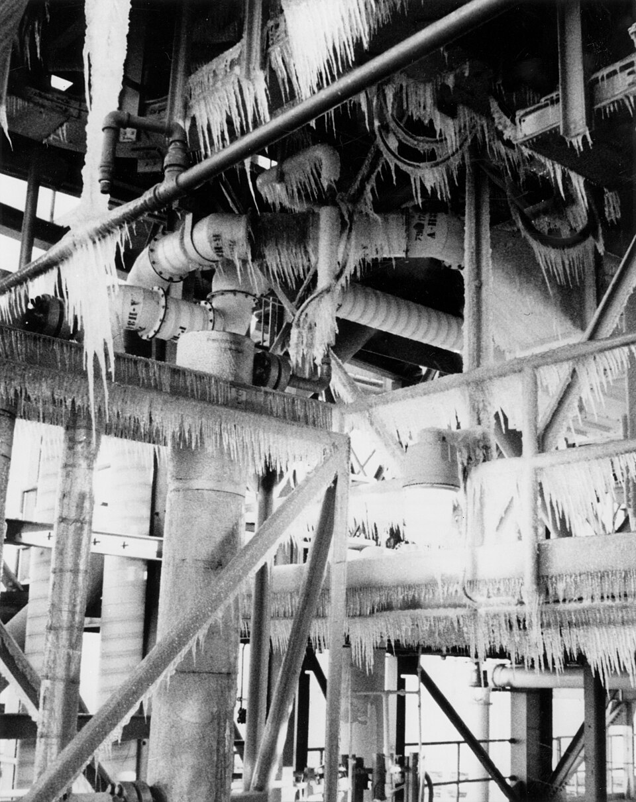

The commission learned on 10 February, in a closed session, what had
happened the night before the launch. **Allan McDonald**, Morton Thiokol's
man at Kennedy, told it that his company's engineers had recommended
against flying. Over the next weeks the commission took testimony from
nearly everyone on the call, and its report sets the evening out hour by
hour. What follows is from that report and its transcripts.

## An evening in three places

On the afternoon of 27 January 1986, with the launch put off a day by high
winds, the forecast for the next morning at the Cape fell to as low as
18°F. At Thiokol's plant at **Wasatch**, in Utah, engineers who had been working
on the eroding O-rings met and were, one of them testified, adamant:
that was far below anything the joint had flown at or been qualified for.

A first telephone conference with NASA's **Marshall Space Flight Center**,
in Huntsville, Alabama, began at about 5:45 p.m. Eastern time. Thiokol
faxed its charts, and at 8:45 a second conference opened, linking about
thirty-four people at Wasatch, Marshall and Kennedy. The plate places the
three ends of the line by latitude and longitude, and sweeps the call's
two and a half hours on a clock.

**Roger Boisjoly** presented the evidence: the flight of January 1985, the
coldest before, whose joints had come back with jet-black soot between the
rings. His vice president of engineering, **Robert Lund**, gave Thiokol's
recommendation: do not launch with the O-rings colder than 53°F, the
coldest they had flown at. NASA's booster manager, **Lawrence Mulloy**,
objected that this was a new launch rule invented on the eve of a launch;
by his own account he asked whether Thiokol wanted him to wait until
April. **George Hardy**, Marshall's deputy director of science and
engineering, said he was appalled by the recommendation, and also that he
would not launch against the contractor's advice.

## Taking off the engineering hat

Thiokol asked for five minutes off the line. The caucus in Utah lasted
about half an hour. Boisjoly and **Arnold Thompson**, who supervised the
rocket's cases, argued on: Thompson walked up the table and sketched the
joint again in front of the managers, and Boisjoly laid out the photographs
of the soot. Neither, Boisjoly testified, could get anyone to listen. Then
the senior vice president, **Jerald Mason**, said a management decision was
needed, and turned to Lund. Boisjoly told the commission that Mason asked
Lund "to take off his engineering hat and put on his management hat".
The decision was made by four senior managers alone. At about 11 p.m. Thiokol came back on the line
and recommended launch, the data on temperature being, it now said,
inconclusive. McDonald, at Kennedy, went on arguing for delay; the written
recommendation was faxed at about 11:45 over the signature of **Joe
Kilminster**, Thiokol's vice president for the booster program.

Overnight, an ice crew found icicles all over the launch tower. The air was 36°F at lift-off
at 11:38, and the commission estimated the coldest point of the right aft
joint at about 28°F. The people who gave the final word that morning had
not been told of Thiokol's first recommendation or of its engineers'
continued opposition.

## The chart nobody drew

At the meeting the managers' strongest argument was that temperature did
not explain the damage: one flight at 75°F had come back with blow-by too.
That is true if one looks only at the flights that had trouble. The
commission looked at all twenty-four flights before Challenger, and found
the pattern plain.

| O-ring temperature at launch | Flights | With O-ring distress | Share |
| ---------------------------- | ------: | -------------------: | ----: |
| 66°F or warmer               |      20 |                    3 |   15% |
| 63°F or colder               |       4 |                    4 |  100% |
| Challenger, about 28°F       |       1 |                      |       |

The commission concluded that Thiokol's management had reversed its
position at Marshall's urging, against its own engineers, to accommodate a
major customer. Feynman heard Lund explain the change of hats at a later
hearing and questioned him about probability, and afterwards, by his own
account, felt he had been too hard on a man whose career lay on the table
in front of him. The numbers were his question, and the next frame is the
answer he found.
