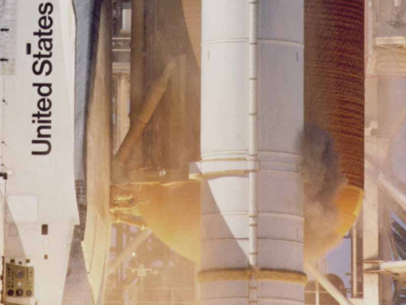

Each of the shuttle's two **solid rocket boosters** was a steel tube twelve
feet across, built by **Morton Thiokol** in Utah in four segments, shipped
by rail and stacked at Kennedy. That made three **field joints** in each
booster, and every one of them had to hold in burning gas at around 900 pounds per
square inch for two minutes. The commission's
first finding was that one of them, the aft field joint of the right
booster, had not.

## Tang, clevis and two rings

The joint is a plug in a socket. The bottom of the upper segment ends in a
_tang_, a lip that slides down into a U-shaped channel, the _clevis_, cut
into the top of the segment below. Steel pins through the outer leg of the
clevis and the tang hold the two together. The seal was two rubber
**O-rings**, 0.280 inches thick, sitting in grooves in the clevis's inner
leg and pressed against the tang. Inboard of them, zinc chromate **putty**
filled the gap in the rocket's insulation.

The designers expected the seal to work by pressure. When the motor lit,
gas would push the putty ahead of it, squeeze the air behind it, and drive
the primary O-ring into the gap it guarded, sealing it tighter. The plate
draws the joint in section, roughly to scale, with that gas path: through
the putty, to the ring.

## Joint rotation

The trouble was found before the shuttle ever flew. In a 1977 test, with
a case pressurised by water, the joint bent: the case wall bulged outward
more than the stiffer joint, the tang and clevis rotated relative to each
other, and the gap the O-rings sealed opened instead of closing. The
commission's analysis put the opening at about 0.029 inches at the primary
ring of an aft joint, complete about six-tenths of a second after
ignition. The
plate draws it enlarged: the inner leg swung away, and the gap between.
To seal, the rubber had to spring out and follow the moving metal faster
than the gap opened. Thiokol's engineers thought that acceptable; engineers
at NASA's **Marshall Space Flight Center**, which managed the boosters,
wrote memos from 1977 into 1979 calling the design unacceptable.

It flew. In November 1980 NASA listed the joint as _Criticality 1R_,
meaning a failure could lose the vehicle but a second ring backed up the
first. In December 1982, accepting that rotation could unseat the second
ring, it changed the listing to _Criticality 1_: no backup. Nothing about
the joint changed.

## Flight after flight

After the second shuttle flight, in November 1981, a primary ring came
back eroded by hot gas, 0.053 inches deep, the worst field-joint erosion
ever found. From 1984 erosion and _blow-by_, soot driven past the primary
ring, turned up more and more often. One cause was the test meant to check
the seals: raising the leak-check pressure to 200 pounds per square inch
blew holes in the putty through which gas could jet at the rings.

| Leak-check pressure | Flights | Field-joint O-ring anomalies |
| ------------------- | ------: | ---------------------------: |
| 50 psi              |       7 |                          14% |
| 100 psi             |       2 |                           0% |
| 200 psi             |      15 |                          56% |

In January 1985 flight 51-C launched after the coldest night yet, with its
O-rings at about 53°F, and came back with black soot behind a primary ring
and heat damage on a secondary, the first time a second ring had been
touched. In April, on flight 51-B, a primary ring in a nozzle joint never
sealed at all, and the secondary behind it eroded. Marshall declared a
_launch constraint_ on the problem and then waived it for every flight
that followed. That July, Thiokol's **Roger Boisjoly** warned his vice
president of engineering that if a field joint failed the result would be
"a catastrophe of the highest order".

## Seventy-three seconds

At lift-off on 28 January 1986, cameras filmed puffs of black smoke from the
right booster's aft field joint from 0.678 to 2.5 seconds after
ignition, about three puffs a second. Burnt rubber and oxides then
seem to have plugged the gap for a while. At about 58 seconds a flame
appeared at the same place. It burned into the strut holding the booster
to the tank and into the tank itself, and at 73 seconds the vehicle broke
up.

Thiokol's engineers had watched the joint for years and knew the cold made
it worse. The night before the launch they said so, and the next frame is
that telephone call.
