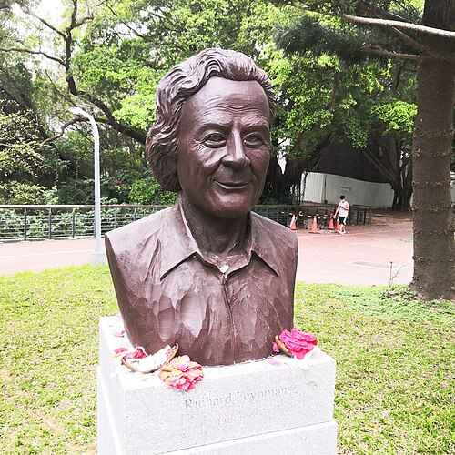

When Feynman died, most Americans knew him from two things: the glass of ice water at the Challenger hearings, and a bestselling book of stories. Both were still new. The public Feynman grew after his death, and it grew mostly out of his own voice: films of him talking, books of his talk, then plays and films about him, and a cloud of sayings that he never said. The making of the memoirs themselves belongs to the frame _Surely you're joking_; this one follows what was built on them.

## Made from his own voice

The first piece came before the books. In 1981 **Christopher Sykes** filmed him for the BBC's _Horizon_ talking about his father, Los Alamos, the Nobel Prize and why he did physics. _The Pleasure of Finding Things Out_ was broadcast in 1981 and later shown in America on _Nova_, and its transcript opens the 1999 collection of the same name. The two memoirs followed in 1985 and 1988.

After his death the biographers came, and they faced the stories first. **James Gleick**, whose _Genius_ appeared in 1992, said he had tried not to lean on the Leighton books too heavily: they were, in his words, "mostly accurate, but strongly filtered." The physicist Philip Anderson praised the book for getting past the "self-created legend". Jagdish Mehra's _The Beat of a Different Drum_ (1994) did the same for the physics.

| Year | Work                                                                 | Built from                      |
| ---- | -------------------------------------------------------------------- | ------------------------------- |
| 1981 | _The Pleasure of Finding Things Out_, BBC _Horizon_                  | an interview on film            |
| 1992 | _Genius_, by James Gleick                                            | interviews, papers, archives    |
| 1996 | _Infinity_, a film directed by and starring Matthew Broderick        | the two memoirs                 |
| 2001 | _QED_, a play by Peter Parnell, with Alan Alda as Feynman            | the memoirs; a day in June 1986 |
| 2009 | The 1964 Messenger Lectures put online by Bill Gates as Project Tuva | the BBC's films of the lectures |
| 2023 | _Oppenheimer_, with Jack Quaid as the young Feynman at Los Alamos    | a biography of Oppenheimer      |

_Infinity_ was written by Broderick's mother, Patricia, from the memoirs, and follows the story of Arline. _QED_ put Alda on the stage of the Mark Taper Forum and then Broadway as Feynman on one day in his office, talking to the audience about safecracking, drawing, Tuva and the cancer. The legend was now performed by other people, in his own words.

## Words he never said

A famous name attracts sayings. Some that are credited to Feynman are his; several are not, and a few he could not have said.

| The saying                                                                         | Where it comes from                                                                                                                |
| ---------------------------------------------------------------------------------- | ---------------------------------------------------------------------------------------------------------------------------------- |
| "Shut up and calculate!"                                                           | N. David Mermin, in _Physics Today_ in 1989. He traced it back to himself in 2004.                                                 |
| "The philosophy of science is as useful to scientists as ornithology is to birds." | No known author. Steven Weinberg quoted it anonymously in 1987; the philosopher Philip Kitcher first linked it to Feynman in 1998. |
| "Physics is like sex: sure, it may give some practical results …"                  | Found in no book of his or about him; the earliest print anyone has found is from 2000.                                            |
| "If you think you understand quantum mechanics, you don't understand it."          | A paraphrase. What he said, in 1964, was that he could safely say nobody understands quantum mechanics.                            |
| "What I cannot create, I do not understand."                                       | His: it was on his blackboard when he died.                                                                                        |

The plate draws two of them, and the study method below, as lines of descent along the years. None of the three was pinned to him while he was alive to deny it.

The **Feynman technique** is a four-step study method: choose an idea, explain it in plain words as if to a beginner, go back to the source wherever the explanation stumbles, and simplify. It is widely taught under his name. He never described it. The name comes from a video by the learning writer **Scott Young**, posted in September 2011 for a free email course, twenty-three years after Feynman's death. It draws on habits Feynman really had, such as rebuilding a subject for himself, but the method and its steps are Young's.

## The reckoning

The memoirs also told stories about women, and they were told as jokes. In _"Surely You're Joking"_ he describes learning, in a bar, to treat women with contempt as a way of getting them into bed; pretending to be an undergraduate at Cornell to take out students; and doing his work and holding meetings in a strip club. His second marriage ended in 1956 in a divorce granted for "extreme cruelty". The _Los Angeles Times_ said in its obituary that he spent almost as much energy on his image as a womaniser as on physics.

In July 2014 an argument over this broke out among science writers. The physicist **Matthew Francis** wrote that the facts were against the usual excuses, and that his behaviour had been passed around as a quirk. **Ashutosh Jogalekar**, in a _Scientific American_ blog post that the magazine removed, restored and has since removed again (it survives on his own blog), answered that Feynman was no more sexist than most men of his time and place, and that the anecdotes were cherry-picked: he championed his sister Joan's career in astrophysics, his letters to women show no bias, and he supported a woman professor's discrimination case at Caltech. In January 2019, after the centenary, **Leila McNeill** wrote that he had "built his bad behavior into his own genius mythos".

The two sides agree on the facts, which come mostly from his own books; they disagree about what the facts weigh. Francis's own conclusion was short: "Don't worship — understand." What survives of Feynman beyond the stories is the physics and the teaching, and that is the frame _Legacy_.
