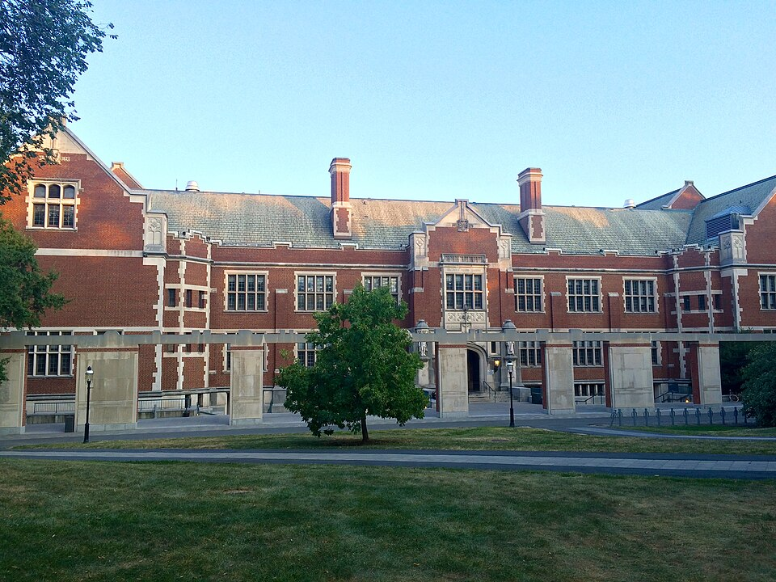

Feynman's doctoral thesis, "The Principle of Least Action in Quantum Mechanics", was written in a few weeks in the first half of 1942, on leave from a war project, by a student who thought the most useful part of it hardly counted. He received his PhD from Princeton that June, at twenty-four. The thesis sat almost unread for sixty years, but the method in it became the path integral, one of the standard ways of doing quantum physics.

## A theory with no Hamiltonian

The absorber theory had left him with a classical electrodynamics written as a single principle of least action, with particles and no fields. The next step was to make a quantum theory of it, and the textbook recipe would not work. Every route from classical to quantum mechanics then began with the _Hamiltonian_, the energy written in terms of positions and momenta at one instant, from which the Schrödinger equation tells how the wave function changes to the next instant. Feynman's action coupled the position of one charge at one moment to the positions of another at different moments, earlier and later, along light cones. The plate draws two such charges: each moment on one world line is tied to two moments on the other, and no single slice of time holds enough to predict the next. Put back a field and the Hamiltonian returns, but getting rid of the field had been the point.

| The usual view                                  | The action view Feynman wanted                    |
| ----------------------------------------------- | ------------------------------------------------- |
| The state at one instant fixes the next instant | A property of the whole path fixes the motion     |
| A differential equation, and a Hamiltonian      | A principle of least action                       |
| A delay needs a field to remember the past      | A delay is just two different times in the action |

He tried models first, two harmonic oscillators coupled with a delay, and could quantise those, but they were too simple to show the general rule.

## A beer at the Nassau Tavern

The key came from **Herbert Jehle**, newly arrived from Europe, who sat down beside him at a beer party in the Nassau Tavern and, asked whether he knew any way to get quantum mechanics from an action, pointed him to a 1933 paper by **Paul Dirac**, "The Lagrangian in Quantum Mechanics". The next day, in a small room in the Princeton library, Feynman turned Dirac's remark that two quantities were _analogous_ into a statement that they were proportional, and got the Schrödinger equation out of it on the blackboard while Jehle copied it down. How that became a sum over every path a particle might take is the story of the trail that begins here.

## Into the drawer, and out again

With the new method he could write the quantum mechanics of slowly moving charges interacting with delays. He could not make it work for relativistic electrons, and when he checked energy in the delayed case, as Wheeler had trained him to, he ran into difficulties he could not resolve. Then Robert Wilson's isotron project took him over, and the work went into a drawer.

Wheeler told him that the new formulation of ordinary quantum mechanics was a thesis in itself. Feynman disagreed. It was only equivalent to what everyone already knew, he felt; the contribution would be the electrodynamics. But he knew from experience that half-analysed research is unreadable later unless it is written down, so he asked for leave from the war work, a few weeks, and got it. By his own account he spent the first days lying on the grass looking at the sky, feeling guilty, and then began to think, and thought he had straightened out the difficulties. He wrote it up for Wheeler and Wigner, and passed.

Later he found that the generalisations in the thesis were probably wrong as written. The parts that were right, the least-action formulation of ordinary quantum mechanics, he published after the war as "Space-Time Approach to Non-Relativistic Quantum Mechanics" in _Reviews of Modern Physics_ in 1948. The thesis itself was available only on microfilm; he told Weiner in 1966 that for years he could not get a copy of his own. It was finally printed in 2005, edited by his former student **Laurie Brown**, as _Feynman's Thesis: A New Approach to Quantum Theory_.

His parents came to the commencement in June 1942. Before the month was out he married Arline Greenbaum.

The trail _Sum over histories_ follows the idea from Dirac's hint to the path integral and what physicists do with it now, starting from the principle of least action itself.
