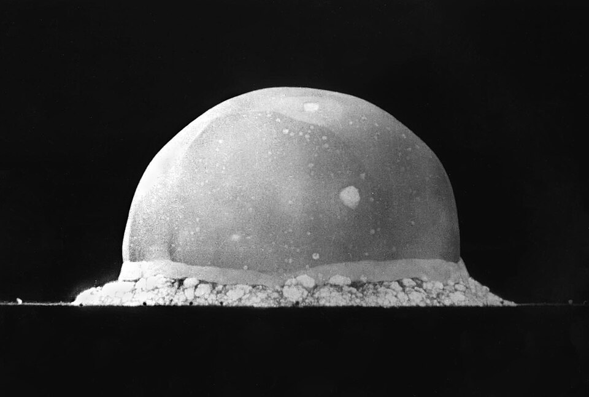
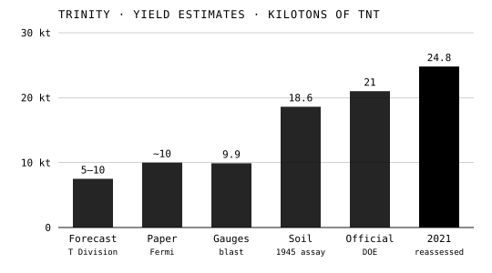

At 5:29 in the morning of 16 July 1945, on the desert floor of the
Jornada del Muerto in southern New Mexico, Los Alamos set off the first
nuclear explosion, a plutonium implosion device called the Gadget, on top
of a hundred-foot steel tower. The test was named **Trinity**. Feynman
watched it from twenty miles away, and his account of what he saw is one
of the best known.

## Called back

After Arline's death, and once his IBM group had finished, against the
clock, its calculation of the energy the tested design should release, he
was sent home to New York for a short rest. Hans Bethe had
promised to warn him, and a telegram came saying that "the baby is
expected" on a certain day. He flew back, reached the laboratory as the
buses were leaving, and went straight out without changing his clothes.

The observers were spread out by rank and job. The men who ran the test
sat in three shelters 10,000 yards from the tower; General Groves and his
visitors watched from base camp, about ten miles south; many
of the scientists were taken to **Compania Hill**, twenty miles to the
north-west. Feynman put himself twenty miles off, on a mountainside, which
fits Compania Hill, though he did not name it. The plate draws the site in plan, with the time
the sound took to reach each post.

## A truck windshield

Everyone at the hill was given dark glass. Feynman reasoned that at twenty
miles the light could not hurt him, only the ultraviolet, and that glass
stops ultraviolet, so he got into the cab of a truck and watched through the
windshield. The flash made him duck, and he saw a purple blot on the floor
of the truck: an after-image. Looking back, he saw the light go from white
to yellow to orange, clouds form and vanish as the shock passed through the
air, and an orange ball rise and blacken at its edges, with a purple glow
around it that did not move when he moved his eyes.

Then, after a silence of about a minute and a half, came a sharp crack and
a long rumble. That, he said, was what convinced him. The arithmetic bears
his memory out. Sound in air travels at about 340 metres a second, and
twenty miles is 32 kilometres, so the crack should have taken about 95
seconds. The man beside him, the _New York Times_ reporter **William
Laurence**, asked what it was.

He claimed afterwards to be about the only person who looked at the
explosion with the naked eye. It is a claim that others' accounts
undercut: **Ralph Carlisle Smith**, also on Compania Hill, wrote that he
had watched with one eye covered by welder's glass and the other open.

## What it measured

The explosion was far bigger than T Division's forecast. **Enrico Fermi**
dropped scraps of paper as the blast went by and paced out how far they
flew: about ten thousand tons of TNT, he estimated. The radiochemists who
analysed the soil in the crater put it at 18.6 kilotons; the official
figure is 21; and a Los Alamos team using modern mass spectrometry put it
in 2021 at 24.8, give or take 2.

| Estimate                               | Kilotons of TNT |
| -------------------------------------- | --------------- |
| T Division's forecast, before the test | 5–10            |
| Fermi's falling paper                  | about 10        |
| Blast-pressure gauges                  | 9.9             |
| First radiochemical assay, 1945        | 18.6            |
| Official Department of Energy figure   | 21              |
| Los Alamos reassessment, 2021          | 24.8 ± 2        |

## Afterwards

Back on the Hill there were parties. Feynman sat on the end of a jeep
beating a drum. The one person he remembered not celebrating was Robert
Wilson, who had brought him into the project, and who said "It's a
terrible thing that we made." Three weeks later a uranium bomb destroyed
Hiroshima, on 6 August, and a plutonium bomb like the Gadget destroyed
Nagasaki on 9 August. Looking back in 1975, Feynman said that they had all
begun for a good reason and then, in the pleasure of the work, simply
stopped thinking; Wilson was the only one still thinking at that moment.

The reckoning came later, in his telling. In 1966 and again in 1975 he
described sitting in a New York restaurant working out how far the damage
at Hiroshima had reached and which streets it would cover, and thinking
people foolish for building bridges and roads that would soon be
destroyed. In 1966 he tied the feeling to Arline's death, and to a sense
that nothing lasted. He left Los Alamos in October 1945, one of the first
group leaders to go, for **Cornell**.
