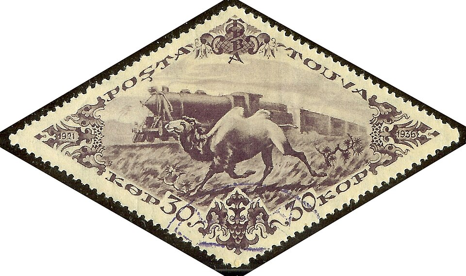

In the summer of 1977, at dinner in his house in Altadena, Feynman asked
his friend **Ralph Leighton**, then a young mathematics teacher, a
geography question: whatever happened to **Tannu Tuva**? Leighton, who
knew Feynman's reputation for pranks, assumed the place was made up. It
was not. Feynman remembered it from his stamp album, a purple patch on the
map north-west of Mongolia, and from a set of stamps shaped like triangles
and diamonds. The question started a quest that lasted the rest of his
life, and it shows, better than any of his physics, what he did for fun.

## A capital spelled K-Y-Z-Y-L

Tuva had been a nominally independent country, the Tuvan People's
Republic, from 1921 until the Soviet Union absorbed it in October 1944.
By 1977 it was an autonomous republic deep inside the USSR, on the upper
Yenisei, closed to almost every Western visitor. When the two men found
that its capital was spelled **Kyzyl**, with no proper vowel in sight,
they decided that any place spelled like that had to be visited.

The stamps he remembered were real. Tuva issued stamps from 1926, in
triangles and diamonds from 1927, and in the mid-1930s a flood of large,
exotic ones that were designed and printed in Moscow and sold abroad to
collectors. Not all of them showed Tuva as it was: the camel racing a
locomotive runs beside a railway Tuva has never had. What followed, as Leighton tells it in _Tuva or Bust!_
(1991), was ten years of letters, phrasebooks, embassies and Soviet
bureaucracy. They learned what Tuvan they could from dictionaries and
phrasebooks, wrote to Kyzyl, and waited months for answers. Leighton founded the
informal **Friends of Tuva** in 1981. And they found the thing Tuva is
now famous for: **throat singing**.

## One voice, two notes

A Tuvan singer holds a low drone and, above it, whistles a clear melody,
both from one throat. The plate draws how. A voice at a steady pitch is a
fundamental and a ladder of harmonics at two, three, four times its
frequency and on up. The singer shapes the mouth and tongue into a sharp
resonance that lifts one harmonic far above the rest; move the tongue and
the resonance slides to the next rung, and the melody steps along the
harmonic series. Singers usually pick out the sixth to the thirteenth
harmonics. The numbers on the plate are an example, not a recording: a
drone of 150 hertz, with the resonance set on the eighth harmonic, at 1,200.

| Year | The quest for Tuva                                               |
| ---- | ---------------------------------------------------------------- |
| 1977 | Dinner in Altadena: "Whatever happened to Tannu Tuva?"           |
| 1981 | Leighton starts Friends of Tuva                                  |
| 1987 | The BBC films the two men for _Horizon_                          |
| 1988 | Feynman dies on 15 February; the Soviet invitation arrives after |
| 1988 | _The Quest for Tannu Tuva_ is broadcast on 4 July                |
| 2009 | His daughter Michelle visits Tuva                                |

The quest ran alongside his cancer, which was diagnosed in 1978, and his
work on the Challenger commission in 1986. The invitation that would have
let him go came only after his death. Accounts differ on how soon after:
the day after, several days, or weeks. Leighton went to Kyzyl without him.
Tuvan singers later came to America, Kongar-ol Ondar among them, and the
Oscar-nominated documentary _Genghis Blues_ (1999), for which Leighton was
an associate producer, followed an American blues singer to Tuva to sing
with them.

## Drums and drawings

Leighton was first of all his drumming partner. They played bongos and
congas together for years, and Leighton recorded Feynman's stories between
the rhythms; those tapes became his memoirs. Feynman had learned samba
percussion in Brazil, and played in the pit for student musicals.

He also drew. In the early 1960s, in his forties, he argued so often with
the Pasadena artist **Jirayr Zorthian** about art and science that they
agreed to swap lessons on alternate Sundays, physics for drawing. By
Feynman's telling, Zorthian learned little physics, while Feynman drew
constantly, took life classes, and sold drawings under the name **Ofey**,
from the French _au fait_, so that nobody would buy them because a
physicist had made them. His daughter collected them in _The Art of
Richard P. Feynman_ (1995).

Meanwhile, at a conference in a Massachusetts mansion in 1981, he gave a
talk that asked what kind of computer could imitate nature.
