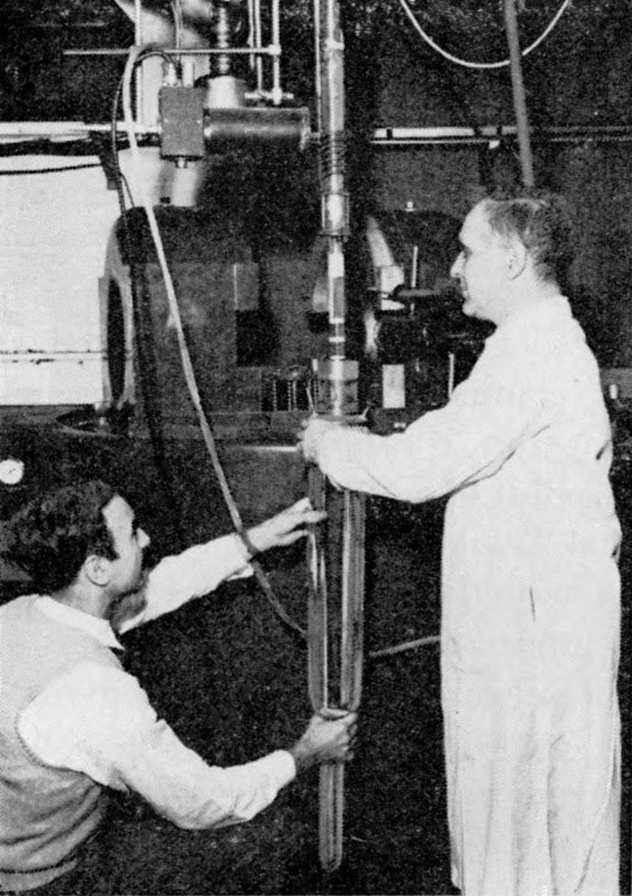
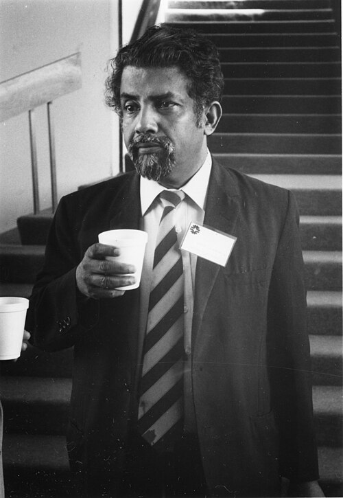

For most of his career [Feynman](kloom:e/richard-feynman) had improved other people's laws. Quantum
electrodynamics, he said in 1966, was essentially the theory of Dirac and
Pauli with better ways of calculating. In the summer of 1957 he found, for
a night or two, a law of nature that he believed nobody else knew, and he
said it fulfilled a long-held dream of finding one. It was not his alone, and how
the credit was shared is still argued over.

## The mirror breaks

The trouble began with two particles, the _theta_ and the _tau_, which had
the same mass but decayed in ways that implied opposite **[parity](kloom:e/parity-physics)**, the
property that tells whether a process looks the same in a mirror. At the
Rochester conference in April 1956 Feynman's room-mate, the experimenter
**Martin Block**, asked him what would go wrong if parity were simply not
conserved. Feynman put the question to the meeting in Block's name; the
proceedings record it. He thought it possible but unlikely, and by his own
account he bet the physicist Norman Ramsey fifty to one against it.

In October 1956 **[Tsung-Dao Lee](kloom:e/tsung-dao-lee)** and **[Chen-Ning Yang](kloom:e/yang-chen-ning)** pointed out that
parity conservation had never been tested in weak decays, and proposed
experiments. **[Chien-Shiung Wu](kloom:e/chien-shiung-wu)** of Columbia did the first, at the National
Bureau of Standards in Washington with Ernest Ambler and his colleagues.
They lined up the spins of cobalt-60 nuclei in a magnetic field at about
0.01 kelvin and counted the electrons of their beta decay. The electrons
came out preferentially opposite the spin. The plate shows why that settles
it: in the mirror image the current in the coil runs the other way, so the
spin points down, but the electrons still go down. The mirror experiment
would give the opposite result, so nature is not mirror symmetric. The
papers of Wu's team and of Richard Garwin, Leon Lederman and Marcel
Weinrich, who saw the same in the decay of pions and muons, appeared
together on 15 February 1957. Lee and Yang had the Nobel Prize that year.

## Vector minus axial

The question now was the form of the [weak force](kloom:e/weak-interaction). At the next Rochester
conference, in April 1957, Feynman stayed with his sister **Joan**, an
astrophysicist in Syracuse, who told him to stop guessing and work through
Lee and Yang's paper step by step. He saw another way to write it, from a
second-order form of the Dirac equation he had used with path integrals,
and proposed it at the meeting. It required the interaction to be a
_vector_ and an _axial vector_ (V and A); the experiments of the day said
_scalar_ and _tensor_. He dropped it.

Back at Caltech that summer the beta-decay experimenters told him the data
were a mess, and that **[Murray Gell-Mann](kloom:e/murray-gell-mann)** thought it might even be vector
after all. That released it, Feynman said. He worked through the night,
found the muon's and the neutron's decay rates agreed with each other to
within 9 per cent, then learned that a new measurement shifted the constant
by 7 per cent; the difference fell to 2. He and Gell-Mann, who had been
circling the same idea, wrote it up together. "Theory of the Fermi
Interaction", received on 16 September 1957, appeared on 1 January 1958.

The paper proposed a universal V − A interaction: the weak force acts only
on left-handed particles. It said, too, that the vector part of the weak
coupling is not altered by the strong force, just as electric charge is
not. It named the experiments it
disagreed with, including one on helium-6, and said they were probably
wrong. Within a few years they had been redone and agreed.

## Two teams, one law

**[George Sudarshan](kloom:e/e-c-george-sudarshan)**, a graduate student at Rochester, and his adviser
**[Robert Marshak](kloom:e/robert-marshak)** had reached V − A by the April 1957 conference, by
Marshak's account, but did not present it. In early July they explained it
at a lunch at Caltech that Gell-Mann attended. Their paper for a conference
at Padua and Venice in late September is dated, like the Feynman–Gell-Mann
preprint, 16 September 1957, but it was published only in the proceedings;
their short letter to the _Physical Review_ appeared in March 1958 and was
long taken for their whole claim. The Feynman–Gell-Mann paper thanks
Marshak and Sudarshan, in Gell-Mann's name, for "valuable discussions".

| Date              | Event                                                |
| ----------------- | ---------------------------------------------------- |
| April 1956        | Block's question at the Rochester conference         |
| 1 October 1956    | Lee and Yang: parity untested in weak decays         |
| 15 February 1957  | Wu and colleagues; Garwin, Lederman and Weinrich     |
| April 1957        | Feynman proposes V and A at Rochester, then drops it |
| Early July 1957   | Sudarshan and Marshak explain V − A at Caltech       |
| 16 September 1957 | Both teams' papers dated                             |
| 1 January 1958    | Feynman and Gell-Mann in the _Physical Review_       |

Feynman did not claim priority. In 1966 he said he had learned only
afterwards that Marshak and others had guessed the law earlier, that the
names attached to it might not match the priorities, and that this was for
historians to judge; the pleasure of the moment was his either way.
Wikipedia reports that in 1963 he credited the discovery to Sudarshan and
Marshak, with himself and Gell-Mann as its publicists. The law itself has
held: it became part of the electroweak theory of the 1960s.

In December 1959, in a lighter mood, he gave a talk to the physicists at
Caltech that took decades to be noticed: **"There's Plenty of Room at the Bottom"**.
