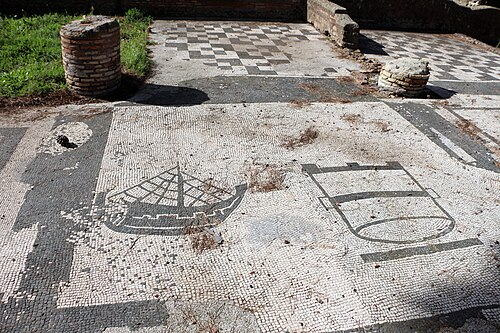

In 123 BC the tribune **[Gaius Gracchus](kloom:e/gaius-gracchus)** carried a law that let every citizen of **[Rome](kloom:e/rome)** buy grain from the state each month at a fixed low price. The historian Appian, writing in Greek nearly three centuries later, called it "the unprecedented suggestion that a monthly distribution of corn should be made to each citizen at the public expense" (Horace White's translation of 1913). A Roman summary of Livy, no friend to Gracchus, lists it among his "ruinous laws" and gives the price, in our translation: "that grain be given to the plebs at six and a third", meaning six and a third asses for each _modius_, and the ration was five _modii_ a month, about 33 kilograms. Gracchus built public granaries to hold it. **[Cicero](kloom:e/cicero)** told how Lucius Piso, who had spoken against the law, came to collect his share; asked why, he said, in C. D. Yonge's translation: "It was against your distributing my goods to every man as you thought proper; but, as you do so, I claim my share."

## From cheap grain to free

Each change of the dole was a political act:

| Year    | Who                         | What changed                                           | On the list                  |
| ------- | --------------------------- | ------------------------------------------------------ | ---------------------------- |
| 123 BC  | Gaius Gracchus              | Five _modii_ a month at a fixed low price              | perhaps 40,000               |
| 58 BC   | Publius Clodius             | The grain made free                                    | about 320,000                |
| 40s BC  | Julius Caesar               | A street-by-street count of who qualified              | 150,000                      |
| 2 BC    | Augustus                    | The list fixed; the emperor in charge of the supply    | "a little more than 200,000" |
| AD 200s | Septimius Severus, Aurelian | Baked bread in place of grain, then oil, salt and pork |                              |

The tribune **[Publius Clodius Pulcher](kloom:e/publius-clodius-pulcher)** made the grain free in 58 BC, the year he drove Cicero into exile. **[Julius Caesar](kloom:e/julius-caesar)**, Suetonius says, "reduced the number of those who received grain at public expense from three hundred and twenty thousand to one hundred and fifty thousand", with the landlords of tenement blocks helping to list who qualified. **[Augustus](kloom:e/augustus)** wrote in the **[_Res Gestae Divi Augusti_](kloom:e/res-gestae-divi-augusti)** that "at a time of the greatest scarcity of grain" in 22 BC he took charge of the supply and freed the people "within a few days" from danger, and he counted the recipients in 2 BC. He set a prefect over the supply, the _praefectus annonae_, and the whole system, the **[_cura annonae_](kloom:e/cura-annonae)**, became the emperor's own duty.

## How the grain came

Rome imported nearly all its grain. Grain came from Sicily, Sardinia, Africa and, after Augustus took Egypt in 30 BC, the Nile. In a speech that the historian **[Josephus](kloom:e/josephus)** wrote for King Agrippa II, Africa fed Rome for eight months of the year and Egypt for four. The ships were privately owned, so emperors bargained for them. After a scarcity in which a mob pelted **[Claudius](kloom:e/claudius)** in the Forum "with pieces of bread", Suetonius says, the emperor promised merchants "the certainty of profit by assuming the expense of any loss that they might suffer from storms", and paid bounties to anyone who built a merchant ship. David Kessler and Peter Temin reckon that the city needed 2,000 to 3,000 voyages a year, at about 70 tonnes a ship. The satirist Lucian described a giant, the _Isis_, 55 meters long, the ship drawn in the plate, though historians suspect he exaggerated.

Grain sailed to the Tiber's mouth, to Ostia, now **[Ostia Antica](kloom:e/ostia-antica)**, where merchants and shippers from across the empire kept some sixty offices around one square, each with a black-and-white mosaic before its door, like this one of a ship and a _modius_. Claudius dug a new harbor, **[Portus](kloom:e/portus)**, four kilometers north, and **[Trajan](kloom:e/trajan)** added an inner basin early in the second century, the hexagon of the plate, 358 meters on a side and ringed with warehouses. There the sacks were moved to barges and towed about 30 kilometers up the Tiber to Rome's warehouses, the _horrea_. By the fourth century the city had nearly three hundred of them.

## How much did Rome eat?

No one counted. Estimates rest on a guessed population, about a million at its height, and a guessed diet; Mattingly and Aldrete's figure gives each person about 2,300 calories a day from grain alone:

| Historian             | Grain a year                             | People fed           |
| --------------------- | ---------------------------------------- | -------------------- |
| Geoffrey Rickman      | 40 million _modii_, about 272,000 tonnes | the whole city       |
| Mattingly and Aldrete | 237,000 tonnes, imported                 | 1,000,000            |
| Paul Erdkamp          | at least 150,000 tonnes                  | 750,000 to 1,000,000 |

The dole was only part of this, perhaps 15 to 33 percent of the imports; most grain was sold on the market. Other trades left better records. **[Monte Testaccio](kloom:e/monte-testaccio)**, an artificial hill beside the Tiber, is made of the broken jars of the olive oil shipped to Rome in the second and third centuries, some 53 million of them. Their painted labels record each jar's weight and its inspectors, and some name the prefect of the grain supply as the consignee.

## Bread and circuses

The satirist **[Juvenal](kloom:e/juvenal)**, early in the second century, gave the system its epitaph, in G. G. Ramsay's translation of 1918: the people "that once bestowed commands, consulships, legions and all else, now meddles no more and longs eagerly for just two things—Bread and Games!" Historians read the dole less bitterly than he did. It went to citizens, not to the poor as such, and five _modii_ a month fed two people amply but not a family of three; a plebeian with children still bought grain in the market. What it bought for emperors was quiet in the city, and its failure meant riots, as Claudius learned. When the Vandals took Carthage in 439, the western empire lost most of the grain that fed its old capital.

The next frame turns east, to a granary built to steady prices rather than to feed a city.
