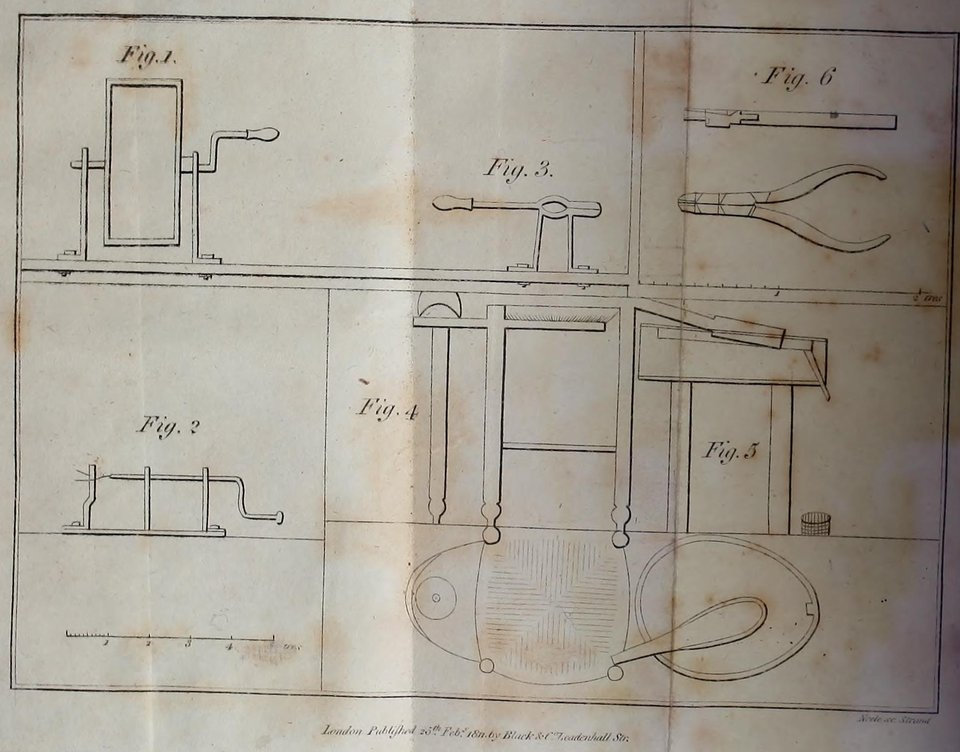

On 30 January 1810 the French minister of the interior, Count Montalivet, wrote to a Paris confectioner named **[Nicolas Appert](kloom:e/nicolas-appert)**. His Board of Arts and Manufactures had examined Appert's process "for the preservation of fruits, vegetables, meat, soup, milk, &c.", and since such food "may be of the utmost utility in Sea-voyages, in hospitals and domestic economy", the minister granted him 12,000 francs. There was one condition: that Appert publish an exact description of the process and send the ministry 200 copies. That spring he did, as _L'Art de conserver, pendant plusieurs années, toutes les substances animales et végétales_, and a London translation followed in 1811.

A story often told, and repeated in encyclopedias, has the French army or **[Napoleon](kloom:e/napoleon)** offer 12,000 francs in 1795 as a prize for a way to feed soldiers. The minister's letter, printed in Appert's book, describes something else: a reward to an inventor who had already succeeded, paid to make his method public.

## The method

Appert had worked for some fifteen years on it, as a confectioner and distiller who knew sugar, syrups and bottles. The Navy had tested his food already: in late 1803 the council of health at Brest reported that his beans and green peas, after three months lying in the roads, "had all the freshness and flavour of recently gathered vegetables." His book reduced the process to four steps, in the translation of 1812:

1. "Inclosing in bottles the substances to be preserved."
2. "Corking the bottles with the utmost care; for it is chiefly on the corking that the success of the process depends."
3. "Submitting these inclosed substances to the action of boiling water in a water-bath (balneum mariae), for a greater or less length of time, according to their nature".
4. "Withdrawing the bottles from the water-bath at the period described."

He used thick glass bottles with wide mouths, corks of the best quality squeezed in a press to soften them and beaten in with a bat, two crossed iron wires twisted over each cork, and a bag around each bottle in case it burst. The plate in his book shows the tools. The bottles stood upright in a boiler, cold water was run in up to their necks, the lid was laid on them and sealed with wet linen, and the fire was lit. Once the bath boiled, it was held there:

| Food                                  | Boiling in the water bath                             |
| ------------------------------------- | ----------------------------------------------------- |
| Pears to be eaten raw                 | Only until the bath boils                             |
| Sorrel, stewed first                  | A quarter of an hour                                  |
| Beef, three-quarters boiled, in broth | One hour                                              |
| Cream, reduced by a fifth             | One hour                                              |
| Small green peas                      | An hour and a half in a cool season, two in a hot one |
| Large green peas                      | Two to two and a half hours                           |

Then the fire was put out, the water drawn off a quarter of an hour later, and the bottles left to cool in the boiler for hours more. He claimed cream kept two years, and sorrel ten.

## Tin

On 25 August 1810 the London merchant **[Peter Durand](kloom:e/peter-durand)** was granted an English patent for preserving food in "bottles or other vessels of glass, pottery, tin, or other metals", sealed, set in cold water and brought to the boil. The invention, the patent says, was "communicated to him by a certain foreigner residing abroad", and research has since named him: the French inventor **[Philippe de Girard](kloom:e/philippe-de-girard)**. Durand sold the patent in 1812 for £1,000, and the engineer **[Bryan Donkin](kloom:e/bryan-donkin)**, with his partners Hall and Gamble, set up a works for **[canning](kloom:e/canning)** at Bermondsey, sealing food in tinned iron. By 1813 they were selling to ships, and the Admiralty became a large customer. The first cans were heavy, and their labels told the owner to cut round the top "with a chisel and hammer". The **[can opener](kloom:e/can-opener)** came decades later: a claw-ended lever in England in 1855, a sickle-bladed one in the United States in 1858, and the cutting wheel in 1870.

## Why it worked, and when it did not

Appert believed that fire had "the peculiar property" of "retarding, for many years at least, if not of destroying, the natural tendency" of food to decay. Why that was so waited on **[Louis Pasteur](kloom:e/louis-pasteur)**'s work on microbes in the 1860s. Heat kills the bacteria and molds in the food, and the seal keeps others out. But not every food gives way at 100 °C. Spores of **[_Clostridium botulinum_](kloom:e/clostridium-botulinum)**, which makes the botulism toxin, survive boiling, and they can grow in a sealed jar of food that is not acidic. So foods with a pH above 4.6, most vegetables, meat and fish among them, are now canned under pressure at 116 to 130 °C. Appert's peas and beef were exactly the foods that need it; his long boiling often worked, but not always.

The tin could poison as well as protect. In 1845 **[Sir John Franklin](kloom:e/john-franklin)** took HMS _Erebus_ and _Terror_ into the Arctic with some 8,000 tins from a supplier, Stephen Goldner, who had won the contract seven weeks before they sailed, and none of the 129 men came back. In the 1980s the anthropologist **[Owen Beattie](kloom:e/owen-beattie)** found high lead in their bones and hair and blamed the solder of the hurriedly made tins. The case is now disputed: K. T. H. Farrer argued that the cans could not have supplied enough lead; William Battersby pointed to the ships' water-distilling system; a re-analysis by Keith Millar and colleagues in 2014 concluded that lead alone did not cause the disaster, though it may have weakened some men; and in 2018 Treena Swanston's team found the crew's bones held no more lead than those of sailors of the same era buried in Antigua.

Why heat preserves, and how gentle it can be, is the subject of the next frame, on pasteurization.
