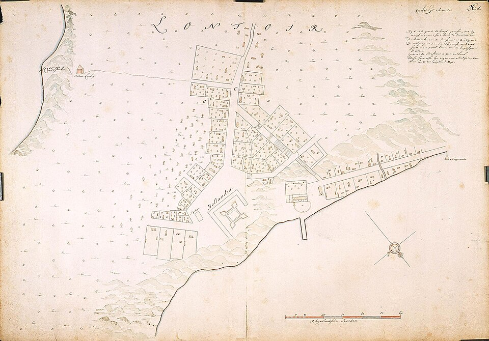

Until the eighteenth century, **[nutmeg](kloom:e/nutmeg)** grew almost nowhere but the **[Banda Islands](kloom:e/banda-islands)**, ten small volcanic islands in the Banda Sea, about 2,000 kilometers east of Java. The tree's fruit, green and six to nine centimeters long, splits when ripe to show a seed wrapped in a red lace, the spice mace; inside the seed's hard shell is the kernel, the nutmeg. The plate draws both. The Bandanese, led by their _orang kaya_, "rich men", sold the spices to Javanese, Malay, Gujarati and later Portuguese traders, and bought the rice and sago their small islands could not grow: they lived by a spice, and bought their food.

## A monopoly by contract

The first Dutch fleet reached Banda in 1599 and bought about 780,000 Amsterdam pounds of nutmeg and 83,000 of mace. In 1602 the Dutch merchants merged into the **[Dutch East India Company](kloom:e/dutch-east-india-company)**, the VOC, with the right to make treaties and wage war in Asia. It made the _orang kaya_ sign contracts to sell to it alone. The Bandanese, the historian Vincent Loth writes, kept trading with others "just as they had always done", since they depended on that trade for food. In 1609 they killed a Dutch admiral and 45 of his men, come to force a fort on them. By 1614 the Company's directors were ready to conquer the islands even if it meant destroying their people. In 1616 the Dutch took the island of Ai; about 400 people, many of them women and children, drowned trying to flee to neighboring **[Run](kloom:e/run-island)**, where English traders were settling.

## 1621

At the end of 1620 the governor-general, **[Jan Pieterszoon Coen](kloom:e/jan-pieterszoon-coen)**, sailed for Banda with 19 ships, 1,655 European and 286 Asian soldiers, among them Japanese mercenaries. In March 1621 they took **[Lonthor](kloom:e/banda-besar)**, the largest island. The _orang kaya_ submitted, but Coen's council judged that the islands would never be safe while their people stayed, and resolved to remove them. Coen reported the result to the directors on 6 May 1621 (in our translation):

> With the ship _Dragon_ we send to Jacatra 789 souls, namely 287 men, 256 women, 246 children. As we understand, about two thousand souls remain in the mountains of the great island of Banda, among them some 600 men. They cannot have much sago for provisions, and the land itself cannot feed them.

He regretted that the ships could not stay long enough to starve them out. Two days later dozens of _orang kaya_ were beheaded by the Japanese mercenaries; accounts give from 24 to 48. Over the following months the Dutch burned villages and boats, and many of those in the mountains died of hunger and disease or threw themselves from the cliffs rather than surrender. A few escaped by boat to the Kei Islands and Seram.

| Number                                             | Source                                     |
| -------------------------------------------------- | ------------------------------------------ |
| About 15,000 Bandanese before the conquest         | Willard Hanna's estimate, followed by Loth |
| About 1,000 left after it                          | Loth, 1995                                 |
| 789 shipped to Jacatra (Batavia), 6 May 1621       | Coen's own letter                          |
| 696 Bandanese on the islands in 1635, 390 enslaved | Governor Gijsels's count, in Miske, 2025   |

All the figures before 1635 are estimates. Historians now widely call the conquest a genocide, among them Frank Dhont and S. J. Miske; in 1943 Dutch writers published defenses of Coen that Loth calls apologetic.

## The perken

The Company then rebuilt production with other people's labor. It divided the nutmeg land into plots, _perken_, handed them to European settlers, the _perkeniers_, and sized each plot in "souls", the slaves needed to work it. The Company sold them enslaved people, at 40 rials each, and rice, and bought their whole harvest at fixed prices: one rial for a _cati_ (about two kilograms) of nutmeg, ten for a _cati_ of mace. The enslaved were brought from India, China and across the archipelago, and in the first decades many died. Surviving Bandanese were set to teach the newcomers; a Company official wrote that the skilled pickers who could tell a ripe fruit from an unripe one were the planters' most valued slaves.

Three harvests a year came in, the largest in July and August. Pickers climbed the trees and pulled the fruit down with long hooks; the husks were cut open with knives and left to rot in heaps, and the mace and nuts were dried and sorted.

Loth argued that the Company turned the groves into neat, intensified orchards. Miske, reading the Company's letters and shipping records, finds the old methods continuing and output no higher: mace exports in 1630–34 averaged about 195,000 pounds a year, below the higher estimates for the years before the conquest and above the lower ones. Stagnation or decline, then, but not a rise.

| Estimate                     | Mace a year, thousand pounds |
| ---------------------------- | ---------------------------- |
| Tomé Pires, c. 1515          | 275–330                      |
| Andrés de Urdaneta, 1537     | 137.5                        |
| Gijsels, before 1621         | 367.5                        |
| VOC exports, 1630–34 average | 195                          |

## Run, Manhattan and the end

On Run the English held out from 1616 to 1620; the Dutch then cut down every nutmeg tree on the island. The **[Treaty of Breda](kloom:e/treaty-of-breda-1667)**, which ended the second Anglo-Dutch war on 31 July 1667, let each side keep what it held: the Dutch kept Run and Suriname, and England kept New Netherland, whose **[New Amsterdam](kloom:e/new-amsterdam)** it had taken in 1664 and renamed New York. The story that Run was swapped for Manhattan is a simplification of that rule.

The Company's hold on this corner of the **[spice trade](kloom:e/spice-trade)** lasted another century. From 1768 **[Pierre Poivre](kloom:e/pierre-poivre)**, intendant of French Mauritius, sent expeditions that brought nutmeg and clove plants out of the **[Moluccas](kloom:e/maluku-islands)**, though the historian Dorit Brixius credits the Malay and Bugis brokers who supplied them. The British, holding Banda during the Napoleonic wars, moved seedlings to Penang, Ceylon and Bencoolen, and from there nutmeg reached Zanzibar and Grenada, whose flag now carries one.

The next frame turns from spice to a drink, coffee, and the coffeehouse.
