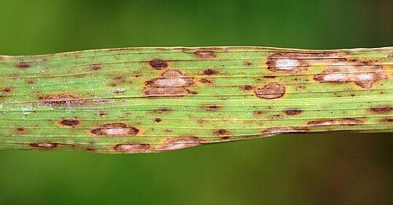

In 1943 between two and three million people died of hunger and the diseases that follow it in Bengal, then a province of the **[British Raj](kloom:e/british-raj)**. The government's own inquiry put the toll at 1.5 million, **[Amartya Sen](kloom:e/amartya-sen)** at about three million; **[Cormac Ó Gráda](kloom:e/cormac-o-grada)** gives 2.1 million as the scholarly consensus. Those who died were the rural poor: landless laborers, fishermen, boatmen and craftsmen. Most landowners and the people of **[Calcutta](kloom:e/kolkata)**, the province's capital, were fed. The **[Bengal famine of 1943](kloom:e/bengal-famine-of-1943)** came without a quota or a decree. It came through prices, in a province at war.

## The war comes to Bengal

Japan took Rangoon in March 1942, and the **[Japanese occupation of Burma](kloom:e/japanese-occupation-of-burma)** cut off the Burmese rice that eastern India bought every year, a small share of Bengal's food but a large one of its margin. Expecting an invasion, the authorities applied a "denial" policy, in the words of the inquiry, "the removal from the coastal districts of Midnapore, Bakarganj, and Khulna of the rice and paddy estimated to be in excess of local requirements", and "the removal of all boats, capable of carrying 10 passengers or more". Some 45,000 boats were taken from a delta whose only roads were rivers. On 16 October 1942 a cyclone and three tidal waves struck the coast of Midnapore, and fungus followed it into the winter rice. That crop, which in an average year fed the province for about 38 weeks, fed it for about 29.

The fungus was brown spot, the disease the photograph shows on a rice leaf. Meanwhile, by a scheme of the Bengal Chamber of Commerce, rice went to workers in Calcutta's war industries, about a million people with their families, at subsidized prices. The wholesale price of rice in Calcutta, about 7 rupees a maund in December 1941, was 14 to 15 rupees in January 1943 and 37 rupees by August.

## Sen's argument

Amartya Sen was nine in 1943, a pupil at Rabindranath Tagore's school at **[Santiniketan](kloom:e/santiniketan)**, and watched the famine from there. He was struck, he later wrote, by "its thoroughly class-dependent character": he "knew of no one in my school or among my friends and relations whose family had experienced the slightest problem". His paper of 1977 and his book _Poverty and Famines_ (1981) turned that memory into an argument. By his reckoning from the official figures, Bengal had about 11 percent more rice and wheat in 1943 than in 1941, a year with no famine. What collapsed was not the supply of food but what Sen called people's _entitlement_ to it: what they could get by selling the one thing they owned. A laborer owns only his work. When the price of rice ran ahead of the wage, a day's work bought less and less rice, and at last too little to live on.

Sen found the evidence in the log books of the farm and dairy at **[Sriniketan](kloom:e/sriniketan)**, beside Santiniketan, where the daily wage of an unskilled laborer had been written down. The plate draws his series:

| Birbhum district | Rice, rupees a seer | Wage, rupees a day | A day's work in rice (Dec 1941 = 100) |
| ---------------- | ------------------: | -----------------: | ------------------------------------: |
| December 1941    |                0.14 |               0.37 |                                   100 |
| November 1942    |                0.31 |               0.31 |                                    38 |
| May 1943         |                0.78 |               0.50 |                                    24 |
| August 1943      |                0.75 |               0.62 |                                    31 |
| December 1943    |                0.33 |               0.69 |                                    79 |

By our arithmetic, a day's wage bought about 2.6 seers of rice, some 2.4 kilograms, in December 1941, and less than two-thirds of a seer, about 600 grams, in May 1943.

## Shortage, policy and blame

The **[Famine Inquiry Commission](kloom:e/famine-inquiry-commission)**, chaired by Sir John Woodhead, reported in May 1945. It found the shortfall amounted to about three weeks' supply, and concluded that "it lay in the power of the Government of Bengal, by bold, resolute and well-conceived measures at the right time to have largely prevented the tragedy of the famine as it actually took place". It wrote, too, that "a million and a half of the poor of Bengal fell victim to circumstances for which they themselves were not responsible."

Every part of this is argued. Plant pathologists and the historian Mark Tauger hold that the brown spot epidemic made the 1942 shortfall far larger than the official estimates, which were guesses made by eye; Ó Gráda accepts Sen's account of entitlements but gives the harvest more weight and hoarding less, and blames a want of political will in Delhi, Calcutta and London: the denial policies, the barriers each province put on its own grain, the refusal to declare a famine. In London, **[Winston Churchill](kloom:e/winston-churchill)**'s War Cabinet refused or cut, through 1943, requests for grain from the Secretary of State for India, **[Leo Amery](kloom:e/leo-amery)**, and from two viceroys, the second of them **[Archibald Wavell](kloom:e/archibald-wavell-1st-earl-wavell)**, who called the famine "one of the greatest disasters that has befallen any people under British rule". **[Madhusree Mukerjee](kloom:e/madhusree-mukerjee)**, in **[_Churchill's Secret War_](kloom:e/churchills-secret-war)** (2010), argues that the shipping assignments of August 1943 "show a will to punish". Her critics answer that Allied ships were being sunk in the Indian Ocean every other day (Tauger), and that the provincial government in Calcutta misjudged the shortage and played it down (the economic historian Tirthankar Roy). Whoever is blamed, the famine belongs to the history of **[World War II](kloom:e/world-war-ii)** as much as to Bengal's: the war cut off the rice, took the boats and set the priorities.

The trail goes on to China in 1959, where a government believed its own reports of plenty.
