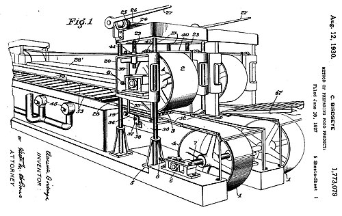

In 1912 a young New Yorker named **[Clarence Birdseye](kloom:e/clarence-birdseye)**, who had trapped animals for the **[United States Department of Agriculture](kloom:e/united-states-department-of-agriculture)** as a field naturalist, went to **[Labrador](kloom:e/labrador)** to trade furs and farm foxes. He came home with an idea. Long afterward, in 1941, he told it this way: in his first winter he "saw natives catching fish in fifty below zero weather, which froze stiff almost as soon as they were taken out of the water", and the fish, thawed months later, still tasted fresh. Fish, game and birds frozen fast in hard cold, he found, were far better than those frozen slowly in the mild frosts of autumn and spring.

That is his telling, and it changed with the years; his biographer Mark Kurlansky has the fish as trout, frozen at thirty below. The knowledge itself was old. The **[Inuit](kloom:e/inuit)** and the settlers of Labrador hung their winter fish on scaffolds and chopped it off as they needed it. In one Labrador family's memory, Birdseye learned the finer point from Garland Lethbridge, who caught fish to feed his foxes: the catch "flicked" back to life on thawing only when it froze at twenty below or colder, and kept better for it. The scholar Marcel Brousseau argues that Birdseye made a fortune from what Inuit and Labradorians taught him, and returned nothing.

## Why fast matters

Ice grows from a few seeds outward. Freeze a fish slowly and the first crystals form in the fluid between its cells; water is drawn out of the cells to feed them, and a few large crystals grow, pushing the shrunken cells apart and tearing their walls. When it thaws, the juice runs out, and the flesh is dry and mushy. Freeze it fast and the cold outruns that slow migration: ice forms everywhere at once, inside the cells and out, as many small crystals. Food scientists have since measured the rule. The mean size of the crystals is inversely proportional to the speed at which the ice front moves through the food; in protein gels the product of the two is about 0.3 × 10⁻⁹ square meters a second. Applied to food two inches thick, frozen from both faces, it gives, by our arithmetic and only as an illustration:

| How the block freezes                 | Speed of the ice front | Mean crystal size |
| ------------------------------------- | ---------------------- | ----------------- |
| Slowly, in a cold room over a day     | 25 mm in 24 hours      | about 1 mm        |
| Between Birdseye's plates, 75 minutes | 25 mm in 75 minutes    | about 0.05 mm     |

Birdseye could not put a number on it either. "By quick freezing," his patent says, "I mean freezing in a sufficiently short space of time so that the cells of the food product are not disrupted or broken."

## The machines

His first company, which froze fish in chilled air, failed in 1924. His second, General Seafood, moved to **[Gloucester, Massachusetts](kloom:e/gloucester-massachusetts)**, and there built the machine his patent of 1930 describes: fish fillets packed in a waterproof carton about two inches thick, carried between two endless metal belts that pressed on the carton above and below, while the belts' far sides were sprayed with **[calcium chloride](kloom:e/calcium-chloride)** brine. The brine never touched the food.

| The double-belt freezer, as patented | Figure                         |
| ------------------------------------ | ------------------------------ |
| Carton                               | about 2 inches thick           |
| Freezing chamber                     | 37 feet long                   |
| Brine                                | calcium chloride, about −45 °F |
| Brine flow                           | about 200 gallons a minute     |
| Time to freeze through               | about one hour and a quarter   |

The design that lasted was the multiplate freezer, which the plate draws: a stack of hollow metal plates, chilled to about −25 °F by **[ammonia](kloom:e/ammonia)** boiling inside them, closed by a press on cartons laid between them, each frozen from both faces. In the Library of Congress's account, a two-inch package of meat reached 0 °F in about ninety minutes, and fruit or vegetables in about thirty. Birdseye and Bicknell Hall patented it in 1931; Kurlansky dates the first application to 1927.

## Selling cold

In 1929 the **Postum Company** and the bank **[Goldman Sachs](kloom:e/goldman-sachs)** bought General Seafood and its patents for about $22 million (some accounts say $23.5 million), and Postum renamed itself **[General Foods](kloom:e/general-foods)**. The new frozen foods were tested in **[Springfield, Massachusetts](kloom:e/springfield-massachusetts)**, from March 6, 1930, under the name **[Birds Eye](kloom:e/birds-eye)**: about two dozen items, from haddock fillets and porterhouse steak to peas, spinach and raspberries. Accounts of the test give ten stores or eighteen.

The hard part was everything after the freezer. Railroads feared lawsuits if the fish thawed in transit, grocers had nowhere cold enough to keep it, and shoppers had nothing at home to keep it in. General Foods put display freezers into the stores and sold the food on consignment. Home **[refrigerators](kloom:e/refrigerator)** were new, and in the 1920s ran on toxic or flammable gases; a safer refrigerant, Freon, was shown off in 1930. Frozen food grew with the **[cold chain](kloom:e/cold-chain)** that carried it, from freezing plant to refrigerated truck, store cabinet and kitchen. In 1953 C. A. Swanson & Sons of Omaha sold a **[frozen meal](kloom:e/frozen-meal)** of turkey on an aluminum tray, the "TV Dinner", for 98 cents, beginning with a run of 5,000. Who invented it is disputed: a retired executive, Gerry Thomas, claimed it, while members of the Swanson family and former employees credit the Swanson brothers. The next section turns from keeping food to growing it, beginning with fertilizer drawn from the air.
