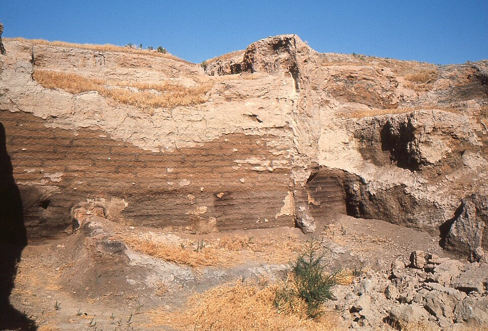

In 1958 the British archaeologist **[James Mellaart](kloom:e/james-mellaart)**, surveying the Konya Plain in central **[Anatolia](kloom:e/anatolia)**, found a mound some 20 meters high, built up of old houses. He dug it for four seasons from 1961 to 1965 and uncovered a town of the New Stone Age, **[Çatalhöyük](kloom:e/catalhoyuk)**. The site lay idle until 1993, when **[Ian Hodder](kloom:e/ian-hodder)** began a project that ran until 2018 and drew in scores of specialists. Its radiocarbon dates put the town's life at about 7100 to 5950 BC, nearly twelve centuries. How many lived there is argued over: the team that studied the skeletons puts the peak at 3,500 to 8,000 people, while a recent estimate from the houses themselves gives 600 to 800 in an average year of the middle period.

## A town without streets

Çatalhöyük had no streets and no public buildings. Houses of mud brick stood wall against wall, and people walked across the roofs and climbed down into their homes by a ladder through a hatch, which also let out the smoke. The hearth and oven stood against the south wall, under the ladder. Plastered platforms lined the other walls, and the dead were buried beneath them. A low opening led to a side room for storage. When a house grew old it was cleaned, knocked down to its stumps and rebuilt on the rubble, which is how the mound rose. The plate draws such a house in plan and section.

In 2009 **[Amy Bogaard](kloom:e/amy-bogaard)** and her colleagues showed what the storerooms held. Each household kept its own grain, fruit, nuts and seasonings in bins deep inside the house, while the heads and horns of aurochs, the wild cattle, were displayed near the entrance in memory of feasts, when food was shared. The plant remains show glume wheats, **[emmer](kloom:e/emmer)** and **[einkorn](kloom:e/einkorn)**, with bread wheat, barley, rye, peas and lentils, pounded and ground for bread and porridge. Sheep and goats were the main meat throughout; cattle were herded only later, and people still hunted wild asses, deer and hares and caught fish.

## What the bones say

In 2019 **[Clark Spencer Larsen](kloom:e/clark-spencer-larsen)** and twelve colleagues published what the skeletons show: 470 complete burials and parts of 272 more. They divided the town's life into three periods:

| Evidence                              | Early, 7100–6700 BC | Middle, 6700–6500 BC  | Late, 6500–5950 BC  |
| ------------------------------------- | ------------------- | --------------------- | ------------------- |
| Population                            | small, growing      | largest, most crowded | falling, dispersing |
| Tooth decay, adult women              | 10.5%               | 12.9%                 | 10.4%               |
| Tooth decay, adult men                | 9.7%                | 10.0%                 | 11.0%               |
| Infection marks on the shins          | 33%                 | 26%                   | 19%                 |
| Walking and workload, from the femurs | low                 | rising                | rising              |
| Healed blows to the head              | present             | rising                | rising              |

The **[tooth decay](kloom:e/tooth-decay)** comes from a diet of soft, starchy grain. Almost every individual has lines of defective enamel on the canine teeth, a sign of illness or hunger in childhood. Soil from the houses holds human and animal dung and the eggs of parasites, and animal pens and middens stood close by. Of 93 skulls studied, 25 had healed fractures from blows to the head, more of them women than men, often struck from behind; the authors suggest the weapons were the hard clay balls found in the houses, thrown with slings. As the herds grazed farther out, the bones of the leg grew stronger: people, children too, walked farther and worked harder.

Yet the same study finds that the people of Çatalhöyük grew normally, to a stature normal for Neolithic people, and shows none of the crowd diseases such as tuberculosis. Its conclusion is that farming there "promoted fertility and population growth, while at the same time contributing to reduced quality of living circumstances."

## The worst mistake?

In May 1987 the physiologist **[Jared Diamond](kloom:e/jared-diamond)** argued in _Discover_ that farming was "in many ways a catastrophe from which we have never recovered." He set farmers against living foragers such as the **[ǃKung](kloom:e/kung-people)** of the Kalahari, who by the studies he cited spent 12 to 19 hours a week getting food, and he drew on skeletons studied by **[George Armelagos](kloom:e/george-j-armelagos)** at **[Dickson Mounds](kloom:e/dickson-mounds)** in Illinois, where, after the people there took up maize farming around AD 1150, enamel defects rose by half, iron-deficiency anemia fourfold and bone lesions from infection threefold, and life expectancy at birth fell from 26 years to 19. A 1984 survey edited by Armelagos and Mark Nathan Cohen had found health declining in 19 of 21 societies that took up farming, and a 2011 review by Amanda Mummert, Armelagos and colleagues found that most later studies agreed: people grew shorter as they came to depend on farming.

The other side of the ledger is numbers. Cemeteries the world over show the share of children jumping when farming arrives, which Jean-Pierre Bocquet-Appel read in 2011 as about two more births per woman: the **[Neolithic demographic transition](kloom:e/neolithic-demographic-transition)**. Farming fed more people, if less well, and the foragers held up against them worked harder than those early counts said: the frame on foragers follows the ǃKung count up to 40 hours a week and more.

## Why farm at all?

No one decided to farm; it happened over many generations. The explanations offered for the **[Neolithic Revolution](kloom:e/neolithic-revolution)** include population pressure, which Lewis Binford and Kent Flannery put forward; feasting, in Brian Hayden's model, in which the ambitious gathered food to give feasts and win power; and the warm, stable climate after the Ice Age. Diamond's answer was a trap: farming fed more mouths, the bands that took it up outbred the bands that did not and drove them off, and once their numbers had grown there was no going back.

Across the ocean, people in Mexico were making a crop of their own out of a wild grass, as the next frame tells.
