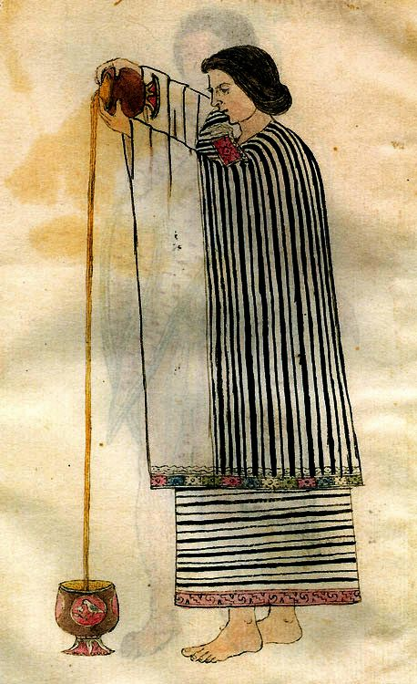

At Santa Ana-La Florida, in the upper Amazon of southeastern Ecuador, people of the **[Mayo-Chinchipe](kloom:e/mayo-chinchipe)** culture left residues in their pottery some 5,300 years ago. In 2018 **Sonia Zarrillo** and her colleagues tested those residues for three independent signs of cacao: its starch grains, theobromine (the bitter alkaloid the tree makes) and fragments of its ancient DNA. All three were there. It is the oldest known use of **[_Theobroma cacao_](kloom:e/theobroma-cacao)**, and it moved the tree's domestication out of **[Mesoamerica](kloom:e/mesoamerica)**, where it had long been placed, to the upper Amazon, where the species is most diverse.

Cacao traveled north. At Puerto Escondido, in Honduras, pots made before 1000 BC carry its chemical traces, and in 2007 John Henderson and his colleagues argued that the first cacao drinks there were made by fermenting the sweet white pulp around the seeds into something like a beer, before anyone ground the bitter seeds themselves.

## Money that grew on trees

By the time of the **[Maya](kloom:e/maya-civilization)** and of the **[Aztec Empire](kloom:e/aztec-empire)**, a drink of the ground seeds was a luxury for lords, warriors and long-distance merchants. Cacao would not grow in the frosty highlands of central Mexico, so the Aztecs took it as tribute from the lowlands, above all from **[Soconusco](kloom:e/soconusco)** on the Pacific coast, which they had conquered for it. The beans were also money. A price list set down in Nahuatl at Tlaxcala in 1545, a generation after the conquest, counts goods in them; the English is that of the historians Arthur Anderson, Frances Berdan and James Lockhart:

| Tlaxcala, 1545                   | Price                                         |
| -------------------------------- | --------------------------------------------- |
| One tomín, a Spanish silver coin | 200 full cacao beans, or 230 shrunken ones    |
| A newly picked avocado           | 3 beans                                       |
| A fully ripe avocado             | 1 bean                                        |
| A tamale                         | 1 bean                                        |
| A turkey hen                     | 100 beans, as later accounts of the list give |

A shrunken bean was worth less than a full one, so beans were counterfeited, with fakes of amaranth dough, wax or broken avocado stones.

## Grinding and frothing

The drink took days of work, and women did it. The seeds were heaped in their own pulp for several days, under leaves or mats, while the pulp fermented, liquefied and drained away, and the seeds turned from pale violet to brown and lost much of their raw bitterness. Then they were dried in the sun, toasted, shelled and ground. The English Dominican **[Thomas Gage](kloom:e/thomas-gage-priest)**, who lived twelve years in Guatemala and drew too on the treatise of the Spanish physician Antonio Colmenero de Ledesma, set the method down in 1648:

| Step     | What was done                                                                                             |
| -------- | --------------------------------------------------------------------------------------------------------- |
| Toast    | Dry the cacao and spices over the fire, stirring, "for if they be overdried, they will be bitter"         |
| Grind    | Beat the cacao little by little to a paste on a stone warmed by "a little fire", which keeps the fat soft |
| Season   | Work in chili, achiote (annatto) for its red, maize and aniseed; richer recipes add cinnamon and sugar    |
| Form     | Spoon the paste onto a leaf to harden into tablets that keep and travel                                   |
| Dissolve | Break a tablet into water, hot or cold                                                                    |
| Froth    | Lift off the foam into a second vessel, then "powre it from on high into the scumme", and drink           |

The stone was the **[metate](kloom:e/metate)**, a sloping slab worked with a hand stone. The Indians, Gage wrote, ground the cacao "upon a broad stone, which they call _Metate_, and is only made for that use." The foam was the point. Pouring from a height whipped air into the drink and held the fat in it, as a woman does in the **[Codex Tudela](kloom:e/codex-tudela)**, painted in Mexico after the conquest. In Spanish kitchens a twirled wooden whisk, the _molinillo_, came to do the work alone.

## To Spain, and to the bar

Despite the story, nothing shows that Hernán Cortés brought **[chocolate](kloom:e/chocolate)** to Spain. The earliest record of it in Europe is from 1544, when Dominican friars brought a delegation of Qʼeqchiʼ Maya nobles from Guatemala to the court of the young prince Philip, and bowls of beaten chocolate were among their gifts. The first recorded shipment of cacao to Spain followed in 1585. Chocolate stayed a drink for three more centuries, until the Dutch chemist **[Coenraad Johannes van Houten](kloom:e/coenraad-johannes-van-houten)** patented a press in 1828 that squeezed much of the fat, cocoa butter, out of the ground cacao, leaving a cake that ground to powder. Cocoa became cheap, and in 1847 **[J. S. Fry & Sons](kloom:e/j-s-fry-and-sons)** of Bristol made what is often called the first chocolate bar.

## Who grew it

From the start, other people's labor grew it. The Spanish raised cacao in New Spain with forced Indigenous labor, and in Venezuela and Ecuador with enslaved Africans. In 1824 the Portuguese carried cacao from Brazil to [São Tomé](kloom:e/sao-tome-island), off the coast of Central Africa, and kept a slave plantation system there after Portugal abolished slavery in 1869, through contracts no laborer could leave. The journalist **[Henry Nevinson](kloom:e/henry-nevinson)**, traveling in Angola in 1904 and 1905, passed forty-three "voluntary laborers" on the Benguela road, marched under armed guard to the ship for the islands; one of them was a woman taken from her husband and three children and "sold for twenty cartridges". "Thus it is," he wrote, "that the islands of San Thomé and Principe have been rendered about the most profitable bits of the earth's surface, and England and America can get their chocolate and cocoa cheap." In 1909 Fry's, **[Cadbury](kloom:e/cadbury)** and Rowntree's stopped buying São Tomé cacao and turned to the British Gold Coast, now Ghana.

Ghana and Côte d'Ivoire now grow nearly 60 percent of the world's cocoa. A survey for the United States Department of Labor, by NORC at the University of Chicago, estimated that in the 2018–19 season 1.56 million children there were in child labor in cocoa, 1.48 million of them in hazardous work: cutting with machetes, spraying agricultural chemicals, carrying heavy loads. Most worked on their own families' farms; the survey did not measure forced labor, though one study finds about 1 percent of the children in child labor there in forced labor or at risk of it.

The next frame follows another tree crop, nutmeg, to the Banda Islands.
