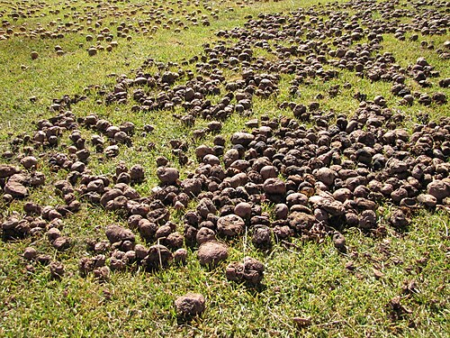
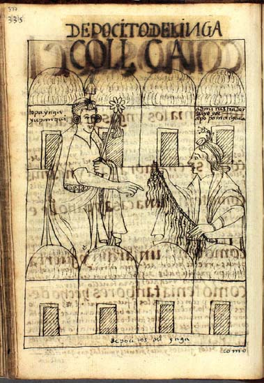

The plateau around **[Lake Titicaca](kloom:e/lake-titicaca)** lies close to 3,800 meters up, between the two ranges of the Andes. Maize will not ripen there, frost comes on most nights of the dry season, and the land is good for little but grass, llamas and roots. It is where people first grew the **[potato](kloom:e/potato)**. In 2005 **David Spooner** and his colleagues compared the DNA of 261 wild potatoes and 98 old Andean varieties and found that all the cultivated ones came from a single source, the northern populations of a group of wild species in southern Peru. Earlier botanists had argued for several separate domestications; the genetic evidence pointed to one.

When that happened is harder to say, because tubers rot and rarely survive. Genetic and botanical estimates put it between about 8000 and 5000 BC. The oldest potato tubers yet found, at Ancón on the coast of Peru, are from about 2500 BC. Closer to the lake, Claudia Rumold and Mark Aldenderfer recovered 141 starch grains from 14 grinding stones at Jiskairumoko, a village of about 3400 to 1600 BC in the western Titicaca basin, and judged 50 of them to be from cultivated or domesticated potato. The International Potato Center in Lima now counts more than 4,000 native varieties in the Andes.

## A poison in the tuber

Wild potatoes protect themselves with bitter **glycoalkaloids**, chiefly **[solanine](kloom:e/solanine)** and chaconine. They are concentrated in the skin and in tubers that turn green in light, and a dose of 2 to 5 milligrams for each kilogram of body weight can make a person ill. Growers today keep them below about 20 milligrams in 100 grams of potato.

Andean farmers dealt with them in three ways. They chose: the botanist **Timothy Johns**, working among the **[Aymara people](kloom:e/aymara-people)** of western Bolivia in the 1980s, found that they judged potatoes by taste and rejected them above a threshold between 20 and 38 milligrams per 100 grams. They ate clay with the bitter kinds: Johns showed in the laboratory that edible clays bind glycoalkaloids, and argued that eating earth helped make domestication possible at all. And they processed them. The bitter, frost-hardy kinds, which grow where others fail, are the ones turned into chuño.

## How chuño is made

**[Chuño](kloom:e/chuno)** is made in June and July, the coldest months, from small tubers spread on flat ground at the end of the harvest. Accounts of the process, among them a study of Bolivian chuño published in 2026, agree on the steps:

| Step                  | What happens                                          | Why                                |
| --------------------- | ----------------------------------------------------- | ---------------------------------- |
| Freeze                | Tubers lie out for about three nights at −1 to −16 °C | Ice crystals burst the cells       |
| Thaw                  | Daytime sun, often above 20 °C                        | Water runs from the broken tissue  |
| Trample               | Families tread the tubers in heaps                    | Squeezes out water, rubs off skins |
| Black chuño           | Dried in the sun                                      | Keeps for years                    |
| White chuño (_tunta_) | Soaked 20 to 30 days in a river or pit, then dried    | Leaches out glycoalkaloids         |

The result is light, hard and nearly dry, and with little care it keeps for years. It is often described as natural freeze-drying, though strictly it is not: industrial freeze-drying removes ice under vacuum, while chuño depends on freezing and thawing in the open air.

The Spaniards who conquered the Inca saw its value at once. **[Pedro Cieza de León](kloom:e/pedro-cieza-de-leon)**, in a chronicle printed in 1553, wrote of the people of the Collao, the Titicaca plain, in Clements Markham's translation of 1864: "They dry these potatoes in the sun, and keep them from one harvest to another." Without that store, he added, they "would suffer from famine and want" whenever rain failed, and "Many Spaniards have enriched themselves and returned prosperous to Spain by merely taking these chuñus to sell at the mines of Potosi." The Jesuit **[José de Acosta](kloom:e/jose-de-acosta)** said the same in 1590, in Edward Grimston's English of 1604: chuño "keeps many daies, and serves for bread." At **[Potosí](kloom:e/potosi)**, Indigenous men drafted under the colonial **[mit'a](kloom:e/mita)**, a labor service the Spanish took over from the Inca and turned to the mines, worked beside paid laborers: a report of 1603 counted 5,100 draftees among 58,800 Indian workers there. Chuño was what they ate.

## The storehouses

The **[Inca Empire](kloom:e/inca-empire)** stored chuño on a scale its conquerors could hardly credit. Its storehouses, the **[qullqa](kloom:e/qullqa)**, stood in rows of dozens or hundreds on hillsides near roads, towns and state farms. The archaeologist **Craig Morris**, who studied those of Huánuco Pampa, showed how carefully they were built for keeping food, and that they were sited high, cold and windy, which is why the largest groups lie above 3,300 meters. At Huánuco Pampa between half and four-fifths of them held dried potatoes and other roots.

The plate draws one in section. A channel under the floor let air in, a gap under the thatch let it out, and the wind on the slope kept it moving; roots were packed in layers of straw. Freeze-dried potatoes may have kept for two to four years in them, and chroniclers said some food was kept for ten. The keepers recorded what came in and went out on khipus, the knotted cords shown in **[Felipe Guaman Poma de Ayala](kloom:e/felipe-guaman-poma-de-ayala)**'s drawing.

Europe received the potato, not chuño. A notary's record of November 1567 lists barrels of potatoes shipped from Gran Canaria to Antwerp, and a hospital in Seville was buying potatoes in 1573. The next frame follows the tuber's slow welcome there, and the pharmacist who campaigned for it.
