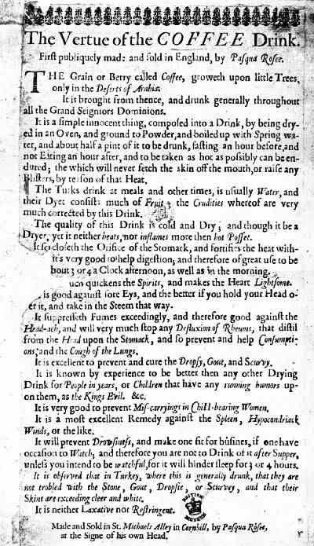

The [coffee](kloom:e/coffee) tree grows wild in the highland forests of Ethiopia, but the drink was made in **Yemen**, across the Red Sea. There is no sure record of it before the fifteenth century. The jurist Abd al-Qadir al-Jaziri, who wrote its first history in 1587, gave the habit to a mufti of Aden, Jamal al-Din al-Dhabhani, who died in 1470, and by the late 1400s the **[Sufi](kloom:e/sufism)** brotherhoods of Yemen were roasting and brewing the seeds to stay awake through their night prayers. The story of a goatherd whose flock danced after eating the berries is a legend. It first appears in print in Rome in 1671, in a treatise by the Maronite scholar Antoine Faustus Nairon, and the goatherd got the name Kaldi only in the twentieth century.

Pilgrims and Sufis carried the drink north. Yemeni dervishes in [Cairo](kloom:e/cairo) kept it in a large red earthenware jar, and a superior dipped it out to each in turn as they chanted through the night. In **[Mecca](kloom:e/mecca)** it left the mosque for the street, and the first coffeehouses opened.

## Banned in Mecca

In 1511 the governor of Mecca, Khair Beg, found men drinking coffee in a corner of the mosque, and called a council of lawyers, physicians and notables. The charge against the coffeehouses, as al-Jaziri's history records it (in William Ukers's English of Silvestre de Sacy's French), was that "men and women met and played tambourines, violins, and other musical instruments" and gambled at chess and mancala. The council condemned coffee, the governor closed the coffeehouses and burned the beans, and the sultan in Cairo overruled him: the best things might be abused, he answered, and that was no reason to forbid them. Bans came and went in Mecca and Cairo for decades, and none lasted. In 1554 two Syrian merchants opened the first coffeehouse in Istanbul, the capital of the **[Ottoman Empire](kloom:e/ottoman-empire)**.

## A penny university

In 1652 **[Pasqua Rosée](kloom:e/pasqua-rosee)**, a Greek servant whom a merchant of the Levant Company had brought home from Smyrna, opened the first coffeehouse in **[London](kloom:e/london)**, a shed in St Michael's Alley, Cornhill. His handbill, the first advertisement for coffee in English, says how the drink was made, "by being dryed in an Oven, and ground to Powder, and boiled up with Spring water", and what it did: "It will prevent Drowsiness, and make one fit for busines."

By 1663 London had 83 coffeehouses. For a penny or two a man could sit, read the newspapers, hear the news and argue, and verse called the houses "penny universities". Merchants did business in them. **[Lloyd's Coffee House](kloom:e/lloyds-coffee-house)**, opened in Tower Street in the late 1680s, drew shipowners and underwriters with its shipping news, and became the insurance market Lloyd's of London. The mathematician **[Abraham de Moivre](kloom:e/abraham-de-moivre)**, a Huguenot refugee, made his living tutoring in the coffeehouses and is said to have played chess for money at Slaughter's. In 1674 _The Women's Petition Against Coffee_ complained that the drink made men "as unfruitful as the deserts". In December 1675 **[Charles II](kloom:e/charles-ii-of-england)** ordered the coffeehouses shut from 10 January, as places where "the great resort of Idle and disaffected persons" spread "false, malitious and scandalous reports". The outcry was so great that it was recalled on 8 January, two days before it took effect.

## Growing it

The coffee was grown far away, and more and more of it by unfree labor. The [Dutch East India Company](kloom:e/dutch-east-india-company) took plants from Mocha to **[Java](kloom:e/java)** and was supplying Europe with Java coffee by 1719. The French planted it on **[Saint-Domingue](kloom:e/saint-domingue)** from 1734, and on the eve of its revolution the colony grew between half and 60 percent of the world's coffee, by different counts, worked by enslaved Africans. The planter P. J. Laborie, in a manual published in London in 1798, set down the method step by step, from the fruit, "a small oval cherry" with "a whitish clammy luscious pulp" around two seeds laid flat face to flat face:

| Step   | What Laborie prescribes                                                                                                     |
| ------ | --------------------------------------------------------------------------------------------------------------------------- |
| Grate  | Strip the skin the same day, before the heaped cherries ferment, in a hand mill turned by eight enslaved workers            |
| Wash   | Soak 24 hours in a basin, raking it over, until the seed is "as white as ivory"                                             |
| Dry    | Spread it on stone platforms in the sun, raked through the day and swept under cover at any sign of rain                    |
| Mill   | Crush off the dry parchment under a heavy wheel driven round a trough; "the mill breaks the parchment only, never the seed" |
| Winnow | Blow off the chaff with a fan mill                                                                                          |
| Pick   | Sort out the black and broken seeds by hand at long tables, a hundred pounds a day required of each worker                  |

The grating, Laborie says, took eleven people to a mill, "performed in the evening, when the negroes return from the field". By then Saint-Domingue sent out more than seventy million pounds of coffee a year. After the revolution Brazil took its place, the largest grower by 1852, and its plantations ran on enslaved labor until 1888.

## A public sphere?

In 1962 the philosopher **[Jürgen Habermas](kloom:e/jurgen-habermas)** made the English coffeehouse of 1680 to 1730 the birthplace of the "public sphere", where, as he put it in its English translation, "private people come together as public" to argue about matters of common concern, outside church and court, and fed their talk into the new periodicals. The book, **[_The Structural Transformation of the Public Sphere_](kloom:e/the-structural-transformation-of-the-public-sphere)**, made the coffeehouse famous among historians, and they have argued with it since. The geographers Eric Laurier and Chris Philo question his picture of the houses as contained, egalitarian rooms of calm, rational debate, and women were shut out of them altogether. Wendy Willems points to what the argument leaves out: coffeehouses were addresses in the slave trade. In 1704 the _London Gazette_ promised a guinea to whoever brought a runaway man named Jack "to the Jamaica Coffee-House in Miles Alley in Cornhill", and Lloyd's insured slave ships. The coffee in the cups came from plantations too.

Tea, steadier in price, soon overtook coffee in Britain, and the next frame follows how Britain paid China for it.
