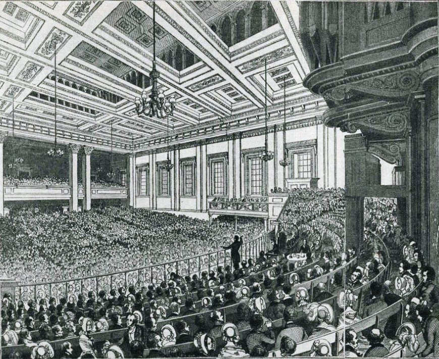

In March 1815, with the long war with France ending and the price of wheat falling, Parliament passed a new **[Corn Law](kloom:e/corn-laws)**. Foreign grain could be landed and stored in bonded warehouses at any time, but foreign wheat could be sold in Britain only when the average price of British wheat stood "at or above the Price of Eighty Shillings per Quarter", a quarter being eight bushels, about 220 kilograms. Below that price it was shut out; above it, it came in free. The landowners who sat in Parliament had their protection, and London rioted while the bill went through.

## How the protection worked

The price that mattered was an average from the markets of the kingdom, published weekly in the _London Gazette_. In 1828 the Duke of Wellington's government replaced the prohibition with a sliding scale of duties that fell as prices rose, and the Conservative prime minister **[Robert Peel](kloom:e/robert-peel)** cut it in 1842. Read from the Acts' own tables, the duty on a quarter of foreign wheat was:

| Price of British wheat | 1815       | 1828   | 1842 | 1846 | From 1849 |
| ---------------------- | ---------- | ------ | ---- | ---- | --------- |
| 50s                    | prohibited | 36s 8d | 20s  | 7s   | 1s        |
| 60s                    | prohibited | 26s 8d | 12s  | 4s   | 1s        |
| 66s                    | prohibited | 20s 8d | 6s   | 4s   | 1s        |
| 70s                    | prohibited | 10s 8d | 4s   | 4s   | 1s        |
| 73s                    | prohibited | 1s     | 1s   | 4s   | 1s        |
| 80s                    | free       | 1s     | 1s   | 4s   | 1s        |

The plate draws all of them. The 1828 scale fell steeply above 66s, so a merchant left his wheat in bond while prices rose and released it all at once when the duty bottomed out. In 1838, in one stretch of falling duties, 96.6 percent of the wheat released paid just a shilling. The scale was so intricate that in the Commons Peel once misread it from a printed paper and **[Lord John Russell](kloom:e/john-russell-1st-earl-russell)** corrected him: "Between 69s. and 70s. the duty is 13s. 8d."

How much the laws raised the price of bread is still argued. The economic historian Jeffrey Williamson, comparing British prices with Prussian ones, put the 1828 scale's effect at a 54 percent tariff. Paul Sharp, counting the duty actually paid on the wheat released, put it at 28 percent, and found that it swung wildly from year to year:

| Year | Price (s) | Foreign wheat released, quarters | Duty paid, % of value |
| ---- | --------- | -------------------------------- | --------------------- |
| 1835 | 39.3      | 48                               | 86                    |
| 1838 | 64.6      | 1,728,453                        | 2                     |
| 1843 | 50.1      | 843,739                          | 28                    |
| 1847 | 69.8      | 2,622,086                        | 0, duties suspended   |
| 1849 | 44.3      | 4,450,043                        | 2                     |

## The League

In 1838 merchants and manufacturers in **[Manchester](kloom:e/manchester)** founded the **[Anti–Corn Law League](kloom:e/anti-corn-law-league)**, led by **[Richard Cobden](kloom:e/richard-cobden)**, a calico printer, and **[John Bright](kloom:e/john-bright)**, a Quaker mill owner's son from Rochdale. It sent lecturers through the country, printed nine million tracts in 1843 alone, and bought forty-shilling freeholds so that its supporters could vote in county elections. The **[Uniform Penny Post](kloom:e/uniform-penny-post)** of 1840, which Cobden had campaigned for, carried its letters: "the correspondence of the League increased a hundred fold," wrote its historian Archibald Prentice. In May 1845 it filled Covent Garden Theatre for seventeen days with a bazaar that took more than £20,000. Landowners, and many Chartists, answered that the manufacturers wanted cheap bread so that they could pay lower wages.

## Repeal

In the autumn of 1845 came the potato blight in Ireland and a poor harvest in Britain. Peel, who had voted against repeal every year since 1837, now proposed it. His cabinet balked; he resigned in December and returned when Russell could not form a government. His bill cut the duties at once and left a duty of one shilling a quarter from 1 February 1849. It passed its third reading on 15 May 1846 by 327 votes to 229, carried by Whigs and Radicals, while most of his own party, led by **[Benjamin Disraeli](kloom:e/benjamin-disraeli)** and Lord George Bentinck, voted against it. On 25 June the Lords passed it; that night the protectionists joined the Whigs to defeat Peel's Irish coercion bill, and he resigned. He gave the credit to Cobden, and hoped to be remembered by those who "earn their daily bread by the sweat of their brow, when they shall recruit their exhausted strength with abundant and untaxed food". The Conservative Party split, and his followers, the **[Peelites](kloom:e/peelite)**, later helped form the Liberal Party. For Ireland, repeal changed little: the hungry had no money to buy grain at any price.

## What the economists said

In 1776, in **[_The Wealth of Nations_](kloom:e/the-wealth-of-nations)**, **[Adam Smith](kloom:e/adam-smith)** had called "the unlimited, unrestrained freedom of the corn trade" "the only effectual preventive of the miseries of a famine". In 1815 **[David Ricardo](kloom:e/david-ricardo)** explained why landowners wanted protection. As population grew, poorer or more distant land had to be farmed; the cost of growing corn there set its price, and the better land then yielded a surplus that went to its owner as rent, while the profits of all other capital fell. His worked example, in quarters of wheat:

| Land in use     | Capital to grow 100 quarters | Rate of profit | Rent on the first land |
| --------------- | ---------------------------- | -------------- | ---------------------- |
| First land only | 200                          | 50%            | 0                      |
| Add second land | 210                          | 43%            | 14                     |
| Add third land  | 220                          | 36%            | 28                     |

"The interest of the landlord," he concluded, "is always opposed to the interest of every other class in the community." **[Thomas Malthus](kloom:e/thomas-robert-malthus)** took the landlords' side. Peel had studied Smith and Ricardo both.

Repeal did not make bread much cheaper at first. Wheat averaged about 52 shillings a quarter for two decades after 1850, and the flood of cheap American grain came only in the 1870s. Sharp argues that protection had mostly gone by 1838 and ended only in 1869, with the shilling. In 2021 Douglas Irwin and Maksym Chepeliev modeled the economy of 1841 and found that repeal left Britain's welfare about unchanged overall but moved income from landowners: the richest tenth lost and the other nine-tenths gained.

The next section turns from growing food to keeping it, beginning with salt.
