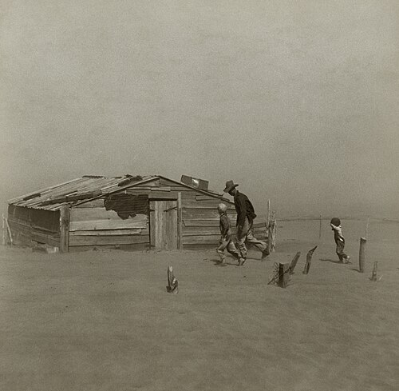
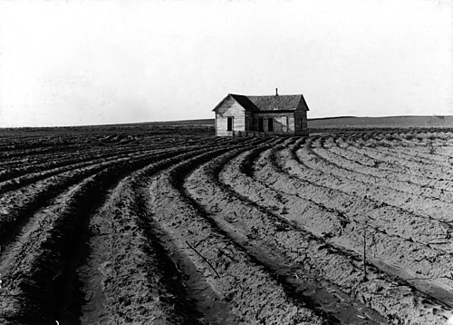

On 21 March 1935 the soil scientist **[Hugh Hammond Bennett](kloom:e/hugh-hammond-bennett)** sat before a subcommittee of the House of Representatives, asking for a permanent federal agency to fight soil erosion. A cloud of dust from the plains was crossing the country toward him. That afternoon, the _Washington Post_ reported, "throngs of curious persons, leaving Government offices, swarmed down the Mall and to Potomac Park, where the dust was visible." The story is often told of Bennett stretching out his testimony until the sky darkened at the window; Douglas Helms, his agency's historian, notes that the transcript says nothing of the cloud and that most accounts of the scene are secondhand. On 27 April Congress declared the wastage of soil "a menace to the national welfare" and created the **[Soil Conservation Service](kloom:e/natural-resources-conservation-service)**, with Bennett at its head.

## Plowing the plains

The dust came from the southern **[Great Plains](kloom:e/great-plains)**, the high grassland west of the 100th meridian, where less than 20 inches of rain falls in a year. The **[Homestead Acts](kloom:e/homestead-acts)** gave settlers 160 acres from 1862, and 320 on the plains from 1909, and wet years seemed to prove the promoters' saying that "rain follows the plow." Tractors let a family break more ground, and the grain prices of the First World War did the rest. On the Llano Estacado of New Mexico and Texas the farmed area doubled between 1900 and 1920, then tripled between 1925 and 1930, much of it sown to **[wheat](kloom:e/wheat)** and cotton. Then prices fell. Cotton sold for 36 cents a pound in 1919 and 6 cents in 1931. The rains failed through the early 1930s, in the longest and deepest drought in more than a century of records, and the **[Great Depression](kloom:e/great-depression)** arrived on farms already in debt. In 1935 crops failed on 46.6 million acres of the plains.

## How soil blows

Bare, dry soil moves in the wind in three ways, and saltation drives the other two:

| Motion        | What moves                                                                                     | Share of the soil moved, roughly |
| ------------- | ---------------------------------------------------------------------------------------------- | -------------------------------- |
| Surface creep | Grains too heavy to lift, rolled and shoved along the ground                                   | 5 to 25 percent                  |
| Saltation     | Grains up to about 2 millimeters, in hops; each landing knocks others loose and throws dust up | 50 to 70 percent                 |
| Suspension    | Dust finer than about 0.05 millimeters, held up by turbulence and carried hundreds of miles    | 30 to 40 percent                 |

A field starts to drift in spots that scour the land downwind, and the finest dust climbs into the jet stream. On 11 May 1934 such a cloud carried soil over Washington and 300 miles out into the Atlantic. On 14 April 1935, **[Black Sunday](kloom:e/black-sunday-storm)**, a black blizzard driven by 60-mile-an-hour winds left Dodge City, Kansas, in total darkness for forty minutes and covered the 105 miles from Boise City, Oklahoma, to Amarillo in an hour and a quarter. An Associated Press dispatch by Robert Geiger spoke of the "dust bowl," and the name stuck: the **[Dust Bowl](kloom:e/dust-bowl)**.

## Holding the ground

The **[United States Department of Agriculture](kloom:e/united-states-department-of-agriculture)** taught that "emergency control of excessive soil-blowing consists essentially in placing obstructions in the path of the wind." A circular of 1937 told farmers to rough up bare fields before the spring winds with a lister, a plow that cuts deep furrows and turns up clods. The furrows trap moving soil, and run level around a slope, along the contour, they hold rain too. In the spring of 1936 more than two million acres of the plains were listed on the contour, and tests after the May rains found about an inch more water held in the ground. "Water is the key," the circular said: only plants hold soil for good. **[Contour plowing](kloom:e/contour-plowing)** was joined by strip cropping, bands of close-growing sorghum or wheat between bands of row crops, laid across the slope and the wind. In the words of a department leaflet of 1931, "each row serves as a miniature terrace," and each strip catches soil blown off its neighbor. The **[Great Plains Shelterbelt](kloom:e/great-plains-shelterbelt)** planted 220 million trees in 30,233 windbreaks between 1935 and 1942, in a zone 100 miles wide from North Dakota to Texas. The plate draws a field laid out this way.

## Who left, and whose fault

The **[Farm Security Administration](kloom:e/farm-security-administration)** sent photographers to the plains and the roads west. **[Dorothea Lange](kloom:e/dorothea-lange)**'s pictures of migrants in California defined the "Okies," and **John Steinbeck**'s **[_The Grapes of Wrath_](kloom:e/the-grapes-of-wrath)** (1939), drawn partly from the field notes of the FSA worker Sanora Babb, gave them a story. The record is less simple. A 1939 survey of about 116,000 families who came to California found that only 43 percent of those from the Southwest had farmed just before they left. The woman in Lange's _Migrant Mother_, Florence Owens Thompson, had left Oklahoma for California's fields in 1934. Lange also photographed tenant houses stranded in tractor-plowed fields, their families pushed out by machines.

Historians still argue over the cause. **[Donald Worster](kloom:e/donald-worster)**, in 1979, blamed capitalism: the Dust Bowl "came about because the culture was operating in precisely the way it was supposed to." Geoff Cunfer replies that dust storms were an old hazard of dry springs, reported by Kansas newspapers in 1879, that little of the plowed land went back to grass after the 1930s, and that the new federal agencies wrote the story of reckless plowing partly to justify themselves. The economist Richard Hornbeck found the damage real all the same: by 1940 farmland in the most eroded counties had lost 28 percent of its value against the least eroded, and through the 1950s farmers' changes of crop made up less than a quarter of the difference.

The rains came back in 1941. Among the young men leading Civilian Conservation Corps crews in 1935 was a forestry student from Iowa who would spend his life breeding wheat; the next frame follows him to Mexico.
