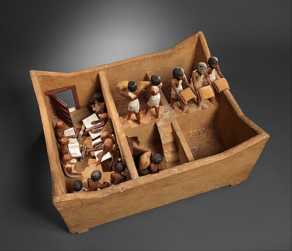

Egypt's harvest came out of its river. Every summer the **[Nile](kloom:e/nile)** rose and spread over its floodplain, and Egyptians farmed by catching it. They divided the fields with a grid of earthen banks, so that the flood stood in each basin, about a meter and a half deep at its height, until the soil was soaked; then they let it drain into the next basin, sowed [emmer](kloom:e/emmer) wheat and [barley](kloom:e/barley) in the wet silt in the autumn, and harvested in the spring. How high the flood would rise decided the year. Officials read it on a **[nilometer](kloom:e/nilometer)**, a stair or well marked in cubits, and set the year's taxes by it. The Roman naturalist **[Pliny the Elder](kloom:e/pliny-the-elder)** recorded the scale, in Bostock and Riley's translation of 1855:

> When the water rises to only twelve cubits, it experiences the horrors of famine; when it attains thirteen, hunger is still the result; a rise of fourteen cubits is productive of gladness; a rise of fifteen sets all anxieties at rest; while an increase of sixteen is productive of unbounded transports of joy.

## A town that ran on bread

In December 1988 the archaeologist **[Mark Lehner](kloom:e/mark-lehner)** began to dig a site 400 meters south of the Sphinx, on the **[Giza pyramid complex](kloom:e/giza-pyramid-complex)**, beside an ancient stone wall called in Arabic Heit el-Ghurab, the Wall of the Crow. It proved to be a town of more than seven hectares, built by the crown to house and feed the people who raised the pyramids of Khafre and Menkaure, and probably Khufu. Its streets were lined, the excavators write, with "craft workshops, industrial yards, bakeries, commissaries, kitchens, warehouses", and its people lived on **[bread](kloom:e/bread)** and **[beer](kloom:e/beer)**, the staples of every rank in **[Ancient Egypt](kloom:e/ancient-egypt)**. Workers on the king's projects were paid in them.

In 1990–91 the team uncovered two bakery rooms, each 5.25 by 2.5 meters, littered with broken _bedja_: heavy conical pottery molds, up to 12 kilograms each, in which dough was baked. The rooms matched the baking scenes carved in Old Kingdom tombs, and between reliefs and floors the method can be followed:

| Step | What the bakers did                                       | What was found                                             |
| ---- | --------------------------------------------------------- | ---------------------------------------------------------- |
| 1    | Mixed the dough in vats                                   | Three large vats set into the floor in a corner            |
| 2    | Heated empty molds, stacked mouth down, over an open fire | An open hearth still holding an upturned _bedja_           |
| 3    | Set the hot molds upright in rows of hollows              | Two rows of depressions "like large egg cartons"           |
| 4    | Poured the dough into them                                | Reliefs show workmen pouring batter into upright molds     |
| 5    | Capped each with a second mold and heaped ashes round     | Black soil full of charcoal in the rows, as in the reliefs |

The plate draws the heating and the baking. In 1993 Lehner and a National Geographic team built a copy at Saqqara and baked in it with emmer and barley flour and wild yeast caught at Giza. The bakeries' low walls, they found, were work surfaces, not ruins: higher ones would have trapped the smoke.

## Silos and their seals

Grain reached the bakers from a walled compound the excavators call the Royal Administrative Building, whose sunken court held silos, fifteen traced by 2022, each about 2.6 meters across, far larger than the town's household bins, and perhaps domed as in tomb paintings. Silo doors and bins were closed with clay pressed over a peg wound with twine and stamped with an official's seal, and the excavators have found many such sealings in the compound. The granary was a place of record.

A model buried about 1980 BC with **[Meketre](kloom:e/meketre)**, a chancellor at Thebes, shows such a granary at work, five centuries later: scribes sit together with their writing boards while porters carry sacks up a stair to the bins.

## Reckoning in loaves

The scribes' arithmetic survives in the **[Rhind Mathematical Papyrus](kloom:e/rhind-mathematical-papyrus)**, copied around 1550 BC from an older book, and T. Eric Peet, who translated it in 1923, saw in it a man who "could measure a field or a granary, and divide wages or booty in fixed proportions". Problem 41 gives a round granary nine cubits across and ten high: take off a ninth of the width, square the eight that remains and multiply by the height, 640, then add half again to turn cubic cubits into 960 _khar_ of grain. Problem 65 shares 100 loaves among ten men, three of whom (a sailor, a foreman and a watchman) take double: thirteen shares, so each man gets 7 2/3 1/39 loaves. Problems 69 to 78 use the _pefsu_, the number of loaves or jugs of beer made from one _hekat_ of grain, which set the size of a loaf and the strength of a beer: 100 loaves of _pefsu_ 10 are worth 450 of _pefsu_ 45.

## When the river failed

A low flood meant hunger, which Egypt remembered as a story. The **[Famine Stela](kloom:e/famine-stela)**, cut into a granite boulder on Sehel Island near Aswan, tells how in the eighteenth year of King **[Djoser](kloom:e/djoser)**, about 2650 BC, the Nile had failed for seven years; Imhotep learned that the god Khnum ruled the flood from Elephantine, Khnum promised in a dream to make the river flow again, and the king endowed his temple. The inscription is Ptolemaic, probably of about 200 BC, and Egyptologists such as Miriam Lichtheim think Khnum's priests composed it to support their temple's claim to the land. Seven lean years were a common motif in the Near East, as in Genesis. Real famines left plainer records. In the troubled century after the Old Kingdom collapsed, about 2180 BC, the provincial governor Ankhtifi boasted in his tomb that he fed his own towns while the rest of Upper Egypt starved. Whether low floods or the collapse of royal power caused that famine is argued; Fekri Hassan of University College London has found that Lake Faiyum dried out between about 2200 and 2150 BC, evidence of real drought.

Egypt's grain would one day feed another empire's capital. The next frame follows it to Rome.
