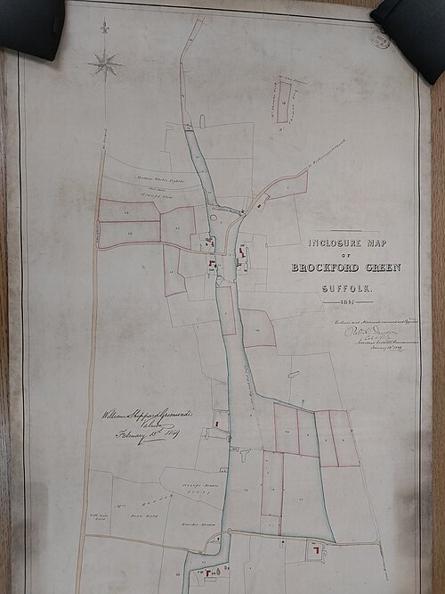

In much of medieval and early modern England a village farmed its land in common. Its arable lay in two or three great **[open fields](kloom:e/open-field-system)**, each cut into long, narrow strips, and a family's holding was a scatter of strips across all of them, worked to a rotation the village agreed. After harvest the stubble and the fallow were grazed by everyone's animals. Beyond the fields lay the waste, the **[common land](kloom:e/common-land)**, where cottagers with rights of common could keep a cow, pigs or geese and cut furze and turf for fuel. **[Enclosure](kloom:e/enclosure)** ended this. It gathered each owner's strips into compact fields, divided the commons among those with a legal claim to them, extinguished the common rights, and fenced or hedged the result.

The first great wave turned plowland into pasture for sheep, because wool paid. In 1516 **[Thomas More](kloom:e/thomas-more)** made it the cause of England's thieves in **[_Utopia_](kloom:e/utopia-book)**. In Ralph Robinson's English of 1551 (spelling modernized), the traveler tells a cardinal that "your sheep, that were wont to be so meek and tame, and so small eaters, now, as I hear say, be become so great devourers and so wild, that they eat up and swallow down the very men themselves." Parliament passed acts against depopulating enclosure from 1489 to 1597, with little effect.

## How an act enclosed a parish

From about 1750 the usual route was an act of Parliament, an **[inclosure act](kloom:e/inclosure-act)** for each parish. It let the owners of most of the land overrule the rest, where enclosure by agreement had needed everyone. Its advocates promised improvement, a word **[John Locke](kloom:e/john-locke)** had already tied to property in 1690: God commanded man "to subdue the earth, i.e. improve it", and whoever tills land "by his labour does, as it were, inclose it from the common." **[J. L. Hammond](kloom:e/john-lawrence-hammond)** and **[Barbara Hammond](kloom:e/barbara-hammond)**, in _The Village Labourer_ (1911), and the economists Leander Heldring, James Robinson and Sebastian Vollmer, in 2022, describe the steps:

| Step          | What happened                                                                                                    |
| ------------- | ---------------------------------------------------------------------------------------------------------------- |
| Agreement     | The largest owners settled the plan and chose their attorney, often before the rest were told                    |
| Petition      | A petition to the House of Commons; from 1774, notice on the church door on three Sundays of August or September |
| Consent       | Owners of three-quarters or four-fifths of the land, counted by value, not by heads                              |
| Bill          | Read twice, examined by a committee chosen largely from the county's own members, passed by both Houses          |
| Commissioners | Usually three, with a surveyor: they mapped the parish, heard every claim, and drew new roads and boundaries     |
| Award         | The division and its map, read in public and fixed to the church door                                            |
| Fencing       | Each owner hedged or fenced his allotment, and the costs were shared by acreage                                  |

Between 1604 and 1914 more than 5,200 such acts enclosed about 6.8 million acres, roughly a fifth of England. The costs were heavy: at least £12 an acre on average by Michael Turner's estimate, nearly five years' income for a farmer of 20 acres. Arthur Young, a champion of enclosure, blamed the expense on "the knavery of commissioners and attorneys".

The map is an award of 1847, made under the Inclosure Act of 1845, which set up standing Inclosure Commissioners who could enclose land without a private act.

## Who gained, who lost

For the Hammonds the verdict was plain: "enclosure was fatal to three classes: the small farmer, the cottager, and the squatter," whose common rights were worth more to them than anything they received. Some resisted. In September 1830 about a thousand people from the villages around **[Otmoor](kloom:e/otmoor)**, in Oxfordshire, walked its seven-mile bounds and pulled down every fence, and when the yeomanry carried 44 of them to Oxford, a crowd at St Giles' Fair set them free.

Later historians disputed the picture. J. D. Chambers and G. E. Mingay argued in 1966 that the Hammonds had exaggerated the costs, and that enclosure brought more food, more land under the plow and, on balance, more work in the countryside. **[Robert Allen](kloom:e/bob-allen-economic-historian)**, in _Enclosure and the Yeoman_ (1992), found that open-field farmers had already adopted the new crops, so that eighteenth-century enclosure mainly moved income from farmers to landlords; Mark Overton disputes his evidence. Heldring and his colleagues found that parishes enclosed by Parliament had crop yields about 45 percent higher by 1830, and more unequal land. **[Jane Humphries](kloom:e/jane-humphries)** showed in 1990 that commons were worth a great deal to the poor, and that women and children worked them most, so their loss made whole families dependent on wages. Leigh Shaw-Taylor answered in 2001 that in ten Midlands villages most laborers had held no common rights to lose.

## A poet's loss

**[John Clare](kloom:e/john-clare)**, a farm laborer's son from Helpston in Northamptonshire who went to work in the fields as a child, mourned the enclosure of the countryside he knew. In _The Village Minstrel_ (1821) he wrote:

> There once were lanes in nature's freedom dropt,
> There once were paths that every valley wound,—
> Inclosure came, and every path was stopt;
> Each tyrant fix'd his sign where paths were found,
> To hint a trespass now who cross'd the ground

## Hands for the mills

**[Karl Marx](kloom:e/karl-marx)**, in the first volume of _Capital_ (1867; English translation 1887), made enclosure part of the "primitive accumulation" that, in his account, created the industrial working class. "The law itself becomes now the instrument of the theft of the people's land," he wrote, and such methods "created for the town industries the necessary supply of a 'free' and outlawed proletariat." On this view the dispossessed became the hands of the **[industrial revolution](kloom:e/industrial-revolution)**'s mill towns. The evidence is mixed: Chambers and Mingay found more work in enclosed villages, not less, and Shaw-Taylor's finding means that many laborers had no land or rights left to lose when the acts came. The next frame turns to the man who asked whether food could ever keep up with people: Malthus.
