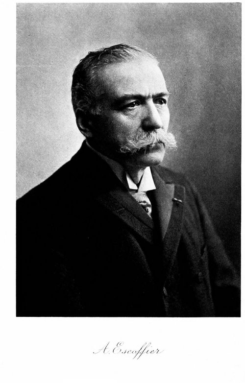

**[Auguste Escoffier](kloom:e/auguste-escoffier)** learned to run a kitchen in hard places. Born in 1846 at Villeneuve-Loubet, near Nice, he was taken out of school at twelve to work in his uncle's restaurant, and he spent nearly seven years as an army cook, ending as chef de cuisine of the Army of the Rhine at Metz in the **[Franco-Prussian War](kloom:e/franco-prussian-war)**. In 1884 the Swiss hotelier **[César Ritz](kloom:e/cesar-ritz)** put him in charge of the kitchens of the Grand Hotel at Monte Carlo (one account has them meet in 1880). In 1890 **[Richard D'Oyly Carte](kloom:e/richard-doyly-carte)**, the theatrical impresario, brought them both to his new **[Savoy Hotel](kloom:e/savoy-hotel)** in **[London](kloom:e/london)**, whose prospectus had promised a restaurant to equal the best in **[Paris](kloom:e/paris)**, where "French cuisine will naturally occupy the first position".

## Five parties and a pass

At the Savoy Escoffier organized his cooks as a **[brigade de cuisine](kloom:e/kitchen-brigade)**, what the historian David Bowie calls "the first large scale systematic restaurant system in England". Before, in Máirtín Mac Con Iomaire's account, each section of a great kitchen dealt only with its own orders and contributed nothing to the others'. Escoffier divided the work by kind of cooking instead, into interdependent _parties_, each under a chef de partie:

| Partie       | Its work                                        |
| ------------ | ----------------------------------------------- |
| Garde-manger | cold dishes, and supplies for the whole kitchen |
| Entremetier  | soups, vegetables and desserts                  |
| Rôtisseur    | roasts, grills and fried dishes                 |
| Saucier      | the sauces                                      |
| Pâtissier    | pastry for the whole kitchen                    |

Above them stood the chef and his second, the sous-chef; the largest kitchens split further, with a poissonnier for fish. An order passed through it like this, as the plate draws it. The waiter brought it from the dining room to the kitchen, where the _aboyeur_, the "barker", called it out to the stations. Each partie made its part and sent it to the pass, the counter where dishes leave the kitchen, and there the dish was assembled, checked by the chef and carried to the table. Mac Con Iomaire gives the gain in one dish, eggs Florentine: the egg cook poached the eggs, the vegetable cook cooked the spinach, the sauce cook supplied the Mornay sauce and the pastry cook the tartlet, and the dish came out in a fifth of the old time. Another telling uses eggs Meyerbeer, cut from fifteen minutes to the time it took to grill the kidneys. His brigades, Bowie writes, ran to as many as 200 cooks and trainees.

Where the system came from is argued. Herbodeau and Thalamas, who wrote his life in 1955, called him a promoter of "Taylorism" in the kitchen, and a 1987 essay said he was "clearly influenced" by **[Frederick Winslow Taylor](kloom:e/frederick-winslow-taylor)**'s _Shop Management_ of 1903. But the brigade was at work at the Savoy in the 1890s, before Taylor's book, so the likeness is more parallel than borrowing; others, Wikipedia's biography among them, point to his years in the army. His time at the Savoy ended badly. On 8 March 1898 the directors dismissed Ritz, Escoffier and the maître d'hôtel Louis Echenard, and in 1900 Escoffier signed a confession to taking commissions of up to 5 percent from the hotel's suppliers. By then the two men had opened the **[Ritz Paris](kloom:e/hotel-ritz-paris)** (1898) and the **[Carlton Hotel](kloom:e/carlton-hotel-london)** in London (1899), whose kitchens Escoffier ran until 1920.

## The guide

In 1903 Escoffier published **[_Le guide culinaire_](kloom:e/le-guide-culinaire)**, written with Philéas Gilbert, Émile Fétu and other chefs as a manual for young cooks. Its English translation of 1907, _A Guide to Modern Cookery_, holds 2,973 numbered recipes. The preface explains why cooking had to change. Steam travel had filled "palatial hotels" and "sumptuous restaurants", and "since restaurants allow of observing and of being observed", society dined in them. The old dinners of the great houses, served "by liveried footmen", were "a mere hindrance to the modern, rapid service". Yet the "fundamental principles of the science" were still those "which we owe to Carême".

**[Marie-Antoine Carême](kloom:e/marie-antoine-careme)** had grouped the sauces of French cooking under four great sauces in 1833. Escoffier's English edition lists five "basic sauces": "Espagnole, Velouté, Béchamel, Tomato, and Hollandaise", each a base from which the small sauces are made by adding one or two things. The French edition of 1903 had put hollandaise among the small sauces, so the familiar **[French mother sauces](kloom:e/french-mother-sauces)**, five of them, are a later tidying of his lists.

He also wrote for a new way of serving. In the old _service à la française_, as the _Guide_ describes it, the first course of a dinner for twenty, "eight or twelve Entrées and four soups", was set on the table "before the admission of the diners", and went cold there. **[Service à la russe](kloom:e/service-a-la-russe)**, dish after dish, each brought from the kitchen and served to each guest, had reached Paris in 1810 at the dinners of the Russian ambassador, Alexander Kurakin, and spread slowly through the century. "The Russian method of serving greatly simplified the practice," Escoffier wrote, and the partie system, which finished each dish at the pass, suited it.

Escoffier was made a knight of the Legion of Honor in 1919 and died at Monte Carlo in 1935. The brigade outlived him: the chef, the sous-chef and the chefs de partie still run the kitchens of many large restaurants. The next frame follows food out of the kitchen and onto the shelves of the supermarket.
