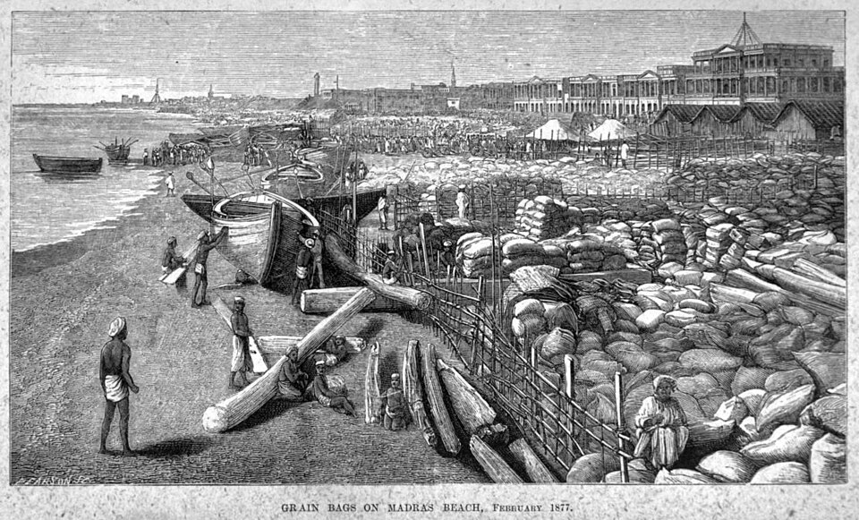

In 1876 the monsoon failed over the Deccan, the plateau of southern and western India, and in 1877 it failed again. It was one of the strongest **[El Niño](kloom:e/el-nino-southern-oscillation)** episodes on record, and drought struck China, Brazil and parts of Africa in the same years. In India the famine reached the **[Madras Presidency](kloom:e/madras-presidency)**, the Bombay Presidency, the princely states of Mysore and Hyderabad, and later parts of the north, some 58.5 million people. India was then ruled by the British Crown, the **[British Raj](kloom:e/british-raj)**, and how its government chose to meet the drought made this the **[Great Famine](kloom:e/great-famine-of-1876-1878)** of 1876–78.

Deaths registered in the Madras Presidency, as **[William Digby](kloom:e/william-digby-writer)**, a journalist who ran its relief fund, printed them in 1878:

| Month    | Deaths, 1876 | Deaths, 1877 |
| -------- | ------------ | ------------ |
| February | 42,498       | 94,546       |
| March    | 35,863       | 91,119       |

## Economy first

The new viceroy, **[Lord Lytton](kloom:e/robert-bulwer-lytton-1st-earl-of-lytton)**, began 1877 by proclaiming Queen Victoria Empress of India at the Delhi Durbar of 1 January 1877, before 68,000 guests. That January his government declared that "human life shall be saved at any cost", and in the same weeks sent **[Sir Richard Temple](kloom:e/sir-richard-temple-1st-baronet)** south as its famine delegate with instructions that set the cost first. Digby summarized them: "Severe economy in relief should be practised. Indiscriminate charity on the part of individuals is admitted to be bad, but on the part of Government is worse." And on the market: "There is to be no interference of any kind on the part of Government with the object of reducing the price of food."

Temple toured fast, struck people off the relief works and cut the wage. His measure, the "Temple wage", was about a pound of grain a day for a man, with a little cash for salt and condiments (half an anna in his first proposal, an anna on the canal works), and less for women and children, in return for a full day's labor. A farm laborer's ordinary wage, Digby noted, was about five pounds of grain. **[William Robert Cornish](kloom:e/william-robert-cornish)**, the presidency's sanitary commissioner, protested that a working man needed at least a pound and a half, with pulses and vegetables. Lytton backed Temple. In March 1877 the Madras government raised its ration toward Cornish's figure, to a pound and a quarter of grain with an ounce and a half of pulses. A Ceylon newspaper set the relief worker's sixteen ounces of rice beside a convicted murderer's prison diet of twenty ounces of rice with bread, fish or meat and vegetables; one critic said it would be "better to shoot down the poor wretches at once than to prolong their misery."

## Grain and the market

The policy had a pedigree. In [_The Wealth of Nations_](kloom:e/the-wealth-of-nations) (1776) **[Adam Smith](kloom:e/adam-smith)** had written that "a famine has never arisen from any other cause but the violence of government attempting, by improper means, to remedy the inconveniencies of a dearth." And food was there for those who could pay. By November 1876 merchants had bought 527,000 bags of rice, 86½ million pounds, to land at Madras from Calcutta and Rangoon. What the hungry lacked was the wages to buy it, the failure of entitlement that the frame on Bengal in 1943 sets out. Across India, the historian **[Mike Davis](kloom:e/mike-davis-scholar)** counts, a record 6.4 million hundredweight of wheat was exported to England in 1877–78.

## How a famine code worked

After the famine, the Famine Commission under **[Richard Strachey](kloom:e/richard-strachey)** reported in 1880. Two members, the agriculturist **[James Caird](kloom:e/james-caird-politician)** and H. E. Sullivan of the Madras service, wrote in a dissent that "upwards of five millions of human beings, more in number than the population of Ireland, perished," and that where a modest insurance fund could prevent it, "no financial excuse can be admitted to justify famine deaths." The Commission's own rules became the **[Indian Famine Codes](kloom:e/indian-famine-codes)**: the government would offer work at a living wage to all who could work, relief in their villages to those who could not, and would watch the food trade, though still not interfere with it. The Provisional Famine Code of 1883 set the machinery out, as the plate draws it:

1. Village officers report the crops, the grain stocks and the cattle; police report crime, "wandering of needy or starving persons", migration and deaths from want.
2. The Commissioner reports scarcity to the provincial government, and registers of the poor are made.
3. Relief works pay a wage that buys at least the minimum ration; the unfit get relief at home; those who refuse work go to a poor-house.
4. A medical officer who finds a ration too small may have it raised at once.

| A man's daily ration, 1883 code | Flour or rice | Pulse |
| ------------------------------- | ------------- | ----- |
| Full                            | 1 lb 8 oz     | 4 oz  |
| Minimum                         | 1 lb          | 2 oz  |
| Penal, in the poor-house        | 14 oz         | 1 oz  |

## How many, and whose fault

The Commission put the deaths in British-ruled provinces in 1877–78 at 5¼ million beyond the normal, and births two million fewer. Digby put the toll at 9.4 million for all India; the demographer Arup Maharatna's careful estimate is about 8.2 million. In _Late Victorian Holocausts_ (2001) Davis argued that these deaths came from the "theological application of the sacred principles of Smith, Bentham and Mill", and called them a genocide. The economist **[Amartya Sen](kloom:e/amartya-sen)**, reviewing the book, praised its history but called its claim that India's village communities had been destroyed "an enormous exaggeration"; the economic historian Tirthankar Roy argued that famines were better recorded under the Raj, not more frequent, and that their excess deaths had fallen by 1915. The trail's next frame turns to a famine made by state policy, in Soviet Ukraine.
