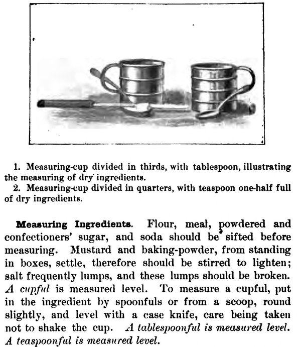

In 1896 the Boston publishers Little, Brown printed 3,000 copies of a cookbook by the principal of the **[Boston Cooking School](kloom:e/boston-cooking-school)**, and printed them at her expense, because they did not expect it to sell. **[Fannie Farmer](kloom:e/fannie-farmer)**'s **[_The Boston Cooking-School Cook Book_](kloom:e/the-boston-cooking-school-cook-book)** sold for a century; by the reckoning of Michigan State University's Feeding America project, more than four million copies. Since she had paid for the first printing, she kept the copyright and the profits. Its most lasting idea fills a page and a half near the front, under the heading "How to Measure".

## A spoonful of what?

Older recipes left quantity to the cook's eye. **[Amelia Simmons](kloom:e/amelia-simmons)**'s _American Cookery_ of 1796, the first known cookbook written by an American, makes a boiled flour pudding of "One quart milk, 9 eggs, 7 spoons flour, a little salt": spoons of what size, filled how? In England in 1861 **[Isabella Beeton](kloom:e/isabella-beeton)** promised in her **[_Book of Household Management_](kloom:e/mrs-beetons-book-of-household-management)** that "a bit of this, some of that, a small piece of that, and a handful of the other" would never be used, and that "all quantities be precisely and explicitly stated". Her Yorkshire pudding still took "6 _large_ tablespoonfuls of flour". She gave a tablespoonful as the bulk of half an ounce of water, and pointed her readers to the French metric system, whose meter was "one forty-millionth part of a meridian of the earth". American cooks kept their cups.

Boston came closest before Farmer. **[Mary Johnson Bailey Lincoln](kloom:e/mary-johnson-bailey-lincoln)**, the school's first principal, answered the saying that "good cooks never measure anything" in her _Boston Cook Book_ of 1884: "They do. They measure by judgment and experience." Her cup was "the common kitchen cup holding half a pint", and to find half a cupful in a tapering cup she poured water from a full cup into an empty one until they stood level. But her standard spoonful was heaped, then shaken "until it is just rounded over, or convex in the same proportion as the spoon is concave". She translated "butter the size of an egg", "a very common expression", into a quarter of a cupful.

## Measured level

Farmer's rule turned the default over. "Correct measurements are absolutely necessary to insure the best results," she began. "Good judgment, with experience, has taught some to measure by sight; but the majority need definite guides." The guides were a tin **[measuring cup](kloom:e/measuring-cup)** "divided in quarters or thirds, holding one half-pint", spoons "of regulation sizes", and "a case knife":

> A _cupful_ is measured level. To measure a cupful, put in the ingredient by spoonfuls or from a scoop, round slightly, and level with a case knife, care being taken not to shake the cup. _A tablespoonful is measured level. A teaspoonful is measured level._

A half spoonful was the level spoon divided lengthwise with the knife, a quarter crosswise again, and "less than one-eighth of a teaspoonful is considered a few grains". Liquids filled the cup; butter was packed in and leveled. The plate draws the cup and knife, and the two spoonfuls side by side. If Mrs. Lincoln's heap mirrored the bowl beneath it, her spoonful held twice Farmer's, by our geometry. A recipe written to the new rule reads like this, her first baking powder biscuit:

| Ingredient     | Measure                 |
| -------------- | ----------------------- |
| Flour          | 2 cups                  |
| Baking powder  | 4 teaspoons             |
| Salt           | 1 teaspoon              |
| Butter         | 1 tablespoon            |
| Lard           | 1 tablespoon            |
| Milk and water | 3/4 cup, in equal parts |

Sift the dry ingredients twice, work in the fat "with tips of fingers", mix in the liquid with a knife, roll to half an inch and bake twelve to fifteen minutes. She was honest about the limit: "It is impossible to determine the exact amount of liquid, owing to differences in flour." A table at the front gave the conversions: three teaspoons to the tablespoon, sixteen tablespoons to the cup, two cups of butter, packed, to the pound.

## The school and the sick

The Boston Cooking School was founded in 1879 by the Women's Education Association of Boston, and taught cooking as part of domestic science, with lessons on diet and the chemistry of food. Farmer came to it at thirty, after an illness at sixteen left her with a lasting limp; Wikipedia's biography calls it a paralytic stroke, and the Feeding America biography a paralysis of the left leg, "probably" polio. She graduated in 1889 and was principal from 1891. Some critics said the book took the school's recipes from Mrs. Lincoln's without acknowledgment.

In 1902 she left to open Miss Farmer's School of Cookery, and turned to feeding the sick. Her _Food and Cookery for the Sick and Convalescent_ (1904) opens with two lines, one unsigned, "Invalid Cookery should form the basis of every trained nurse's education", and one signed by **[Florence Nightingale](kloom:e/florence-nightingale)**: "A good sick cook will save the digestion half its work." Nightingale's own words, in **[_Notes on Nursing_](kloom:e/notes-on-nursing)**, are "good sick cookery will save the digestion half its work." Farmer trained nurses and hospital dietitians, lectured at **[Harvard Medical School](kloom:e/harvard-medical-school)**, and believed she would be remembered for this work rather than her cakes.

The next frame goes from the home cook's cup to the largest professional kitchens of the day, in London.
