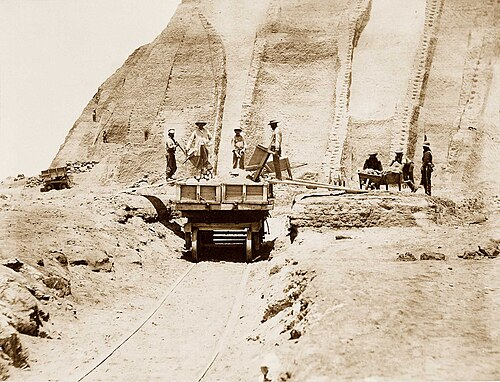

On 2 July 1909, in his laboratory at Karlsruhe, **[Fritz Haber](kloom:e/fritz-haber)** ran a tabletop apparatus for about five hours before two chemists from BASF, making liquid ammonia from the nitrogen of the air. "All parts of the apparatus were tight and functioned well," he wrote to the company's directors the next day, as **[Vaclav Smil](kloom:e/vaclav-smil)** quotes the letter. The chemistry, and the factory that **[Carl Bosch](kloom:e/carl-bosch)** built from it, belong to another subject. This frame follows the ammonia out to the fields, where it now grows about half of what we eat.

## The shortest stave

A crop draws many elements from the soil, and it grows only as far as the scarcest one allows. **[Justus von Liebig](kloom:e/justus-von-liebig)** popularized the rule, now called **[Liebig's law of the minimum](kloom:e/liebigs-law-of-the-minimum)**, after Carl Sprengel had stated it. In _The Natural Laws of Husbandry_ (English edition, 1863) he put it plainly: "Every field contains a maximum of one or several, and a minimum of one or several, other nutritive substances. It is by the minimum that the crops are governed." Later teachers drew it as a barrel of nutrient staves, which holds water only to the shortest. The plate draws one, with nitrogen short. On most farms, for most of history, that was the stave. Plants cannot use the nitrogen gas of the air; they need it fixed, as ammonia or nitrate. Before Haber it came from manure and crop residues, from rain, and from **[nitrogen fixation](kloom:e/nitrogen-fixation)** by bacteria in the root nodules of peas, beans and clover, which Hermann Hellriegel and Hermann Wilfarth showed in 1886.

## Guano and saltpeter

The first **[fertilizer](kloom:e/fertilizer)** trade was in seabird droppings. Alexander von Humboldt brought word of Peru's **[guano](kloom:e/guano)** to Europe after 1802, and the rainless **[Chincha Islands](kloom:e/chincha-islands)** held the richest beds of it. From 1840 the Peruvian state took the trade for itself, and exports peaked above 700,000 tonnes in 1870. The digging was done by men brought, often by force or fraud, from southern China. The American writer George Washington Peck watched them in the 1850s: "They soon become emaciated, and their faces have a wild, despairing expression. That they are worked to death is as apparent as that the hack horses in our cities are used up in the same manner."

As the islands ran out, Chile's desert supplied **[sodium nitrate](kloom:e/sodium-nitrate)**, Chile saltpeter. Chile took the nitrate provinces from Peru and Bolivia in the **[War of the Pacific](kloom:e/war-of-the-pacific)** of 1879 to 1884. By 1898 the exports were about 1,200,000 tons a year, and that September **[William Crookes](kloom:e/william-crookes)** told the British Association that "England and all civilised nations stand in deadly peril of not having enough to eat." Wheat land was running out, he said, and only nitrogen could raise the yield: "When we apply to the land nitrate of soda, sulphate of ammonia, or guano, we are drawing on the earth's capital, and our drafts will not perpetually be honoured." He put the danger in racial terms, warning that without fixed nitrogen "the great Caucasian race will cease to be foremost in the world", and added that running out of it meant "even the extinction of gunpowder!" In the [First World War](kloom:e/world-war-i) the British blockade cut Germany off from Chilean nitrate, and the **[Haber process](kloom:e/haber-process)** made its explosives instead.

## Half of us

How many people does synthetic nitrogen feed? Smil worked it out through protein, which is where the body's nitrogen goes. About 85 percent of the protein people eat comes from crops, directly or through animals fed on them. Synthetic fertilizer supplies about half of the nitrogen those crops receive. So it stands behind roughly two-fifths of dietary protein: without it, he wrote in 1999, "almost two-fifths of the world's population would not be here". Jan Willem Erisman and his colleagues put the share at 48 percent in 2008, and Smil at nearly 45 percent in 2011. They are estimates, crediting fertilizer with yields that better seed, irrigation and machines also earned.

| Year | Nitrogen used, million tonnes | World cereal yield, tonnes a hectare |
| ---- | ----------------------------: | -----------------------------------: |
| 1961 |                          11.5 |                                 1.35 |
| 1980 |                          60.6 |                                 2.16 |
| 2000 |                          81.0 |                                 3.06 |
| 2024 |                         115.2 |                                 4.21 |

## On the field, and after it

The Food and Agriculture Organization's figures show the spread. In 2024 the world used 71 kilograms of nitrogen on each hectare of cropland; China used 192, India 132, the United States 59 and Africa 15. Since 1961 nitrogen use has risen tenfold and cereal yields have tripled, by our arithmetic, on only 15 percent more land.

Much of it never reaches the crop. In experiments grain can take up 85 to 90 percent of a labeled dose, but on real fields recovery is "rarely above 50%", Smil found; in China's paddies the losses can pass 70 percent. The rest leaches as nitrate into groundwater and rivers, escapes as ammonia, or returns to the air as nitrogen and as **nitrous oxide**, a greenhouse gas. In the sea it feeds algae whose decay strips the water of oxygen: in 2008 Robert Díaz and Rutger Rosenberg counted more than 400 such **[dead zones](kloom:e/dead-zone-ecology)**, over 245,000 square kilometers in all. The largest in the United States, off the Mississippi's mouth, reached 22,730 square kilometers in 2017.

Making the ammonia burns natural gas, its main feedstock and fuel since the Second World War. The geography is lopsided: where farmers can afford too much, it runs off; in sub-Saharan Africa, Smil wrote, rates are "an order of magnitude below the recommended levels". The next frame turns from what crops need to what people need: the vitamins.
