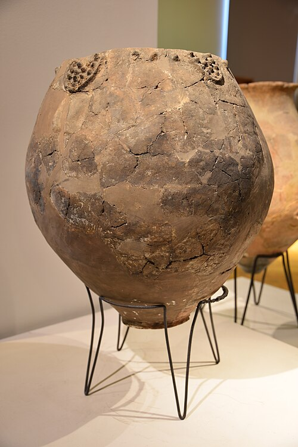

About fifty kilometers south of Tbilisi, on a plateau above the Khrami River, two low mounds a couple of kilometers apart hold the remains of [Neolithic](kloom:e/neolithic) villages: Gadachrili Gora and Shulaveris Gora. Each covered about a hectare, a cluster of round mudbrick houses one to five meters across, with pits and courtyards between them. They belong to the **[Shulaveri–Shomu culture](kloom:e/shulaveri-shomu-culture)**, the first farmers and potters of the South Caucasus, and among the most common things they made were jars, some of them nearly a meter tall and holding more than 300 liters. In 2017 **[Patrick McGovern](kloom:e/patrick-edward-mcgovern)** of the University of Pennsylvania Museum, with Georgian and North American colleagues, reported in _PNAS_ that eight of those jars had held a product of the grape. Radiocarbon dates put them at about 6000 to 5800 BC, which made this the oldest chemical evidence of grape **[wine](kloom:e/wine)** in the Near East.

## Reading a potsherd

A drink leaves nothing to see after eight thousand years. What survives is in the clay. Fired pottery is porous, and liquids soak into it, where the compounds they carried are held against the weather until a chemist dissolves them out again. The team chose base sherds, because whatever settles out of a liquid collects on the inside of the base. The sherds were not washed in the field, and soil from the same spot was bagged separately, as a check on anything the ground itself might have put there.

The marker they looked for was **[tartaric acid](kloom:e/tartaric-acid)**, the principal acid of grapes, which wine holds at one to five grams a liter, mostly as tartrate salts. Of three methods, infrared spectroscopy matched the old sherds' spectra to wine and tartaric acid; gas chromatography found mostly fatty acids, plus the plasticizer of the storage bags and a compound of hand cream; and liquid chromatography with tandem mass spectrometry, the most sensitive, found tartaric, malic, succinic and citric acids, at the retention times of modern standards. What mattered was how the sherd compared with its own soil:

| Sample         | Tartaric acid in the sherd | In its soil |
| -------------- | -------------------------- | ----------- |
| GG-IV-33, base | 87 ng per mg of residue    | 7           |
| GG-IV-56, base | 39                         | 19          |
| GG-IV-50, base | 17                         | 5           |
| SG-16a, base   | 55                         | 1 to 2      |
| SG-IV-20, body | 4                          | 3           |

At Gadachrili the sherds ran 3.4 to 12.4 times their soils. SG-16a, found on the surface in the 1960s, ran 44 times, and SG-IV-20 so little above its soil that the authors allowed it might be negative. Other evidence stood beside the chemistry. Grape pollen lay in the Neolithic layers but not in the modern topsoil, with the nearest vines today several kilometers off, and one jar sherd held grape starch, grapevine tissue and the remains of fruit flies.

Not everyone accepts the marker alone. Reviewing every method in 2020, **Léa Drieu** and her colleagues pointed out that tartaric acid is also high in tamarind, Chinese hawthorn and some pomegranates, and dissolves easily, so it can move into a sherd from the soil. Testing pots from Zamostje 2, a hunter-gatherer site north of Moscow with no grapes and no contact with any, they found it in all six, probably from viburnum berries. None of the proposed markers, they concluded, is proof of wine without the archaeology around it, which McGovern's group, replying in 2021, agreed with. What the Georgian jars held was a grape product; that it was wine is the likeliest reading, not a measurement.

## Taming the vine

The wild grape, **[_Vitis vinifera_](kloom:e/vitis-vinifera)** subspecies _sylvestris_, has separate male and female plants. Only females bear fruit, and only when wind carries pollen to them. The domestic vine has hermaphrodite flowers, male and female parts in one, which pollinate themselves, so every plant fruits and fruits heavily. In 2023 a large team led by Yang Dong sequenced 3,525 vines and found two domestications, both about 11,000 years ago: one in the Near East that gave table grapes, and one in the Caucasus that gave wine grapes. The Caucasian vines stayed mostly at home; Europe's wine grapes descend largely from the Near Eastern ones crossed with local wild vines. The genomic date is thousands of years older than the archaeology, which the authors admit. No grape seed from a Shulaveri–Shomu site has yet been dated to the Neolithic, so whether these villagers pressed wild or tended grapes is unknown.

## Areni and the qvevri

The oldest known winery is in a cave. At **[Areni-1](kloom:e/areni-1-winery)**, in Armenia's Vayots Dzor, excavators led by Boris Gasparyan, Gregory Areshian and Ron Pinhasi found, between 2007 and 2010, a sloping clay basin about a meter long in which grapes were trodden, draining into a vat buried 60 centimeters deep, with storage jars, pips of domestic vines and pressed skins, all dated to about 4100 to 4000 BC. Tartaric acid and malvidin, the pigment of red grapes, were found in the vessels. A review of 2022 gives the vat about 55 liters, the Wikipedia article about 65.

Georgians still make wine in a buried jar, the **[qvevri](kloom:e/kvevri)**. Grapes are pressed and the juice, skins, stalks and pips poured into an egg-shaped earthenware vessel, which is sealed and buried so that it ferments for five or six months; UNESCO added the method to its list of intangible heritage in 2013. Wikipedia says qvevri go back to the sixth millennium BC, but McGovern's paper is more careful: no one knows whether the Neolithic jars were buried, though their small, unsteady bases suggest it, and the earliest certain qvevri winemaking in Georgia is of the eighth or seventh century BC.

The next frame turns from the vine to the grain, and the beer of Sumer.
