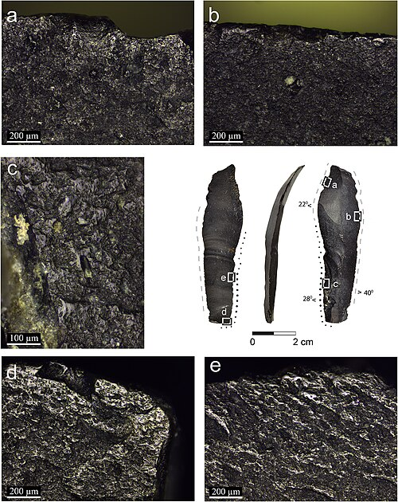

In 1989 a drought dropped the level of the **[Sea of Galilee](kloom:e/sea-of-galilee)** far enough to uncover the floors of a camp on its southwestern shore. **[Ohalo II](kloom:e/ohalo-ii)** had burned about 23,000 years ago, at the height of the **[Last Glacial Maximum](kloom:e/last-glacial-maximum)**, and the lake had then risen over it and sealed it in mud. Archaeologists under **Dani Nadel** of the University of Haifa found the charred floors of six brush huts, hearths, a grave, flint and ground stone tools, the bones of mammals, birds and fish, and something that almost never survives from the Old Stone Age: the plants the people ate.

There were more than 90,000 plant remains, from 142 kinds of plant. In the account of **Ehud Weiss** and his colleagues in 2004, the staples were wild grasses: wild wheat and barley, and a great many small-grained grasses whose seeds are tiny and hard to gather: nearly 19,000 grass grains in all. Beside them were acorns of the Mount Tabor oak, almonds, pistachios, wild olives, figs, grapes, raspberries and the fruit of Christ's thorn. The people of Ohalo II also fished the lake and hunted, and they knew a long list of plants and when each was ripe.

## Grinding, before farming

One hut floor shows how the grain was eaten. In it lay a flat basalt slab, set on small pebbles "much like an anvil", with grains and seeds concentrated around it. In 2004 **[Dolores Piperno](kloom:e/dolores-piperno)** and her colleagues recovered from the slab starch grains of barley, and possibly of wheat, ground on it: flour, made 23,000 years ago, more than 10,000 years before anyone farmed. Five flint blades from the site carry a polish along their edges that, under the microscope, matches cutting the stems of cereals while they were still a little green, just before the ripe ears shatter and drop their seed. Some were held in the hand; others were set in a handle, the first known composite sickles.

The plate draws both. Ohalo II's people had the tools of farming without the crops: the wheat and barley they cut and ground were wild.

## What foragers eat now

No foragers living today are a window onto the Stone Age. They live beside farmers, herders, states and markets, and have done for a long time. But they show what a diet without farming can be, and some have been measured closely.

The **[Hadza people](kloom:e/hadza-people)** of Tanzania, who live around [Lake Eyasi](kloom:e/lake-eyasi), number about 1,200 to 1,300, and only about a third still live mainly by foraging. Their diet falls into five kinds of food: tubers, berries, meat, the fruit of the baobab, and honey. Asked to rank them, Hadza put honey first and tubers last. **Frank Marlowe** and **Julia Berbesque** found that tubers are a "fallback food", always there and eaten most when berries are scarce. Women in camps that brought in more meat carried more body fat.

In 2012 **[Herman Pontzer](kloom:e/herman-pontzer)** and his colleagues measured how much energy 30 Hadza adults spent each day, using water labeled with rare isotopes, and found what no one expected:

| Daily energy, kcal | Women | Men   |
| ------------------ | ----- | ----- |
| Hadza              | 1,877 | 2,649 |
| Western adults     | 2,347 | 3,053 |
| Bolivian farmers   | 2,469 | 2,855 |

The Hadza walk far more, yet once body size is allowed for, they spend about the same energy as people in industrialized countries. The foraging life is active, but it is not a furnace.

## The original affluent society?

At the "Man the Hunter" symposium in 1966, the anthropologist **[Marshall Sahlins](kloom:e/marshall-sahlins)** turned the old picture of the starving savage upside down. Drawing on **[Richard Borshay Lee](kloom:e/richard-borshay-lee)**'s work among the **[ǃKung](kloom:e/kung-people)** of the Kalahari, he argued that foragers worked fifteen to twenty hours a week for their food and were affluent by "desiring little": the **[original affluent society](kloom:e/original-affluent-society)**. It became one of anthropology's best-known ideas, and among its most argued over. Lee's own count rose to about 40 to 44 hours a week once processing and cooking food were added. Critics, among them David Kaplan in 2000, have argued that the figures left out collecting firewood and preparing food, and that high infant mortality, disease and the pressure to share everything were left out of the picture too. What the evidence supports is narrower: foragers knew their land closely and ate a varied diet, and their lives were neither paradise nor bare survival.

For almost all of human history this was how everyone ate. The next frame finds the oldest bread, baked by foragers some 14,400 years ago.
