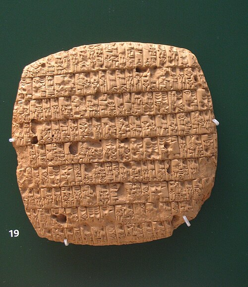

In 1916 the American Egyptologist James Henry Breasted needed a name for the arc of farmland that bends from the eastern Mediterranean, along the foot of the northern mountains, down to the Persian Gulf. "This great semicircle, for lack of a name," he wrote, "may be called the **[Fertile Crescent](kloom:e/fertile-crescent)**." Its hills and plains hold the wild ancestors of the crops that fed the first farmers of western Asia, and through them Europe, North Africa and much of South Asia. In 1988 the botanists **[Daniel Zohary](kloom:e/daniel-zohary)** and Maria Hopf named eight of them the **[founder crops](kloom:e/founder-crops)**: three cereals, two kinds of **[wheat](kloom:e/wheat)**, **[einkorn](kloom:e/einkorn)** and **[emmer](kloom:e/emmer)**, and **[barley](kloom:e/barley)**; four pulses, the **[lentil](kloom:e/lentil)**, the pea, the **[chickpea](kloom:e/chickpea)** and bitter vetch; and **[flax](kloom:e/flax)**, for oil and fiber. Their wild forms grow there still, and the three cereals pollinate themselves, so a chosen plant breeds true.

People had cut and ground the wild grasses for ten thousand years and more. From about 9500 BC they began to sow them too. Wild einkorn and emmer were planted for a thousand years or so before plants of a domestic kind turned up in the fields of southern Turkey and Syria, after about 8800 BC.

## How a wild grass changes

A wild cereal looks after its own seed. As the ear ripens, its stalk, the rachis, falls apart joint by joint, and each spikelet drops to the ground with its grain. That is how it sows itself. But in most wild stands a few plants carry a mutation that keeps the rachis whole. Gatherers who beat the ears over a basket collect the shattering kind; people who cut the stems with a sickle, or pull the plants up, bring home the tough ones too, and if they sow from what they harvested, the tough plants gain a little every year. In the end the crop cannot sow itself at all, and depends on the farmer to thresh it and plant it.

| Trait          | Wild                            | Domestic                          | What the archaeologist sees                            |
| -------------- | ------------------------------- | --------------------------------- | ------------------------------------------------------ |
| Seed dispersal | The ear shatters when ripe      | The ear holds until threshed      | A smooth scar, or a torn break, on each rachis segment |
| Grain          | Smaller                         | Larger and plumper                | Grains measured, allowing for shrinkage in charring    |
| Germination    | Seeds wait for the right season | Seeds sprout once sown and wetted | Thinner seed coats, where they survive                 |
| Pulses         | Pods split open                 | Pods stay closed                  | Seed size, which grew only thousands of years later    |

The first row is the one that counts. When an ear shatters on its own, each segment parts at a clean joint and leaves a smooth scar. When a tough ear is broken up by threshing, the segment is torn and its base is rough. Charred chaff survives in ancient hearths and middens, so an archaeobotanist can count the two kinds of break, as the plate draws them, and measure how far a crop had come.

## How fast it happened

In 1990 the archaeobotanist Gordon Hillman and M. S. Davies worked out that, with sickle harvests of nearly ripe plants and sowing in fresh ground, the tough rachis could take over a field in 20 to 100 years. That fitted the old picture of a **[Neolithic Revolution](kloom:e/neolithic-revolution)**, a quick invention of farming. The chaff says otherwise. In 2006 Ken-ichi Tanno and George Willcox showed that tough-eared wheat appeared only about 9,500 years ago, and that shattering forms were still common in cultivated fields 2,000 years later. **[Dorian Fuller](kloom:e/dorian-fuller)** compiled the counts from about twenty sites in 2007. Grains grew larger within perhaps 500 to 1,000 years of cultivation, but the tough rachis took 1,000 to 2,000 years more to become fixed: about 1,500 years in wheat, and 2,000 or more in barley. **[Domestication](kloom:e/domestication)** was a long drift, not an event, and much of it was not intended.

## One cradle or many

Where it happened is argued too. In 1997 Manfred Heun and his colleagues compared 288 genetic markers in wild and cultivated einkorn and found the cultivated plants closest to a wild population on **[Karaca Dağ](kloom:e/karaca-dag)**, in southeastern Turkey. With other evidence, this suggested a single "core area" in southeastern Turkey and northern Syria where one group of people brought all the founder crops into cultivation. In a review of 2011, Fuller, Willcox and Robin Allaby argued against it: cultivation began earlier than had been thought, with many more species and some false starts, and domestication went on in parallel across the northern and southern **[Levant](kloom:e/levant)** as well as the core area, and earlier outside it than within. The genetic evidence is read both ways, for einkorn especially.

## The farming year

A crop that cannot sow itself must be sown, and that changed the year. Seed had to be kept back from one harvest for the next. The ears had to be cut with flint sickles, threshed and winnowed. Above all, grain had to be stored. At Dhra', near the Dead Sea, Ian Kuijt and Bill Finlayson excavated round granaries about three meters across, built around 9300 BC. Their floors were laid on wooden beams set in notched upright stones, so that air could pass underneath and rodents and insects could not get in. Barley husks lay on their floors. The granaries are older than any domestic cereal: people stored wild grain before they had changed it.

Barley went on to become the grain of account. A tablet from Girsu in southern Iraq, of about 2350 BC, records the barley rations issued each month to adults and children. The next frame turns from plants to animals: sheep, goats, cattle and the first herds.
