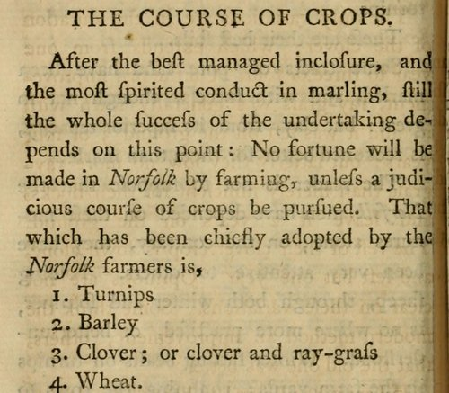

In _The Farmer's Tour through the East of England_ (1771), the agricultural writer **[Arthur Young](kloom:e/arthur-young-agriculturist)** set down why the farming of **[Norfolk](kloom:e/norfolk)** had become "so famous in the farming world". Forty to sixty years before, he wrote, much of the north and west of the county had been sheep-walks, let for sixpence to two shillings an acre. He gave seven causes for the change: enclosing without Parliament, marling the light sands, "an excellent course of crops", "the culture of turnips well hand-hoed", "the culture of clover and ray-grass", long leases, and large farms. Then he wrote the course down.

That is the **[Norfolk four-course system](kloom:e/norfolk-four-course-system)**. Each field went through the four crops in turn, so that in any year a farm grew all four, a quarter of its land in each, and none of it lay bare.

## The four years

| Year | Crop                            | What it did                                                                                                                                                   |
| ---- | ------------------------------- | ------------------------------------------------------------------------------------------------------------------------------------------------------------- |
| 1    | Turnips                         | Sown on manured land and hoed twice, they cleaned the field of weeds; sheep folded on them ate them where they grew, or they were stored for cattle in winter |
| 2    | Barley                          | Sown on the turnip land after three plowings                                                                                                                  |
| 3    | Clover, or clover and rye-grass | Grazed and cut for hay for one year or two; its roots enriched the soil for the wheat                                                                         |
| 4    | Wheat                           | The main grain crop, sown on the clover ley                                                                                                                   |

"This is a noble system, which keeps the soil rich," Young wrote; "only one exhausting crop is taken to a cleansing and ameliorating one." The links depended on each other: "Every link of the chain of Norfolk husbandry has so intimate a connexion and dependance, that the destruction of a single one, ruins the whole." The **[turnip](kloom:e/turnip)** took the place of the old bare fallow, the year in three when a field rested and was plowed to kill weeds: "Turnips on well manured land, thoroughly hoed, are the only fallow in the Norfolk course." Without turnips and clover there was no winter feed for sheep and cattle, and without animals there was no dung. The plate shows four strips of one farm passing through the course over four years.

## Why it worked

**[Clover](kloom:e/clover)** mattered most. Its roots carry nodules holding bacteria that take nitrogen from the air, through **[nitrogen fixation](kloom:e/nitrogen-fixation)**, and leave it in the soil as compounds a plant can use, which the **[wheat](kloom:e/wheat)** and **[barley](kloom:e/barley)** after it took up. Young knew only that the clover roots were "a rich manure for the wheat". Historians now treat nitrogen as the limit on English grain yields before the nineteenth century. Mark Overton reckoned that clover raised the nitrogen reaching English farmers' crops by over 60 percent, and Robert Allen's model of 2008 credits nitrogen-fixing plants with about half the rise in yields from the Middle Ages to the industrial revolution, the rest coming from better cultivation, seed and drainage. Fallow fell from about 20 percent of England's arable land in 1700 to 12 percent in the 1830s and 4 percent by 1871.

| Period    | Wheat, bushels an acre | Turnips, % of sown area | Clover, % of sown area |
| --------- | ---------------------: | ----------------------: | ---------------------: |
| 1250–1349 |                     15 |                       0 |                      0 |
| 1350–1449 |                     12 |                       0 |                      0 |
| 1584–1640 |                     15 |                       0 |                      0 |
| 1660–1739 |                     15 |                       7 |                      2 |
| 1836      |                     23 |                      24 |                     25 |
| 1854      |                     30 |                      22 |                     21 |

Overton's figures for Norfolk show yields flat for five centuries and doubling, by our arithmetic, between the early eighteenth century and 1854, as turnips and clover spread over a quarter of the sown land each. Allen stressed the slowness: the nitrogen that clover put into the soil was released slowly, so the revolution was gradual.

## Turnip Townshend and Coke of Norfolk

The rotation has two famous names attached. **[Charles Townshend, 2nd Viscount Townshend](kloom:e/charles-townshend-2nd-viscount-townshend)**, was a Whig statesman who left office in 1730 and retired to **[Raynham Hall](kloom:e/raynham-hall)** to farm, where his zeal for turnips earned him the nickname Turnip Townshend; **[Alexander Pope](kloom:e/alexander-pope)** put "Townshend's turnips" into verse. Rowland Prothero, later Lord Ernle, called him in _English Farming Past and Present_ (1912) "the initiator of the so-called Norfolk, or four-course, system". Later historians cut him down. Turnips had been grown in England since the sixteenth century, and Overton found that over half the farmers in Norfolk grew some by 1720, before Townshend retired, though turnips took only 7 percent of their cropped land. Even Prothero conceded that turnips and clover had come into the county in the half century before him, and the rotation is generally traced to Flanders. Young's seven causes name no one.

The second legend is **[Thomas Coke](kloom:e/thomas-coke-1st-earl-of-leicester-seventh-creation)**, who inherited **[Holkham Hall](kloom:e/holkham-hall)** and 30,000 acres in 1776, five years after Young printed the course. Nineteenth-century writers credited him with the four-course system, which the historian Naomi Riches called an "error", and R. A. C. Parker showed in 1955 that "many of the innovations he is supposed to have introduced should be attributed to his predecessors in Norfolk". What Coke did do was publicize: his annual sheep shearings at Holkham grew from gatherings of local farmers into dinners for hundreds.

Clover's nitrogen came slowly and in limited amounts. When imported guano and nitrates, and then nitrogen made in factories, removed that limit, yields climbed far past anything Norfolk had seen, as the frame on fertilizer from the air tells. The next frame turns from crops to the land itself, and who would own it: enclosure.
