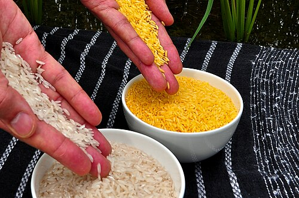

On 18 May 1994 the US **[Food and Drug Administration](kloom:e/food-and-drug-administration)** finished its review of a tomato from Calgene, a small company in Davis, California, and concluded that it was as safe as tomatoes bred in the ordinary way. Three days later the **[Flavr Savr](kloom:e/flavr-savr)** went on sale in Davis and Chicago, the first whole food from a genetically engineered plant to be sold. Calgene had added a reversed, "antisense" copy of the tomato's own gene for polygalacturonase, the enzyme that breaks down pectin in the cell walls as the fruit softens, so that the tomato could ripen on the vine and still survive the journey. It opened the age of **[genetically modified crops](kloom:e/genetically-modified-crops)**, which by 2016 covered some 12 percent of the world's cropland and are still argued over.

## How a crop is changed

Breeding mixes whole genomes and selects among the offspring. Genetic engineering adds one chosen stretch of **[DNA](kloom:e/dna)**. The method that made the Flavr Savr was borrowed from a plant disease. **[_Agrobacterium tumefaciens_](kloom:e/agrobacterium-tumefaciens)**, a soil bacterium, causes crown gall by cutting a segment of DNA, the T-DNA, out of its own plasmid and inserting it into the genome of a wounded plant cell. In the 1970s Marc Van Montagu, Jeff Schell and others worked out how it does this, and laboratories learned to remove the tumor genes and put their own between the T-DNA's borders. The first engineered plant, a tobacco, was reported in 1983. For plants the bacterium infects poorly, such as the cereals, John Sanford and his colleagues at Cornell built the **[gene gun](kloom:e/gene-gun)**, first a modified air pistol, which fires microscopic tungsten or gold particles coated with DNA into cells; they reported it in _Nature_ in 1987. Either way, the work runs in five steps, which the plate draws:

| Step       | What is done                                                                                                     |
| ---------- | ---------------------------------------------------------------------------------------------------------------- |
| Construct  | The gene is joined to a promoter that switches it on, and to a marker gene, such as one for kanamycin resistance |
| Deliver    | _Agrobacterium_ carries it into cut leaf pieces, or the gene gun shoots it into embryos or callus                |
| Select     | The tissue grows on a medium with the antibiotic or herbicide, so only cells carrying the marker survive         |
| Regenerate | Plant hormones turn a surviving cell into shoots, roots and a whole plant                                        |
| Test       | Each plant is a separate insertion, an _event_; the best is tested, then crossed into elite varieties            |

Each event is identified by the DNA at its junction with the plant genome. The European Union tests food and feed for them with event-specific tests based on the **[polymerase chain reaction](kloom:e/polymerase-chain-reaction)**, whose primers span that junction.

## The tomato that failed, and the crops that spread

Demand for the Flavr Savr was high, but, two University of California agronomists wrote in 2000, "the product was never profitable." The antisense gene lengthened shelf life but left the fruit too soft for machine picking, and Calgene had built it on an old, low-yielding variety. **[Monsanto](kloom:e/monsanto)** bought the company in 1997 and shelved the tomato. A tomato paste made the same way by Zeneca sold 1.8 million cans in Britain's Sainsbury's and Safeway, clearly labeled, from 1996 until sales fell away in the autumn of 1998.

The crops that spread did something else: they protected yields. From 1996 farmers planted maize and cotton carrying a gene from **[_Bacillus thuringiensis_](kloom:e/bacillus-thuringiensis)**, a soil bacterium whose crystal protein kills the larvae of particular insects, and Monsanto's Roundup Ready soybeans, which survive the herbicide **[glyphosate](kloom:e/glyphosate)**, so that one spray kills the weeds and not the crop. According to the International Service for the Acquisition of Agri-biotech Applications (ISAAA), a nonprofit that promotes the crops, their area rose from 1.7 million hectares in 1996 to 190.4 million in 2019, in 29 countries, in its 2019 count:

| Crop, 2019 | Million hectares | Share of the world's crop area |
| ---------- | ---------------: | -----------------------------: |
| Soybeans   |             91.9 |                            74% |
| Maize      |             60.9 |                            31% |
| Cotton     |             25.7 |                            79% |
| Canola     |             10.1 |                            27% |

## Golden Rice

In 2000 **[Ingo Potrykus](kloom:e/ingo-potrykus)** of ETH Zurich, Peter Beyer and their colleagues described a rice with added genes from the daffodil and from a bacterium that makes beta-carotene, the precursor of vitamin A, in the grain, coloring it yellow: **[Golden Rice](kloom:e/golden-rice)**, aimed at the vitamin A deficiency that blinds and kills children where rice is most of the diet. A version of 2005 with a maize gene made up to 37 micrograms of carotenoids a gram. The Philippines approved it for commercial planting in July 2021, the first country to do so. After a petition by farmers' and environmental groups, among them Greenpeace, the Court of Appeals in Manila revoked the permits on 17 April 2024, holding that its safety lacked "full scientific certainty". The government's rice institute appealed to the Supreme Court, where the case was pending in 2025.

## The argument

In 2016 a committee of the US National Academies of Sciences, Engineering, and Medicine heard 80 speakers, read more than 700 public comments, went back to the original studies and found "no substantiated evidence that foods from GE crops were less safe than foods from non-GE crops." It found too that the crops did not raise potential yields; that Bt crops cut insecticide use, but damaging resistance evolved in some insects where resistance-management strategies were not followed; and that where farmers relied on glyphosate alone, resistant weeds became "a major agronomic problem". Critics add the economics. Seed is patented: in **[_Bowman v. Monsanto Co._](kloom:e/bowman-v-monsanto-co)** (2013) the Supreme Court held that an Indiana farmer who planted soybeans bought from a grain elevator, knowing many would carry the Roundup Ready gene, had made unlicensed copies of Monsanto's invention. The Academies found that patents can shut out small farmers and breeders who cannot pay to license them, and called for study of whether a concentrated seed industry raises prices. A claim that Bt cotton drove a wave of farmer suicides in India was not borne out by the data. Safety, on the evidence, is largely settled; who owns the seed, and who gains, is not.

The next frame turns from growing more to who still goes without: hunger today.
