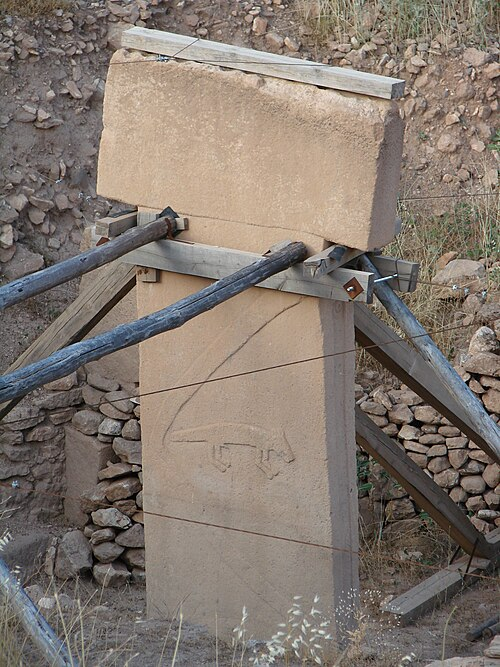

In October 1994 the German prehistorian **[Klaus Schmidt](kloom:e/klaus-schmidt-archaeologist)**, of the **[German Archaeological Institute](kloom:e/german-archaeological-institute)**, was asking in villages near Şanlıurfa, in southeastern Turkey, about hills strewn with flint. Mahmut Yıldız, whose family farmed one, led him to **[Göbekli Tepe](kloom:e/gobekli-tepe)**, "Potbelly Hill". A survey by Istanbul University and the University of Chicago, under Halet Çambel and **[Robert Braidwood](kloom:e/robert-john-braidwood)**, had noted it in 1963, but had taken the broken limestone slabs on its surface for grave markers. Schmidt saw that they were the tops of buried pillars, and began to dig in 1995.

What came out were round enclosures 10 to 30 meters across, walled in rough stone, with T-shaped limestone pillars set into the walls and two taller pillars, up to 5.5 meters high, standing at the center. Some pillars have arms carved down their sides, the hands meeting over a belt and a loincloth: the T is a stylized body, its crossbar a head. Most carry animals: foxes, snakes, boars, **[aurochs](kloom:e/aurochs)**, gazelle, wild asses, cranes and vultures. A geophysical survey suggests at least 20 enclosures in the mound. The people who raised them did not farm. They were **[hunter-gatherers](kloom:e/hunter-gatherer)**, about 11,500 years ago.

## How old, and what for

The first two radiocarbon dates, published in 1998, came from the soil filling the enclosures and were 500 to 1,000 years younger than expected. Schmidt explained that the fill had been brought from elsewhere when the enclosures were deliberately buried, and dated organic matter in the wall plaster instead. Later work dropped both ideas: the fill came down in landslides from the slope above, and dates from plaster are skewed by the "old wood" effect, in which long-dead carbon makes a sample seem older than it is. The site is now dated from about 9500 to 8000 BC.

Schmidt read Göbekli Tepe as a sanctuary on a hilltop, without houses, where bands of foragers met to build, feast and then scatter. Since his death in 2014 the excavators have found houses, rainwater cisterns cut into the bedrock that held about 150 cubic meters, and the tools of daily life. Most now see a settlement where ritual and ordinary life went on together. How many builders it took is argued too: Schmidt reckoned on hundreds, while experiments at the site suggest that 12 to 24 people could have built the later structures in under four months.

## What they ate

The fill was full of animal bones smashed open for their marrow. Joris Peters and Schmidt counted the identifiable bones from the first six seasons:

| Animal           | Bones identified |
| ---------------- | ---------------: |
| Goitered gazelle |            7,949 |
| Aurochs          |            2,574 |
| Wild sheep       |            1,237 |
| Asiatic wild ass |            1,177 |
| Fox              |              971 |
| Wild boar        |              863 |
| Cape hare        |              386 |
| Red deer         |              170 |

Every species was wild. The sheep, pig and cattle bones are large, most come from adults, and males outnumber females: the signs of a hunt, not a herd. Gazelle were the commonest kill, but weighed by bone the aurochs, the wild ox, gave about half the meat. The ages and tooth chemistry of the **[goitered gazelle](kloom:e/goitered-gazelle)** show that the herds passed through only between midsummer and autumn, so the gatherings may have been timed to them.

Plants survive badly on the hilltop. The few charred seeds are wild **[einkorn](kloom:e/einkorn)**, wheat or rye, barley, almonds and pistachios. But the microscopic silica bodies that grasses leave, phytoliths, run to between half a million and three million per gram of soil, four-fifths of them from grasses, among them wheat and barley.

## Grinding for a crowd

In 2019 Laura Dietrich and her colleagues studied 7,268 grinding tools from the site, an extraordinary number for the period: flat slabs and bowls, and the handstones pushed across them. Six volunteers ground einkorn on copies over a year. Pushed back and forth, a handstone ground 500 grams of grain to flour in 40 to 60 minutes, so one could make about 4.8 kilograms in an eight-hour day: enough, at half a kilogram to a kilogram a person, for five to ten people. With no large stores found, the team argued that the food was made to be eaten at once, at _work feasts_: food and drink given in return for labor on the monuments.

## Beer, or porridge?

Drink is the harder question. In 2012 Oliver Dietrich, Schmidt and others described six limestone troughs and barrels holding up to 160 liters, some with grayish-black residues inside. A chemical spot test gave "probable evidence of oxalate", a deposit left by steeping and fermenting grain, but the test "was not sensitive enough to give reproducible results". Their summary said the builders were drinking **[beer](kloom:e/beer)** "almost certainly"; the article itself called brewing "not yet certain". They revived an old idea, debated at a symposium Braidwood held in 1953, that people first tamed cereals to brew rather than to bake. A 2020 study of some 600 stone vessels from the site concluded that the troughs were used for cooking cereals. Whether that meant beer, porridge or both is still open.

If feasting did push people to sow more grain, the place was right for it. Cultivated einkorn was traced in 1997 to a wild population on **[Karaca Dağ](kloom:e/karaca-dag)**, a volcano about 95 kilometers to the east-northeast by our arithmetic, as the next frame tells. A trail follows the first drinks, from the oldest wine to the Bavarian beer law.
