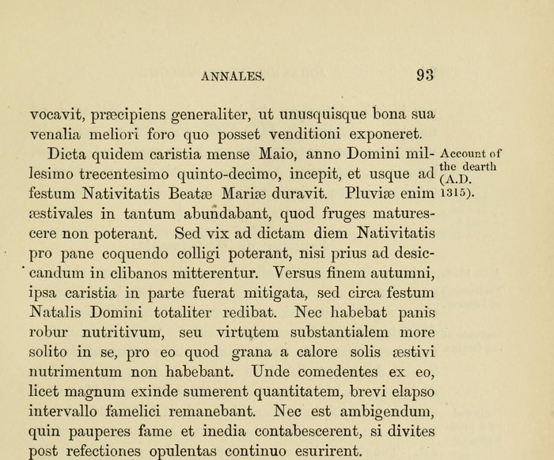

In the spring of 1315 it began to rain across northern Europe, and it went on raining. At the abbey of St Albans, north of London, the monk **[John of Trokelowe](kloom:e/john-of-trokelowe)** kept the house's annals, and he wrote down what followed. "The summer rains were so abundant that the crops could not ripen," he wrote (in our translation of his Latin). Even by early September the grain could hardly be gathered for baking "unless it was first put into ovens to dry", and the bread it made had lost its strength: people who ate a great deal of it "were hungry again a short while after." On 10 August, when **[Edward II](kloom:e/edward-ii)** came to St Albans, bread could hardly be found to feed his household. It was the beginning of the **[Great Famine](kloom:e/great-famine-of-1315-1317)**, which lasted in most places until the harvest of 1317 and in some until 1322.

## What the rain cost

In 2020 Seung Baek and his colleagues read the Old World Drought Atlas, a reconstruction of summer soil moisture from the growth rings of trees, and found that the summers of 1314, 1315 and 1316 together were the fifth wettest three-year stretch in Europe between 1300 and 2012.

Prices show the harvests that rain destroyed. The historian **[James Thorold Rogers](kloom:e/thorold-rogers)** gathered the prices of grain recorded in English manorial and college accounts and in 1866 printed their yearly averages, in shillings and pence for a quarter of [wheat](kloom:e/wheat), about eight bushels:

| Rogers's year | Wheat, a quarter | Against 1312 |
| ------------- | ---------------- | ------------ |
| 1312          | 4s. 11⅜d.        | 1.0          |
| 1313          | 5s. 6⅜d.         | 1.1          |
| 1314          | 8s. 4⅜d.         | 1.7          |
| 1315          | 14s. 10⅞d.       | 3.0          |
| 1316          | 15s. 11⅞d.       | 3.2          |
| 1317          | 8s. 3½d.         | 1.7          |
| 1318          | 4s. 6½d.         | 0.9          |
| 1321          | 11s. 7¾d.        | 2.3          |

The last column is our arithmetic, and the plate draws the series from 1312 to 1325. An average hides the worst: Rogers saw "a quintuple rise in many places", and Trokelowe gives 20 shillings in 1315, and 30 rising to 40 in the summer of 1316. In Flanders rye cost eight times as much in 1316 as in 1312.

People died of hunger and of the dysentery and fevers that came with it. In 1316 the city of **[Bruges](kloom:e/bruges)** paid to bury more than 1,800 bodies, perhaps 5.5 percent of its people; **[Ypres](kloom:e/ypres)** lost 10 percent or more. Recent estimates put the loss at about a tenth of the population across the affected regions, though every figure is local and uncertain. Then, in 1319 and 1320, a disease of cattle, the **[Great Bovine Pestilence](kloom:e/great-bovine-pestilence)**, killed some 62 percent of the oxen and cows of England and Wales, by Philip Slavin's count from manorial accounts, and with them the plow teams, the manure and the milk.

## How a kingdom met a dearth

In March 1315 **[Parliament](kloom:e/parliament-of-england)** fixed the most that might be asked for meat and eggs, on pain of forfeiting the goods:

| Writ of 14 March 1315         | Most that might be charged |
| ----------------------------- | -------------------------- |
| The best fat ox, grass-fed    | 16 shillings               |
| The best fat ox, fed on grain | 24 shillings               |
| The best fat cow              | 12 shillings               |
| A fat pig of two years        | 40 pence                   |
| A fat goose                   | 2½ pence                   |
| A good capon                  | 2 pence                    |
| Twenty-four eggs              | 1 penny                    |

It failed. "From the time they were issued and proclaimed," Trokelowe wrote, "everything became dearer than usual." At Lincoln in February 1316 the king and his barons revoked the order entirely, "commanding that everyone should put his goods up for sale at the best price he could." In January 1317 Edward tried a narrower rule, so that grain went to bread: wheat was not to be brewed into ale, and ale was to sell in the towns at London's price, a penny and a half a gallon for the better and a penny for the weaker, and in country villages for a penny.

Charity contracted just as it was needed. Lords and religious houses, Trokelowe wrote, "cut back their households, withdrew their customary alms, and reduced their retinues," and the servants they turned out took to robbery. Towns did more. Ypres changed the legal weight of its loaf 49 times in the year from November 1315, about once a week, to keep bread priced to grain. Bruges bought grain from the Mediterranean and gave the wheat rents of a hospital to its parish poor tables, to be handed out weekly "for the common good and benefit of the poor."

Not everyone lost. In coastal Flanders, Mathijs Speecke and Thijs Lambrecht found, large farms and abbeys did well out of high prices, while smallholders sold their land to eat: the land of a median household there, at the land prices of 1312, would have bought rye to feed four people for over 7,000 days at that year's price of rye, and for about 844 days at 1316's. Hunger followed who could pay for grain as well as how much grain there was, the argument this trail follows.

## Rain, ice and the debate

Why it rained is argued. The famine fell between the **[Medieval Warm Period](kloom:e/medieval-warm-period)** and the **[Little Ice Age](kloom:e/little-ice-age)**, but Baek's team dates the Little Ice Age from about 1450, so 1315 sits at a turning, not inside the cold. Reviewing the field in 2023, Fredrik Charpentier Ljungqvist and his colleagues found that eruptions came before 11 of the 17 great European famines they counted; for 1315 the case for a volcano is not settled. They stressed too that even this famine "was not solely climate-driven": population was near its medieval peak, smallholdings were tiny, and war, here France's embargo on grain for Flanders, made shortage worse.

## Before the plague

Sharon DeWitte and Philip Slavin, reading skeletons and manorial accounts together, argued in 2013 that the loss of cattle left England short of protein, calcium and vitamin B₁₂ for a generation, and that the people it raised were the more easily killed when the **[Black Death](kloom:e/black-death)** arrived in 1348. The trail's next frame moves to India, five and a half centuries later, where the rain failed instead.
