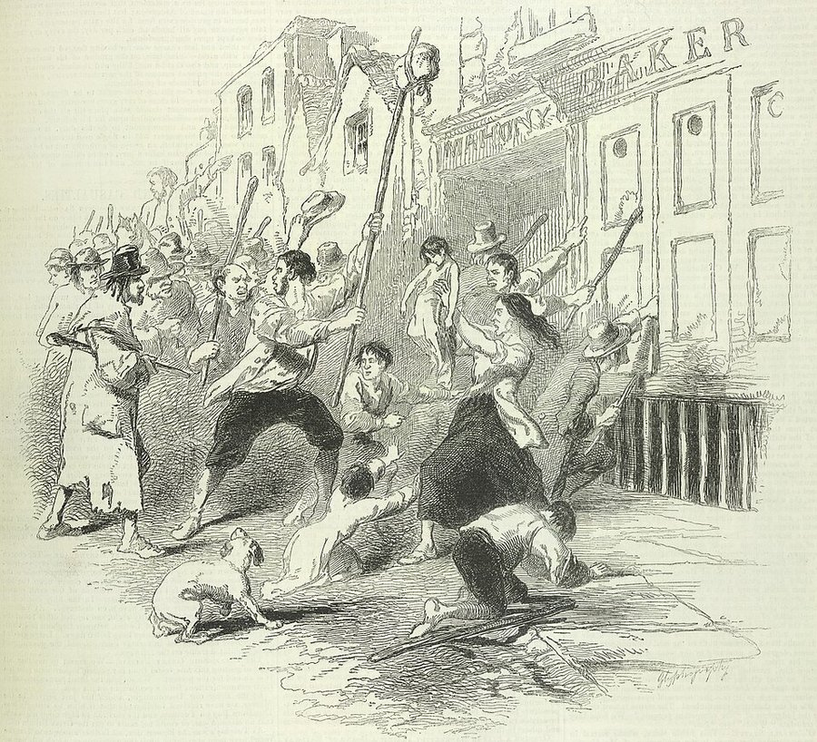

In September 1845 a disease new to Ireland began to rot the staple crop of its poor in the ground: the blight, **[_Phytophthora infestans_](kloom:e/phytophthora-infestans)**, carried from the Americas, whose cause a later trail tells. It destroyed about a third of that year's crop, nearly all of 1846's and, after a season's respite, most of 1848's. Across Europe it brought hardship; in Ireland, the **[Great Famine](kloom:e/great-famine-ireland)**, _an Gorta Mór_, from 1845 to 1852, which killed about one person in eight.

## One crop

The census of 1841 counted 8,175,124 people in Ireland, then governed from London as part of the United Kingdom. By the reckoning of the economic historian **[Cormac Ó Gráda](kloom:e/cormac-o-grada)**, the poorest third of them, laborers and cottiers who paid for a patch of ground with their work, lived almost wholly on the **[potato](kloom:e/potato)**: four to five kilograms a day for a grown man, much of it a heavy-cropping, watery variety called the **[Irish Lumper](kloom:e/irish-lumper)**. Only about half the crop was eaten by people:

| Use of the potato crop, early 1840s | Million metric tons |
| ----------------------------------- | ------------------- |
| Eaten by people in Ireland          | 6.2                 |
| Fed to pigs and cattle              | 4.4                 |
| Fed to horses and other animals     | 0.3                 |
| Exported                            | 0.2                 |
| Kept for seed, or wasted            | 2.5                 |

A potato does not keep from one year to the next, and one bad harvest left less seed for the next. People who already ate the cheapest food there was had nothing cheaper to turn to. **[Charles Trevelyan](kloom:e/sir-charles-trevelyan-1st-baronet)**, the Treasury official who ran the relief, said so himself: those "habitually and entirely fed on potatoes, live upon the extreme verge of human subsistence".

## What the government did

After the first failure the Conservative prime minister **[Robert Peel](kloom:e/robert-peel)** secretly bought £100,000 of **[maize](kloom:e/maize)** in the United States, to be sold cheaply from depots to hold prices down, and started public works. The unfamiliar yellow meal was nicknamed "Peel's brimstone", but there was little excess mortality that first year. In June 1846 Peel's government fell, his party split by the repeal of the **[Corn Laws](kloom:e/corn-laws)**, and the Whig ministry of **[Lord John Russell](kloom:e/john-russell-1st-earl-russell)** left the import of food to private trade. Its public works, mostly roads, employed about 700,000 people at their peak in the spring of 1847, one in twelve of the population, outdoors in winter, on wages too low to buy food at famine prices.

In February 1847 the government changed course. The **[Temporary Relief Act](kloom:e/temporary-relief-act-1847)** fed people directly from soup kitchens, run by local committees and paid for from the local poor rates and government loans. Trevelyan set out the daily ration:

| One ration, 1847                        | Amount                                                   |
| --------------------------------------- | -------------------------------------------------------- |
| Biscuit, meal or flour                  | 1 lb                                                     |
| or soup thickened with meal             | 1 quart, with a quarter ration of bread, biscuit or meal |
| or bread                                | 1½ lb                                                    |
| Usual form: stirabout of maize and rice | 1 lb dry, swelling to 3 or 4 lb cooked                   |

It was given only cooked: raw meal could be sold, but stirabout soured overnight, so only the hungry queued for it. In July 1847, 3,020,712 people received rations, 755,178 of them children. Deaths seem to have fallen while the kitchens ran; they closed in September, and relief was thrown back on the workhouses of the Irish poor laws, paid for by Irish ratepayers. The Poor Law act of June 1847 carried the Gregory clause: no one holding more than a quarter of an acre could be relieved until he had "absolutely parted with or surrendered" the rest. Families gave up their land to eat, and landlords cleared them. Trevelyan saw in it "a direct stroke of an all-wise and all-merciful Providence", laying bare Ireland's "social evil": "the sharp but effectual remedy".

The **[Quakers](kloom:e/quakers)** opened a Central Relief Committee in Dublin in November 1846, passed on money and food sent by Friends in Philadelphia and New York, and sent visitors west to report; the Choctaw Nation sent $170.

## Food leaving a hungry country

Grain and cattle went on being shipped to Britain, and Russell's government would not close the ports, as had been done in 1782. "The Almighty, indeed, sent the potato blight," wrote **[John Mitchel](kloom:e/john-mitchel)**, "but the English created the famine." The trade returns complicate the charge without erasing it:

| Year | Grain exported (1,000 quarters) | Grain imported | Of which maize |
| ---- | ------------------------------- | -------------- | -------------- |
| 1845 | 3,252                           | 147            | 34             |
| 1846 | 1,826                           | 987            | 614            |
| 1847 | 970                             | 4,519          | 3,287          |
| 1848 | 1,953                           | 2,186          | 1,546          |
| 1849 | 1,437                           | 2,908          | 1,897          |

From 1847 Ireland imported far more grain than it sent out, and Peter Solar's estimates in calories, averaged over 1846–50, suggest that imports largely made up for the lost harvests. But the average hides the lag: in the winter of 1846–47, he notes, "exports still exceeded imports", presumably because the poor could not afford the wheat and oats being shipped out. The historian **[Christine Kinealy](kloom:e/christine-kinealy)** has argued from British port records that the official returns undercount what left, that butter, livestock and porter went too, and that the winter of 1846–47 was a "starvation gap" that a government unwilling to meddle in the food trade left open.

## Deaths, flight and blame

The census of 1851 counted 6,552,385 people. With no civil registration, excess deaths can only be estimated, from about 800,000 to 1.5 million; most historians take about a million, most of them from typhus, dysentery and other diseases of hunger. About a million more emigrated, mostly to North America. The population kept falling for eighty years.

Was it genocide? In 1996 New Jersey put the famine in its Holocaust and Genocide curriculum, and some genocide scholars call Russell's relief policy genocidal. Most historians reject the charge for want of an intent to destroy: "not even the most bigoted and racist commentators of the day," Ó Gráda writes, "sought the extermination of the Irish." But they agree the response failed. **[Joel Mokyr](kloom:e/joel-mokyr)**: "There is no doubt that Britain could have saved Ireland." Ó Gráda: the government's "obsession with parsimony" and "its determination to make the Irish pay for 'their' crisis cannot but have increased the death rate."

The Famine trail follows other famines from here, from medieval Europe to China; the main spine turns to the Corn Laws.
