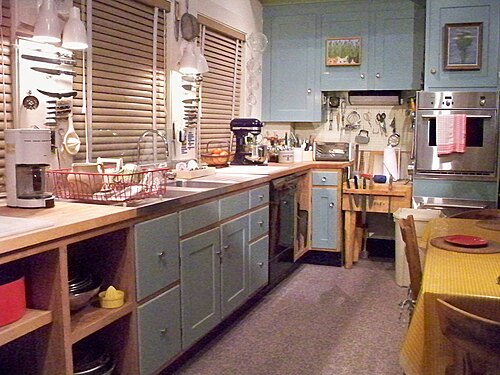

In 1948 a Californian of thirty-six, **[Julia Child](kloom:e/julia-child)**, arrived in **[Paris](kloom:e/paris)** with her husband Paul, posted there by the State Department. They had met in Ceylon while working for the wartime **[Office of Strategic Services](kloom:e/office-of-strategic-services)**, and she could barely cook. Her first meal in France, of oysters, sole meunière and wine at Rouen, she later called "an opening up of the soul and spirit for me." Her war service entitled her to government-paid training, and she joined the professional course at **[Le Cordon Bleu](kloom:e/le-cordon-bleu)** beside former GIs. The school's director delayed her examination, and her diploma came only in 1951.

Through a women's cooking club in Paris she met **[Simone Beck](kloom:e/simone-beck)** and **[Louisette Bertholle](kloom:e/louisette-bertholle)**, who were writing a French cookbook for Americans and wanted an American to help. In the early 1950s the three opened a cooking school for Americans in Paris, L'École des Trois Gourmandes, and taught the recipes as they tested them. Child translated and checked that every ingredient could be bought in an American grocery, and added instructions for the electric mixer and the garlic press that American cooks owned and French cooks did not. Houghton Mifflin, which had signed the book, refused the manuscript as "too formidable to the American housewife." **[Judith Jones](kloom:e/judith-jones)**, a young editor at **[Alfred A. Knopf](kloom:e/alfred-a-knopf)** who had lived in Paris, took it, and Knopf published **[_Mastering the Art of French Cooking_](kloom:e/mastering-the-art-of-french-cooking)** in 1961: 726 pages and 524 recipes.

## How the book teaches

Its foreword opens by calling it "a book for the servantless American cook." It is built as themes and variations rather than as a catalog of dishes. Each section begins with a master recipe, worked through step by step, and then the variations that follow from it, each changing an ingredient or a step of the method the cook has just learned; the plate draws the scheme. The master recipes, and most of the others, are laid out in two columns. On the left are the ingredients for one step, often with the pan or tool it needs; on the right, a paragraph saying what to do with them, so that what to cook and how are "brought together in one sweep of the eye." More than a hundred line drawings show the steps. The Smithsonian's curators describe the change as moving recipes from lists of ingredients with general directions to complete explanations, "tool-by-tool and step-by-step," written so the cook knows in advance what can go wrong.

## Cooking on camera

On February 20, 1962, Child went on _I've Been Reading_, a book program on Boston's public station **[WGBH-TV](kloom:e/wgbh-tv)**. Instead of being interviewed she brought a copper bowl, a whisk, an apron and eggs, and made an omelet. In the account of her grandnephew and co-author Alex Prud'homme, twenty-seven viewers wrote in asking for more; WGBH's own history dates the visit to her 1961 promotional tour. Three pilots were taped in June 1962, and **[_The French Chef_](kloom:e/the-french-chef)** began as a series on February 11, 1963, with boeuf bourguignon.

Videotape was costly and hard to cut, so each half-hour program was taped in a single continuous take, rehearsed but unscripted. When something went wrong, as when an apple charlotte collapsed at the end of one program, she carried on with good humor and showed how to rescue it, and the slips became part of what viewers trusted. The series ran for 212 episodes, until January 1973, won a Peabody Award and an Emmy, and in 1972 became the first American television program captioned for deaf viewers.

| When    | What                                                          |
| ------- | ------------------------------------------------------------- |
| 1948    | The Childs arrive in Paris                                    |
| 1950    | Finishes Le Cordon Bleu's course; the diploma follows in 1951 |
| 1950s   | Recipes tested in Paris and as the Childs moved around Europe |
| 1959    | Houghton Mifflin turns the manuscript down                    |
| 1961    | Knopf publishes Volume One                                    |
| 1962    | _I've Been Reading_ (February); three pilots taped (June)     |
| 1963–73 | _The French Chef_ on WGBH and public television, 212 episodes |
| 1970    | Volume Two, by Beck and Child                                 |

## The kitchen she was writing for

The American kitchen of 1960 was being sold as a showcase of electric appliances and processed foods. The **[frozen meal](kloom:e/frozen-meal)** on its aluminum tray had been in the stores since 1953. In 1960 **[Peg Bracken](kloom:e/peg-bracken)**'s _The I Hate to Cook Book_, quick recipes built on canned and frozen foods for people who wanted to spend as little time cooking as they could, began selling what became more than three million copies. One editor had told Child, by her own telling, that Americans wanted "to cook something quick, with a mix." The year _Mastering_ appeared, a French chef, René Verdon, began cooking in the Kennedy White House.

The Childs designed their own kitchen in Cambridge, Massachusetts, in 1961, with counters raised for her height and pans hung on pegboard; it was the set of three of her later series and is now in the **[National Museum of American History](kloom:e/national-museum-of-american-history)**.

## What she changed, and the argument over it

The book sold more than 100,000 copies in under five years, at $10 a copy. The historian David Strauss judged that it "did more than any other event" in half a century to reshape gourmet dining in America. Not everyone agrees what it did. Caroline Barta, in an essay of 2020, reads it as democratizing fine cooking, addressed to a cook who needed neither servants nor a code of taste. The historian Tracey Deutsch argues that Child recast elaborate cooking as a middle-class pleasure, made for guests, and so placed it outside what counted as women's work at all. Others asked how French it was: there was almost no demand for the book in France. Later critics found its recipes too long, and nutritionists its butter and cream too rich, to which she answered in 1990 that a "fear of food" would be "the death of gastronomy." The next frame asks what the factory did to the American dinner in the half-century after.
