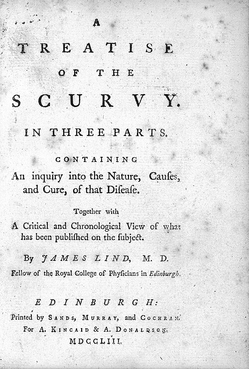

In 1740 Commodore **[George Anson](kloom:e/george-anson-1st-baron-anson)** sailed from England with eight ships to raid Spain's Pacific empire. He came home around the world in 1744 with a treasure galleon taken and most of his men dead. Counts differ, since some ships turned back: by one, 188 of the 1,854 who sailed came home with him; by another, about 1,300 of 2,000 died, most of them of **[scurvy](kloom:e/scurvy)**. The official account, compiled by the chaplain Richard Walter and published in 1748, described the disease aboard the _Centurion_ after it rounded Cape Horn: "large discoloured spots dispersed over the whole surface of the body, swelled legs, putrid gums, and, above all, an extraordinary lassitude". By the time it reached land in June 1741 it "could not at last muster more than six fore-mast men in a watch capable of duty." Old wounds opened again, and the callus of a long-healed fracture dissolved.

Scurvy was the disease of the long voyage, made on salt meat and ship's biscuit.

## Twelve men on the _Salisbury_

**[James Lind](kloom:e/james-lind)**, a Scot, was surgeon of the 50-gun **[HMS Salisbury](kloom:e/hms-salisbury-1746)** of the **[Royal Navy](kloom:e/royal-navy)**, serving in Anson's fleet in the western approaches to the Channel. In his _Treatise of the Scurvy_ (Edinburgh, 1753) he wrote:

> On the 20th of May 1747, I took twelve patients in the scurvy, on board the Salisbury at sea. Their cases were as similar as I could have them. They all in general had putrid gums, the spots and lassitude, with weakness of their knees. They lay together in one place, being a proper apartment for the sick in the fore-hold; and had one diet common to all.

The common diet was sweetened gruel, mutton broth, puddings, biscuit, barley and raisins. Then he gave each of six pairs a remedy of the day:

| Pair | Remedy, for a fortnight                                                     | Outcome                                              |
| ---- | --------------------------------------------------------------------------- | ---------------------------------------------------- |
| 1    | A quart of cider a day                                                      | Gums, lassitude and weakness "somewhat abated"       |
| 2    | 25 drops of elixir of vitriol (dilute sulfuric acid) three times a day      | Cleaner mouths; no other good effect                 |
| 3    | Two spoonfuls of vinegar three times a day                                  | "No remarkable alteration"                           |
| 4    | Half a pint of sea water a day; the two worst cases                         | "No remarkable alteration"                           |
| 5    | Two oranges and one lemon a day, for six days, until the fruit ran out      | One fit for duty in six days; the other made a nurse |
| 6    | An electuary of garlic, mustard seed, horseradish, balsam of Peru and myrrh | "No remarkable alteration"                           |

"The consequence was," Lind wrote, "that the most sudden and visible good effects were perceived from the use of the oranges and lemons; one of those who had taken them, being at the end of six days fit for duty." The other "was appointed nurse to the rest of the sick." He judged the three that did nothing against other sick men given only a mild laxative. The design is what makes the passage famous: patients matched as closely as he could, one diet for all, one thing changed between the pairs.

## Why it took fifty years

Lind did not read his trial the way we do. The experiments fill a few paragraphs of a book of more than 350 pages, which, the historian Michael Bartholomew shows, its own readers took in contradictory ways. Lind held that scurvy came from cold, damp air closing the pores, so that the body could not sweat off the waste of a hard sea diet and began to putrefy. Fruit and greens helped, in his view, because they digested easily, and he recommended a "rob" of lemon and orange juice boiled down to keep, without testing it as he had tested the fruit. Boiling destroyed what made the juice work. As chief physician of the naval hospital at Haslar from 1758 he kept trying many treatments, and the third edition of 1772 is, in Bartholomew's reading, the record of a man more and more frustrated by the disease.

Others reached for other cures. **[James Cook](kloom:e/james-cook)**, sailing the _Resolution_ around the world from 1772 to 1775, carried malt for sweet wort, a portable soup, and **[sauerkraut](kloom:e/sauerkraut)**, "not only a wholesome vegetable food, but, in my judgment, highly antiscorbutic, and spoils not by keeping"; each man had a pound of it twice a week. He lost one man to disease in three years, and that one not to scurvy. But Cook rated malt highest, and of the rob of lemons wrote: "I have no great opinion of them alone."

What settled it was practice. In 1794 the _Suffolk_ sailed to India without a landfall, two-thirds of an ounce of lemon juice issued to each man daily in his grog, and arrived without serious scurvy. In 1795, urged by the physician **[Gilbert Blane](kloom:e/gilbert-blane)**, newly a commissioner of the Sick and Hurt Board, the Admiralty made lemon juice part of the daily ration on all its warships.

## Lost and found

Then the cure was lost. In the nineteenth century the Navy turned to West Indian limes from Britain's own colonies, which have much less of what lemons have, and served the juice after it had stood in the light and run through copper pipes. Scurvy came back on Arctic expeditions, and as late as 1902 **[Robert Falcon Scott](kloom:e/robert-falcon-scott)**'s men in the Antarctic were cured by fresh seal meat.

No one could say why until animals could be given the disease. In 1907 two Norwegians, Axel Holst and Theodor Frølich, found that guinea pigs fed on grain develop scurvy. In 1932 Charles Glen King in Pittsburgh, and **[Albert Szent-Györgyi](kloom:e/albert-szent-gyorgyi)** and Joseph Svirbely in Hungary, showed that the substance Szent-Györgyi had isolated as hexuronic acid was the antiscorbutic factor, and fell out bitterly over who was first. It was renamed ascorbic acid: **[vitamin C](kloom:e/vitamin-c)**. As little as 10 milligrams a day prevents scurvy.

Comparing groups of patients by counting their outcomes became a method of medicine only later, with Pierre Louis's numerical method in Paris. The vitamin itself belongs to the frame on the discovery of vitamins. The next frame stays at sea, with Nicolas Appert's answer to the salt meat: food sealed and boiled in a bottle.
