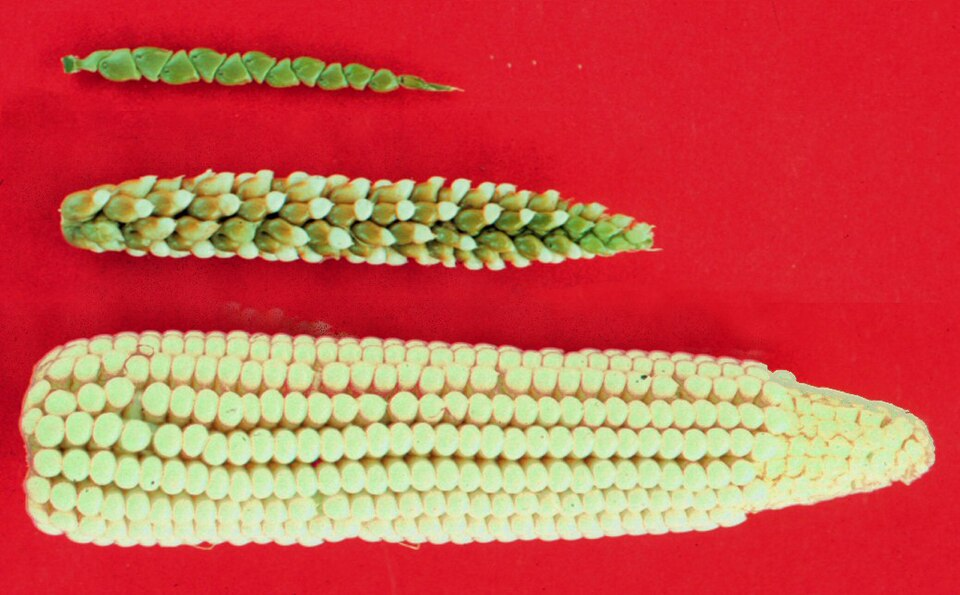

In the valley of the **[Balsas River](kloom:e/balsas-river)**, in the hot, seasonally dry hills of southwestern Mexico, grows a bushy wild grass called Balsas teosinte. It does not look like a crop. Its ears are thin spikes of a few hard, stony seeds that fall apart when ripe. Yet every ear of **[maize](kloom:e/maize)** in the world descends from it. In 2002 Yoshihiro Matsuoka, **[John Doebley](kloom:e/john-doebley)** and their colleagues genotyped 264 maize and teosinte plants at 99 places in the genome and found that all maize came from a single domestication, from teosinte of the central Balsas, about 9,000 years ago. Their date has wide error bars, 5,689 to 13,093 years at 95 percent confidence; the archaeology narrows it.

## A grass with no cob

|             | Teosinte                                        | Maize                                         |
| ----------- | ----------------------------------------------- | --------------------------------------------- |
| The plant   | a bush of many long branches                    | one stalk, its ears on short side branches    |
| The ear     | two rows of kernels                             | 8 to 32 rows, up to 1,200 kernels             |
| Each kernel | sealed in a hard fruitcase of silica and lignin | naked on the cob                              |
| When ripe   | the ear shatters and scatters its seed          | the kernels hold on, and only people sow them |

So different are the two that for decades some botanists held that maize came instead from a wild maize, now extinct. The geneticist **[George Beadle](kloom:e/george-beadle)** argued for teosinte from 1932, and after he retired he put it to a test. He crossed maize with teosinte and grew the grandchildren. Most were intermediate, but about one plant in 500 was as much maize, or as much teosinte, as a grandparent. If each gene that differs is sorted at random, a plant matches one grandparent at all of _n_ such genes with a chance of one in 4ⁿ, and one in 500 lies between 4⁴ and 4⁵. A handful of genes did most of the work: Beadle reckoned five or six, and the arithmetic gives four or five.

## How one became the other

Doebley's laboratory found two of them. _teosinte branched1_ holds back the side branches: the maize version is expressed at twice the level of the teosinte one, and turns a bush into a single stalk whose short branches end in ears. _teosinte glume architecture1_ makes the fruitcase. In 2005 Doebley's group traced the difference to a stretch of DNA a thousand letters long, with seven fixed differences between the two plants. A change there left the kernel naked on the surface of the ear, where people could eat it.

The ground shows when. At the Xihuatoxtla rock shelter in the central Balsas, **[Dolores Piperno](kloom:e/dolores-piperno)** and her colleagues washed starch from 21 grinding stones of about 8,700 years ago. Starch came off 19 of them, and 90 percent of it was maize. The grains averaged 12 to 17 micrometers, larger than any teosinte's. The sediments held the tiny silica bodies of cobs and none from teosinte fruitcases, which suggests that the change at _tga1_ had begun. The oldest cobs themselves come from **[Guilá Naquitz](kloom:e/guila-naquitz-cave)**, a cave in the Valley of Oaxaca dug by **[Kent Flannery](kloom:e/kent-flannery)**'s team in 1966. In 2001 Piperno and Flannery dated two of them to about 6,250 years ago. They are small, and when Beadle saw them in the 1970s he took them for a primitive maize or a hybrid with teosinte. The fat cob of the drawing took thousands of years more.

## Lime, beans and squash

Maize alone is a poor food. Its protein is short of lysine and tryptophan, and people who live on little else fall ill with **[pellagra](kloom:e/pellagra)**, a disease of too little **[niacin](kloom:e/nicotinic-acid)**. The peoples of **[Mesoamerica](kloom:e/mesoamerica)** cooked it in lime. The FAO's account of **[nixtamalization](kloom:e/nixtamalization)**, from a 1943 description of rural Mexico: one part of whole maize to two of a lime solution of about 1 percent, heated to 80 °C for 20 to 45 minutes and left overnight, then washed two or three times to take off the hulls, and ground into the dough for tortillas. Equipment for it on the south coast of Guatemala dates from 1500 to 1200 BC. Why it protects is still argued: one school holds that lime frees niacin bound in the grain, another that it improves the balance of amino acids, from which the body makes niacin.

Where maize traveled without the method, pellagra followed. In the American South between 1906 and 1940 there were more than three million cases and more than 100,000 deaths. In 1914 **[Joseph Goldberger](kloom:e/joseph-goldberger)** of the **[US Public Health Service](kloom:e/united-states-public-health-service)** changed the diet at two orphanages in Mississippi, adding "a marked increase in the fresh animal and the leguminous protein foods", and of 172 children who had had pellagra the year before, one fell ill again.

Indigenous farmers grew maize with beans and squash, in the **[milpa](kloom:e/milpa)** of Mesoamerica and the **[Three Sisters](kloom:e/three-sisters-agriculture)** gardens farther north. The stalk holds up the climbing bean, the bean fixes nitrogen, and the squash leaves shade out weeds. At the table the beans supply the lysine and tryptophan that maize lacks: in feeding trials the FAO reports, protein quality was best at about 70 parts maize to 30 of beans, close to what children chose for themselves.

## Through the Americas

Maize crossed Central America by about 7,500 years ago and reached South America by about 6,500, where Logan Kistler's genomes show it arrived only partly domesticated and was improved again in the southwestern Amazon. It was grown in New Mexico and Arizona about 4,100 years ago, and became the staple of eastern North America around AD 900. The next frame crosses to the other side of the world, where wild rice was becoming a crop in the marshes of the Yangtze.
