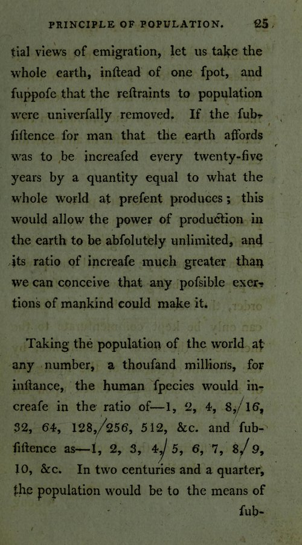

In 1798 the London bookseller **[Joseph Johnson](kloom:e/joseph-johnson-publisher)** published an anonymous book: _An Essay on the Principle of Population, as It Affects the Future Improvement of Society, with Remarks on the Speculations of Mr. Godwin, M. Condorcet, and Other Writers_. Its author was **[Thomas Robert Malthus](kloom:e/thomas-robert-malthus)**, 32, a Cambridge fellow and a curate in Surrey. It began, the preface says, in a conversation about an essay by **[William Godwin](kloom:e/william-godwin)**, whose _Political Justice_ (1793) had imagined a future of equality and reason. In France the **[Marquis de Condorcet](kloom:e/marquis-de-condorcet)**, hiding from the Terror, had written a sketch of humanity's indefinite progress before he died in prison in 1794. **[_An Essay on the Principle of Population_](kloom:e/an-essay-on-the-principle-of-population)** was Malthus's answer to both. Two chapters also argue with **[Adam Smith](kloom:e/adam-smith)**, who in Malthus's view wrongly took every increase in a nation's wealth for more food for its workers.

## Two postulata and two ratios

Malthus asked for two things to be granted: "First, That food is necessary to the existence of man. Secondly, That the passion between the sexes is necessary and will remain nearly in its present state." From them he drew his principle:

> Population, when unchecked, increases in a geometrical ratio. Subsistence increases only in an arithmetical ratio.

The rate came from the United States, where, he wrote, population had been found to double in 25 years. For food he was generous on purpose: let Britain's produce double in 25 years, then grow every 25 years by as much as it first produced, "though certainly far beyond the truth". From a guess of seven million people he worked a century:

| Years from now | People, millions | Food for, millions | Unprovided for, millions |
| -------------- | ---------------- | ------------------ | ------------------------ |
| 0              | 7                | 7                  | 0                        |
| 25             | 14               | 14                 | 0                        |
| 50             | 28               | 21                 | 7                        |
| 75             | 56               | 28                 | 28                       |
| 100            | 112              | 35                 | 77                       |

Then he took the whole world, "a thousand millions, for instance":

"In two centuries and a quarter," the next page goes on, "the population would be to the means of subsistence as 512 to 10." Since the two could never actually part, something must hold numbers down: the **checks**. The _preventive_ check was foresight: men who put off marriage because they could not keep a family. The _positive_ check was death, falling chiefly on the children of the poor, by want, disease, war and, last, "gigantic inevitable famine". All, he concluded, came down to "misery or vice". The second edition of 1803 added a gentler third, _moral restraint_.

## Dearth and the poor laws

He wrote in hungry years. After the harvest of 1795 Berkshire's magistrates, at Speenhamland, tied parish relief to the price of the gallon loaf, and parishes across the south followed. Malthus argued that the **[Poor Laws](kloom:e/english-poor-laws)** gave the poor money without making more food, so that prices rose and the parish "spread the general evil over a much larger surface". In 1800 the harvest failed again. A Commons committee found the wheat crop nearly a quarter short, counted 1,261,932 quarters of wheat and flour imported in a year, and asked that relief be paid in rice and other substitutes for bread. Nobody knew how many mouths there were. Malthus's book fed the argument that brought the **[Census Act 1800](kloom:e/census-act-1800)**, and the first count, on 10 March 1801, found 8.9 million people in England and Wales and 1.6 million in Scotland.

## Two centuries of being wrong

His series can be set beside what happened, at the same steps of 25 years from 1798:

| Year | Malthus: people | Malthus: food | World population, times 1800's |
| ---- | --------------- | ------------- | ------------------------------ |
| 1798 | 1               | 1             | 1                              |
| 1848 | 4               | 3             | 1.29                           |
| 1898 | 16              | 5             | 1.63                           |
| 1948 | 64              | 7             | 2.48                           |
| 1998 | 256             | 9             | 6.11                           |
| 2023 | 512             | 10            | 8.23                           |

The last column is our arithmetic from Our World in Data's estimates: 983 million people in 1800, 8.09 billion in 2023. Population never doubled every 25 years, and food more than kept up. Since 1961 the world's cereal harvest has grown 3.6 times while its people grew 2.6 times, and the food supplied per person each day rose from about 2,180 to 3,010 kilocalories, by our arithmetic from the FAO's figures. New land was plowed, the prairies above all, and yields rose. In 1898 the chemist **[William Crookes](kloom:e/william-crookes)** warned that the wheat-eaters would soon outrun the land, which was Malthus's argument again, and the Haber process answered it. Then births fell. The **[demographic transition](kloom:e/demographic-transition)**, described by Warren Thompson in 1930, is the pattern in which falling death rates are followed by falling birth rates. The United Nations put fertility at 2.3 children a woman in 2024, and expects about 10.3 billion people at the peak, in the mid-2080s.

Was he wrong about his own world? The economic historian **[Gregory Clark](kloom:e/gregory-clark-economist)** argues that he described every society before 1800 exactly: "the average person in the world of 1800 was no better off than the average person of 100,000 BC," a forager, because each gain in output was eaten by more people. **[Ester Boserup](kloom:e/ester-boserup)**, in 1965, turned the argument round: pressure of numbers drives farmers to work the land harder and invent, so population drives food, not the reverse. The fear came back in 1968 with _The Population Bomb_, by **[Paul Ehrlich](kloom:e/paul-r-ehrlich)** and Anne Ehrlich: "The battle to feed all of humanity is over." Famines came, but the world famine they foresaw did not.

## Darwin and Wallace

In October 1838 **[Charles Darwin](kloom:e/charles-darwin)** "happened to read for amusement 'Malthus on Population'", and saw that in such a struggle "favourable variations would tend to be preserved". _On the Origin of Species_ called its struggle for existence "the doctrine of Malthus applied with manifold force" to plants and animals. In 1858 **[Alfred Russel Wallace](kloom:e/alfred-russel-wallace)**, feverish in the Moluccas, remembered the positive checks and asked, "Why do some die and some live?"

The next frame turns to a machine that helped feed more people than Malthus thought possible: the reaper.
