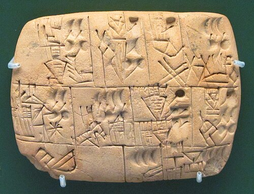

The oldest recipe for **[beer](kloom:e/beer)** is a hymn. It is written in Sumerian on three clay tablets of the Old Babylonian period, about 1800 BC, one of them from Nippur, and it praises **[Ninkasi](kloom:e/ninkasi)**, the "mistress of beer", a minor goddess of **[Sumer](kloom:e/sumer)** who stood for the drink itself. Twelve strophes of four lines each repeat the goddess's name and her work, step by step, from the grain to the poured beer. The Assyriologist **[Miguel Civil](kloom:e/miguel-civil)** of the University of Chicago's Oriental Institute published the first full translation in 1964, together with the drinking song always copied after it, which he thought was sung at the opening of a tavern kept by a woman. In his English, the hymn's soaking of the malt reads: "You are the one who soaks the malt in a jar, / The waves rise, the waves fall."

## A recipe in verse

Civil read the strophes as the brewing process in order, and most scholars still do:

| Lines | What Ninkasi does                                                  | The Sumerian term       |
| ----- | ------------------------------------------------------------------ | ----------------------- |
| 13–20 | Mixes dough and sweet aromatics in a pit, bakes them in a big oven | _bappir_                |
| 21–24 | Waters the malt, lightly covered with earth, while dogs guard it   | _munu_, sprouting grain |
| 25–28 | Soaks the malt in a jar                                            | _sun_, the mash         |
| 29–32 | Spreads the cooked mash on reed mats to cool                       | _titab_                 |
| 33–40 | Holds the "great sweetwort", brewing it with honey and wine        | _dida_                  |
| 41–48 | Sets the fermenting vat on a collector vat and pours the beer      | the beer, filtered      |

The plate draws the last two steps and the jar the beer was drunk from. Civil noted that the husks were kept in the mash because they helped it filter, and that the hymn is a poem, not a manual: it never says how the sprouting was stopped, or whether the mash was heated. The historian of science **Peter Damerow** went further in 2012. The reading as consecutive steps, he argued, leans on modern brewing knowledge to fill the poem's gaps. In the administrative texts **[bappir](kloom:e/bappir)**, usually translated "beer bread", was measured by volume, not counted like loaves; Walther Sallaberger has argued it was a sourdough. And the honey and wine are probably poetry, since the accounts list only barley and emmer as ingredients.

Experiment has tested the method. At Tall Bazi in Syria, a German team found that houses of the thirteenth century BC each had a jar of up to 200 liters half sunk in the floor. Working with local barley, they let it sprout for four days at 24 °C, dried the malt at 60 °C, as a summer roof would, mashed it without boiling, in eight parts of water,, and let it ferment for 36 hours: a sound, low-alcohol beer that kept for more than two months. In 1989 Anchor Brewing of San Francisco brewed a "Ninkasi" from a twice-baked barley bread with the anthropologist Solomon Katz.

Sumerian beer was drunk through straws. Unfiltered, it carried a layer of hulls and yeast on top, and a straw reached the clear beer beneath. Drinkers with straws appear on a stamp seal from **[Tepe Gawra](kloom:e/tepe-gawra)** of about 4000 BC, and the tomb of **[Puabi](kloom:e/puabi)** at **[Ur](kloom:e/ur)** held a straw of gold beside a silver vessel.

## Beer as wages

The first written records already count beer. Proto-cuneiform tablets of 3200 to 3000 BC from **[Uruk](kloom:e/uruk)** and other cities of the south, among them the one pictured, record jugs of beer issued by the great households of temple and palace, with the barley and malt that went into them. By the Ur III state, about 2000 BC, breweries kept balanced accounts: one, which Damerow worked through, received about 1,400 _gur_ of barley in two months and delivered nearly 1,000 _gur_ of beer, some 300,000 liters by his conversion. Laborers on the temple estates received about a liter of beer a day.

The **[Code of Hammurabi](kloom:e/code-of-hammurabi)**, set up about 1750 BC by the king of **[Babylon](kloom:e/babylon)**, regulated the women who sold it. In L. W. King's translation of 1910:

> 108. If a tavern-keeper (feminine) does not accept corn according to gross weight in payment of drink, but takes money, and the price of the drink is less than that of the corn, she shall be convicted and thrown into the water. 109. If conspirators meet in the house of a tavern-keeper, and these conspirators are not captured and delivered to the court, the tavern-keeper shall be put to death.

Law 110 condemned to burning a priestess who opened a tavern or went into one to drink; law 111 gave a tavern-keeper who furnished sixty _ka_ of drink fifty _ka_ of grain at harvest.

## Beer before bread?

In 1953 **[Robert Braidwood](kloom:e/robert-john-braidwood)**, digging the early farming village of Jarmo, put a botanist's question to his colleagues in the _American Anthropologist_: "Was the subsequent impetus to this domestication bread or beer?" They concluded that people lived first on gruel, then on bread, and only then on bread and beer. In 1986 Solomon Katz and Mary Voigt argued that a craving for beer could have driven people to plant cereals, while admitting there was no direct evidence. In 2018 Li Liu and her colleagues reported starch and wear in three stone mortars at **[Raqefet Cave](kloom:e/raqefet-cave)** in Israel, made by people of the **[Natufian culture](kloom:e/natufian-culture)** 13,000 years ago, as the remains of malting and brewing. David Eitam replied that the mortars had ground grain for food, and the argument has not been settled. The bread at Shubayqa, 14,400 years old, is so far the older find.

The trail ends three thousand years later, in Bavaria, where a duke decided what beer could be made of.
