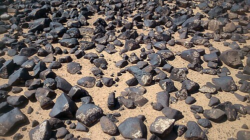

Northeastern Jordan is covered by a field of black basalt boulders, the **[Harrat al-Sham](kloom:e/harrat-al-sham)** or Black Desert. Some 14,400 years ago a group of [hunter-gatherers](kloom:e/hunter-gatherer) of the **[Natufian culture](kloom:e/natufian-culture)** built a half-sunken stone house there, at the site now called Shubayqa 1, with a floor of basalt flagstones and a round fireplace about a meter across at its center. The last fire in it was never cleaned out. The house was abandoned, the hearth was buried under half a meter of later deposits, and a second fireplace was built almost on top of it. Archaeologists from the **[University of Copenhagen](kloom:e/university-of-copenhagen)** dug the site from 2012 to 2015, under the auspices of Jordan's Department of Antiquities, and sieved and floated the whole contents of both hearths.

They found more than 65,000 charred plant remains from at least 95 kinds of plant. Most, about 50,000, were the tubers of **[club-rush](kloom:e/bolboschoenus-glaucus)**, a sedge of wet ground. There were wild **[einkorn](kloom:e/einkorn)** wheat, wild barley and oats, mustards and small legumes. And there were 642 lumps of charred food. In 2018 **Amaia Arranz-Otaegui**, **Tobias Richter** and their colleagues reported that 24 of these were pieces of [bread](kloom:e/bread), or of something very like it. Seven radiocarbon dates put the hearths' use at about 14,400 to 14,200 years ago, some 4,000 years before anyone farmed.

## How to recognize a burned crumb

Most of the 24 fragments are a few millimeters across. What makes them bread is inside. When flour is mixed with water, tiny bubbles of gas form in the dough. Kneading joins them into larger ones; baking opens them into a network of pores. So each way of preparing grain leaves its own pattern of holes, or voids, which experiments with modern charred preparations have measured. The team looked at their fragments under a scanning electron microscope and compared:

| Preparation, charred | Size of the voids  | Share of the surface |
| -------------------- | ------------------ | -------------------- |
| Dough, unbaked       | 0.5 to 0.8 mm      | over 30 percent      |
| Flat bread           | 0.05 to 0.25 mm    | 5 to 10 percent      |
| Leavened bread       | over 1 mm          | 40 to 70 percent     |
| Shubayqa 1           | 0.15 mm on average | 16 percent           |

The plate draws each crumb as a field three millimeters across, its voids at these sizes. Shubayqa's sit closest to flat bread: unleavened, and thinner than 25 millimeters, the height the classification sets for a flat bread.

The microscope showed the ingredients too. Fifteen fragments held the bran layers and endosperm cells of cereal grains, among them wild wheats such as einkorn, with barley not ruled out, and one held starch of the oat type. Five held plant tissue that was not cereal, most likely the club-rush tubers. Experiments show that bread of club-rush alone is brittle and flaky, while wheat flour mixed in makes a dough that holds together.

## The recipe

The particles in the bread also tell how it was made. About 41 percent are the size of modern flour, under 0.3 millimeters; 29 percent are semolina, and 29 percent coarser grist. There is no chaff and no whole grain, which later, everyday Neolithic breads often contain. Nearly half the wild wheat and barley grains in the hearths had the bulging broken ends that grinding leaves. Shubayqa 1 has also given the largest set of grinding stones of its age known in the southern [Levant](kloom:e/levant). From all this the team reconstructed the chain of work:

1. Dehusk the wild grain, and gather and prepare the tubers.
2. Grind them on a stone, again and again.
3. Sieve or winnow out the coarse bran.
4. Mix the flour with water into a dense dough.
5. Bake it flat. With no oven at the site or any of its age, probably on a hot stone or in the ashes.

## Food for a feast?

Why bake at all? Bread is costly to make: wild cereals have to be found, cut, dehusked and ground by hand. The finds lay in hearths left as they were when the house was abandoned, so the bread may have been provisions for a journey, light and long-keeping. But the authors also raise feasting: a laborious, valued food made to impress guests. The plant remains of the Natufian period favor that view. Cereals were rare in Natufian diets, which leaned on small-seeded grasses, fruit, nuts and roots. Bread, they conclude, was probably a special food here, and became an everyday one only after about 9,000 years ago, when farming was firmly established and ovens appear in houses.

From here a trail follows bread itself through ten thousand years, to the bakeries of Pompeii and the sliced loaf. The main spine goes on to Göbekli Tepe, built by foragers on the eve of farming.
