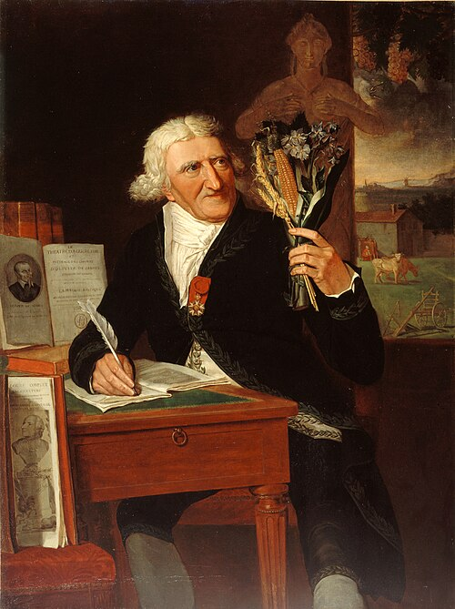

**[Antoine-Augustin Parmentier](kloom:e/antoine-augustin-parmentier)** was an army apothecary in the **[Seven Years' War](kloom:e/seven-years-war)**, and he spent part of it a prisoner of the Prussians. He came home to Paris in 1763 with a taste he had not expected. "Our soldiers in the last war ate a great many potatoes," he wrote in his _Examen chymique des pommes de terre_ of 1773, in our translation. "They were my only resource for more than fifteen days, and I was neither tired nor made ill by them. Need had condemned me to this diet, and taste made me adopt it afterwards." He went on to spend forty years persuading France to do the same.

## Kings, doctors and prizes

He was not the first. In Prussia **[Frederick the Great](kloom:e/frederick-the-great)** issued some fifteen orders to grow the **[potato](kloom:e/potato)**, the first in 1746 during a famine in Pomerania. His circular to the officials of Silesia of 24 March 1756 told them to explain to lords and peasants alike that "no crop yields more on the same ground than potatoes", in our translation, so that the poor could eat potatoes and sell more of their grain. A second order the next year told them to send the rural dragoons out in May to check that the planting had been done. Prussian soldiers came to know the crop well: in the **[War of the Bavarian Succession](kloom:e/war-of-the-bavarian-succession)** of 1778–79, a war of marches with almost no battles, Prussians and Saxons called it the _Kartoffelkrieg_, the Potato War. Historians explain the name in several ways: the armies ate the fields bare, the war fell at harvest time, or they threw potatoes at each other.

In France the tuber was widely suspected of causing disease, though the agronomist Henri-Louis Duhamel du Monceau had urged it as a famine food in 1761. After the famines of 1769 and 1770 the Academy of Besançon set as its prize question which plants could replace the usual foods in a time of scarcity, and how to prepare them. Parmentier's memoir, which argued that a nourishing starch could be drawn from many plants, potatoes among them, won; it was printed in Paris in 1773. In 1772 the Faculty of Medicine of Paris, asked by the controller-general of finances whether potatoes caused illness, reported that they were wholesome. When the nuns who owned the land objected to his trial plots at **[Les Invalides](kloom:e/les-invalides)**, where he was apothecary, he lost them.

## The field at Sablons

In 1786 **[Louis XVI](kloom:e/louis-xvi)** let him plant some 54 arpents, about 18 hectares by our arithmetic, of barren ground on the plain of Les Sablons, west of Paris. The best-known story about it comes from **[Julien-Joseph Virey](kloom:e/julien-joseph-virey)**, his colleague, in a biography published the year after Parmentier died: he had soldiers guard the crop by day but not by night, so that Parisians would steal what looked like a royal delicacy, and he rewarded the men who reported each theft. Parmentier's own account is plainer. In his _Traité_ of 1789, printed by order of the king, he called "the success of the large-scale experiment on the plain of Les Sablons and that of Grenelle, at the gates of the capital" proof "without reply" that no ground was too poor for potatoes, with work. He said nothing of guards. The trick itself he had told years earlier, of someone else: in his prize essay, as translated into English in 1783, "an officer of distinction" forbade his servants to eat potatoes, and so "made this plant an object of attention in his neighbourhood." Similar stories are told of Frederick. They are better evidence of how the promoters saw the people than of what happened.

## What an acre could feed

The case for the potato was arithmetic. **[Adam Smith](kloom:e/adam-smith)** set it out in **[_The Wealth of Nations_](kloom:e/the-wealth-of-nations)** in 1776:

| Per acre, in Smith's figures | Weight        | Solid food                            |
| ---------------------------- | ------------- | ------------------------------------- |
| Wheat                        | 2,000 pounds  | 2,000 pounds                          |
| Potatoes                     | 12,000 pounds | 6,000 pounds, allowing half for water |

Three times the food from the same land, he concluded, so that "Population would increase, and rents would rise much beyond what they are at present." He offered as proof the Irish porters and coal-heavers of London, "the strongest men … perhaps in the British dominions", fed on this root. He also named its weakness: it was "impossible to store them like corn, for two or three years together."

How much the potato really added to Europe's growth is taken up at the anchor of this trail, the Columbian Exchange. How Ireland came to depend on it is the subject of the Great Famine.

## Was Europe really reluctant?

The historian **[Rebecca Earle](kloom:e/rebecca-earle)** argues that the familiar story, of stubborn peasants won over by far-sighted savants, has it backwards. Records of disputes over tithes show cottagers growing potatoes in their gardens in England from the 1680s, and in Flanders, Alsace, Galicia and Ireland in the early eighteenth century; potatoes were shipped from the Canaries to France and the Low Countries in the sixteenth century, and French and English garden books told how to grow them from 1603 and 1629. What changed in the later eighteenth century, she argues, was not the eating but the state: governments from Spain to Sweden came to see a well-fed, growing population as the source of their wealth and strength, and the potato as a way to get one. The orders and memoirs say more about what officials wanted than about what ordinary people already ate.

The next frame follows the potato to 1845, when a blight swept its fields across Europe.
