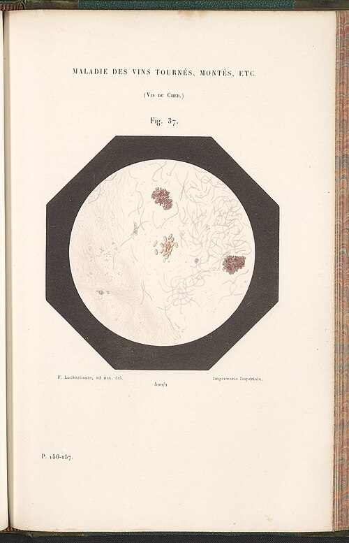

In July 1863 the Emperor **[Napoleon III](kloom:e/napoleon-iii)** encouraged **[Louis Pasteur](kloom:e/louis-pasteur)** to study the "diseases" of wine. French wine, a great export, traveled badly, turning sour, ropy or bitter. Pasteur came to the problem from fermentation, which since 1857 he had been arguing was the work of living microbes. In _Études sur le vin_ (1866) he drew the consequence. The diseases of wine came not from some spontaneous change in it but from "microscopic parasitic growths" that found in it the conditions to multiply. So, in our translation, "it must be enough, to prevent the diseases of wines, to find a way to destroy the vitality of the germs of the parasites that make them up."

## Heating the bottle

He found the way in the summer of 1864, in his family's wine town of **[Arbois](kloom:e/arbois)** in the Jura. Cork and tie each bottle, stand a basket of them in a water bath up to the string, put among them a bottle of water holding a thermometer, and lift the basket out when it reads the degree wanted, "for example 60°". He had once thought 45 °C might do, but for wine meant to keep he would not go "below 50° at least." The wine was not boiled, and tasters found it unharmed. He patented the process on 11 April 1865, and later granted that **[Nicolas Appert](kloom:e/nicolas-appert)** had first proposed keeping wine by heating it, decades before. The process took Pasteur's name: **[pasteurization](kloom:e/pasteurization)**.

## How it works

Pasteurization is not sterilization. It heats a food below boiling, long enough to kill the microbes that cause disease and most of those that spoil it, but bacterial spores survive, so pasteurized milk still needs a refrigerator. The hotter the heat, the shorter the hold. American law defines it by pairs of temperature and time, each reached by "every particle":

| Method                              | Temperature | Held for                  |
| ----------------------------------- | ----------- | ------------------------- |
| Pasteur's wine, 1865                | 50–60 °C    | until the bath reaches it |
| Rosenau's milk, 1912                | 60 °C       | 20 minutes                |
| Batch (vat), US law today           | 63 °C       | 30 minutes                |
| High-temperature, short-time (HTST) | 72 °C       | 15 seconds                |
| Higher heat, shorter time           | 89–100 °C   | 1 to 0.01 seconds         |
| Ultra-pasteurized                   | 138 °C      | 2 seconds                 |

The international food code designs it to kill at least 99.999 percent of _Coxiella burnetii_, the bacterium of Q fever. The plate draws an HTST line. Cold milk from the farm is warmed in a regenerator by milk already pasteurized, which it cools in turn, and the pasteurized side is held at the higher pressure, so a pinhole leaks clean milk into raw and never the reverse. A heater brings the milk to 72 °C, a holding tube keeps it there for 15 seconds, and a valve at the tube's end sends any milk below temperature back to the tank. Inspectors check the result with an enzyme of milk itself, alkaline phosphatase, which the same heat destroys: finding it means the milk was underheated.

## Milk for babies

Milk needed it most. In the 1850s cows stalled beside distilleries in **[New York](kloom:e/new-york-city)** were fed their hot waste mash, and the thin "**[swill milk](kloom:e/swill-milk-scandal)**", exposed by _Frank Leslie's Illustrated Newspaper_ in 1858, was blamed for thousands of infant deaths; the city's first milk laws followed in 1862. In 1886 the chemist **[Franz von Soxhlet](kloom:e/franz-von-soxhlet)** proposed heating infants' milk in its bottles. In 1893 the merchant **[Nathan Straus](kloom:e/nathan-straus)** opened a depot on a pier in New York selling pasteurized milk for babies; in 1908 his depots gave out more than four million bottles. His wife Lina's book of 1917 tabulated deaths of children under five in Manhattan and the Bronx, 96.2 a thousand a year in 1892 and 34.0 in 1916, and credited pasteurized milk with 241,930 lives saved.

Scholars still argue over that claim, because filtered water, sewers and milk inspection came in the same years. In 2014 Huiqiang Wang and colleagues found that city pasteurization ordinances cut children's deaths from diarrhea. In 2022 D. Mark Anderson, Kerwin Kofi Charles and Daniel Rees, studying 25 cities from 1900 to 1940, found that filtering water lowered infant mortality but that the cities' milk standards and the testing of cows did not measurably do so.

## Raw milk and tuberculosis

Pasteurization had a rival. In 1893 the Newark physician Henry Coit had a medical commission certify **[raw milk](kloom:e/raw-milk)** from inspected, healthy herds. The public health physician **[Milton Rosenau](kloom:e/milton-j-rosenau)** called certified milk "the very safest raw milk that it is possible to produce", and warned that even it had once spread diphtheria. **[Chicago](kloom:e/chicago)** required pasteurization of milk from untested cows in 1908, and of all milk only in 1916.

**[Tuberculosis](kloom:e/tuberculosis)** was the strongest argument for heat. In 1901 **[Robert Koch](kloom:e/robert-koch)** said that the cattle bacillus, **[_Mycobacterium bovis_](kloom:e/mycobacterium-bovis)**, so rarely infected people that no precautions were needed. Within a year researchers had found it in children who had died of tuberculosis, and government commissions in Britain and Germany confirmed them. Rosenau wrote that 60 °C for twenty minutes rendered it "entirely harmless". In 1917, when about one American dairy cow in ten was infected, the Department of Agriculture began testing every herd, and some four million cattle were condemned.

Since 1987 federal law has barred raw milk from interstate sale, but many states allow it. Between 2013 and 2018 it caused 75 outbreaks and 675 illnesses, nearly half in people under 20, and states that allowed its sale had about three times as many outbreaks. On the other side, in the GABRIELA study (2011) rural children in Germany, Austria and Switzerland who drank unboiled farm milk had less asthma; boiled farm milk showed no such effect, and an association found by survey does not prove that raw milk caused it. The next frame keeps food with cold instead of heat: refrigeration.
