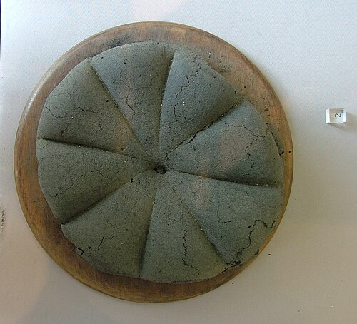
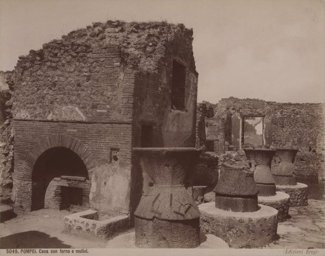

When the **[eruption of Vesuvius in AD 79](kloom:e/eruption-of-mount-vesuvius-in-79-ad)** buried **[Pompeii](kloom:e/pompeii)**, a bakery on the street now called the Via degli Augustali was working. Its oven was found shut with a bar of iron across the mouth, and inside were 81 loaves of **[bread](kloom:e/bread)**, charred but whole. It is called the bakery of Modestus, from an election notice painted beside its door, "MODESTVM AED", Modestus for aedile; whether Modestus was the baker or a candidate he backed, nobody knows. A Pompeian loaf was round, scored before baking into eight wedges so that it broke cleanly, and sometimes stamped: one from nearby **[Herculaneum](kloom:e/herculaneum)**, the **[Herculaneum loaf](kloom:e/herculaneum-loaf)**, reads "of Celer, slave of Quintus Granius Verus".

## How a Pompeian bakery worked

The archaeologist **[August Mau](kloom:e/august-mau)**, in the 1902 edition of his book on Pompeii, counted "more than twenty" bakeries in the part then excavated, "each of them with three or four mills". The Pompeii Archaeological Park now counts 36. "In antiquity", Mau wrote, "the miller and the baker were one person": a bakery bought grain and sold bread, and did everything between.

Each mill was two stones of lava. The lower, the _meta_, was a cone standing on a cylinder, set in a ring of masonry whose top made a trough for the flour. The upper, the **[millstone](kloom:e/millstone)** called the _catillus_, was "like a double funnel", an hourglass of stone: its lower half fitted over the cone, and its upper half was the hopper. A wooden post set in a square hole in the top of the cone carried an iron pivot, and on the pivot turned the beam that held the _catillus_. Grain poured into the hopper ran down through the waist and was ground between the two stones as the upper one turned, and the flour fell out at the foot of the cone into the trough. The stone barely touched the cone, or no animal could have turned it, and the post's length set the grind finer or coarser.

| Room              | What was done there                                                                   |
| ----------------- | ------------------------------------------------------------------------------------- |
| Mill room         | Grain ground between _meta_ and _catillus_; floor paved with basalt for the animals   |
| Stable            | The donkeys that turned the mills fed and slept                                       |
| Kneading room     | Dough worked on tables or in a kneading machine, loaves shaped                        |
| Oven              | A low dome heated with wood, raked out, loaded, its mouth closed to keep the heat     |
| Storeroom or shop | Baked loaves passed through a second opening in the oven's front, for sale or carting |

The kneading machine was a lava basin about half a meter across with a turning shaft inside. Wooden arms on the shaft pushed the dough round and wooden pegs through the basin's wall held it back, folding and stretching it as a baker's hands would.

## The prison bakery

Mau wrote that the smaller mills "were turned by slaves, the larger by draft animals". In 2023 a dig in Region IX uncovered a bakery that shows what that meant. It was built into a house after the earthquake of AD 62, and the initials of Aulus Rustius Verus, a politician whose election notices were painted in the house, are cut on both stones of one of its mills. The work rooms had no door to the street; their only exit led through the atrium of the owner's house. Their few windows were barred, even one between two rooms of the same house. A stable with a long manger for six or seven animals opened onto the mill room, where notches cut in the basalt paving kept the animals from slipping and marked their circular path round four mills set so close that two donkeys could not pass. "It is the most shocking side of ancient slavery," wrote the park's director, Gabriel Zuchtriegel, "the one devoid of both trusting relationships and promises of manumission."

The park's report sets beside it the one account of such a mill from inside, **[Apuleius](kloom:e/apuleius)**'s second-century novel **[_The Golden Ass_](kloom:e/the-golden-ass)**, whose hero, turned into a donkey, is sold to a baker. In William Adlington's translation of 1566:

> O good Lord what a sort of poore slaves were there; some had their skinne blacke and blew, some had their backes striped with lashes, … some were marked and burned in the heads with hot yrons, some had their haire halfe clipped, some had lockes of their legges.

It is fiction, written in North Africa a century later, as the park's authors note. But the barred windows and the worn paving agree with it. So do the reliefs on the **[Tomb of Eurysaces the Baker](kloom:e/tomb-of-eurysaces-the-baker)** in Rome, which suggest that each mill was worked by a pair, a donkey and an enslaved man who drove it, poured in the grain and gathered the flour. The authors set bakeries beside quarries, mines and galleys as the places where **[slavery in ancient Rome](kloom:e/slavery-in-ancient-rome)** was at its most brutal.

## What Pliny knew

**[Pliny the Elder](kloom:e/pliny-the-elder)**, who died in the eruption, wrote in his **[_Natural History_](kloom:e/natural-history-pliny)** that "there were no bakers at Rome until the war with King Perseus" of Macedon, which ended in 168 BC: before that, Romans made their bread at home, and it was women's work. He knew how a loaf rose. Some made leaven from millet and grape juice, he says, but most "make use of a little of the dough that has been kept from the day before", and "the principle which causes the dough to rise is of an acid nature". That is sourdough, and the Herculaneum loaf, analyzed, proved to be one.

Not every baker was poor. The **[Portrait of Terentius Neo](kloom:e/portrait-of-terentius-neo)**, a painted couple from a house on the Via Stabiana, is often called a baker and his wife: a bakery was built into the house, and an election notice by Terentius Neo is painted outside. Both the name and the trade are inferences. The trail goes on to medieval London, where the law set the weight of every loaf.
